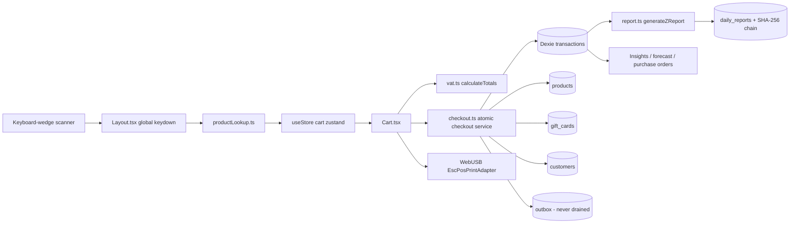

# POS Audit — Phase 1 & Phase 2 (A, B)

> **Historisch document — niet gebruiken als actuele releasestatus.** Deze
> audit beschrijft de browser-only fase van 8 augustus 2026, vóór de huidige
> Supabase-architectuur en honderden latere tests. De statusvakjes hieronder
> zijn alleen historisch. Gebruik [`PROJECT-CONTEXT.md`](PROJECT-CONTEXT.md)
> voor de actuele, op commit `1273dad` afgebakende projectstatus.

> Audit date: 2026-08-08 · Scope excludes auth, storage and backend security (demo build, local storage only, 0 backend).
> Status legend: `[ ]` open · `[~]` in progress · `[x]` fixed & verified

**Initial audit verification:** `npx tsc --noEmit` (clean) · `npx vitest run` (47/47 pass, 11 files) · isolated re-execution of the money/VAT/CSV logic to confirm arithmetic defects. No source, config, schema, or data was modified during the initial audit.

**Post-remediation verification (commit `41e1a74`):** `npm run lint` clean · `npm test` 69/69 pass (13 files) · `npm run build` succeeds. The repository was independently re-checked after the remediation commit.

**Remediation round 2 (2026-08-08):** F1, F2 and F3 implemented · `npm run lint` clean · `npm test` **89/89 pass (15 files)** · `npm run build` succeeds. Gift-card payment and CSV import now **default to off** (`FEATURES`), so an unconfigured deployment is safe. On-device verification and the pre-v10 IndexedDB export remain outstanding, so the release status is still **NO-GO**.

---

## PHASE 1 — System reconstruction

### Actual architecture

A **single-process, browser-only React 19 + Vite SPA**. There is no server, API, scheduled job, payment-provider process, or sync worker. Checkout now has one canonical service and one atomic IndexedDB write boundary; the outbox is still never drained.



### Canonical sources of truth

| Concern | Canonical source of truth | Assessment |
|---|---|---|
| Order / sale status | `transactions.isFinalized` (0/1) | Only two states; no lifecycle |
| Payment status | **None** — implied by row existence | No pending/authorized/declined/voided/reversed |
| Refunds / returns | **Does not exist** | — |
| Cash drawer | **Does not exist** | `shifts` table declared, never written |
| Inventory | `products.stockQty` | Mutated in place, no ledger except purchase receipts |
| Tax | `products.vatRate` snapshot inside `transactions.items` | Only 12 / 21 are representable |
| Receipt numbering | `transactions.id` (IndexedDB `++id`) | No series, no gap control |
| Gift cards | `gift_cards.balanceCents` | Redemption is atomic; issuance/recharge still has no matching cash transaction |
| Reports | `daily_reports` + prev-hash chain | Chain never verified |
| Accounting export | **Does not exist** | — |

**Entry points:** the app shell, the global keydown scanner, WebUSB, CSV import, and the `?view=` / `?presentation=1` URL parameters.

**Money-flow equality check.** For the currently supported 12%/21% checkout paths, A1–A5, A19 and B1 are remediated at the persistence boundary. The full target `expected = persisted = provider = receipt = report = accounting` still **cannot hold end to end**: there is no payment-provider leg, A6/A7 can break report reconciliation, A8 mis-models gift-card issuance/recharge, historical receipt identity remains mutable (B3/B4), and there is no accounting-export leg.

**Assumptions / unknowns not resolvable from the repo:** deployment status; whether more than one device is ever used (`tableId` is hard-coded to `1`, so all registers self-identify as "Kassa 1"); whether the merchant is subject to fiscalization obligations; and whether 12%/21% are sufficient for the real catalogue. Those two rates are now enforced; products requiring 0% or 6% remain intentionally blocked until the VAT model is generalized.

> Out of the scope set for this audit: a production build still auto-logs in as `owner` when the URL carries `?presentation=1` ([src/App.tsx](src/App.tsx#L16-L34)). Noted once, not pursued.

---

## PHASE 2A — Financial & transactional correctness

### - [x] A1 · FIXED · CRITICAL — Paying in full with a gift card never debits the card

[src/components/Cart.tsx](src/components/Cart.tsx#L470-L480) calls `addCartGiftCard(...)` and then, **in the same event handler**, `finalizeCheckout('Cadeaubon')`. `finalizeCheckout` closes over the `cartGiftCards` value from the *previous* render, which is still `[]`. Consequently, at [src/components/Cart.tsx](src/components/Cart.tsx#L166):

- `if (cartGiftCards.length > 0)` is false → no `Split`, no `splitTenders` recorded;
- `for (const gc of cartGiftCards) await deductGiftCard(...)` iterates nothing → **the balance is never reduced**.

A €100 card pays a €100 basket an unlimited number of times. The partial-payment path (add card, then press Cash/PIN) is unaffected because it spans two renders — which is exactly why this is invisible in casual testing.

**Resolution:** the selected allocation is now passed explicitly to `checkout.ts`; the full-payment path no longer depends on a Zustand re-render. The committed transaction contains the gift-card tender and the balance debit in the same Dexie transaction.

### - [x] A2 · FIXED · CRITICAL — Redemption is not capped by the real balance

`addCartGiftCard` appends with no de-duplication, and `GiftCardPaymentModal` computes `Math.min(totalCents, card.balanceCents)` against an in-memory copy that is only written at checkout. The same card can therefore be added twice for a combined amount exceeding its balance. `deductGiftCard` then absorbs the overdraft silently via `Math.max(0, cur.balanceCents - amountCents)` ([src/store/useCustomers.ts](src/store/useCustomers.ts#L146-L155)) — the shop eats the difference with no trace.

**Resolution:** allocations are de-duplicated, the card is re-read inside the database transaction, and inactive, invalid, over-balance and over-basket allocations fail the whole checkout without writes.

### - [x] A3 · FIXED · HIGH — Manual discount is computed on an inflated base

[src/components/Cart.tsx](src/components/Cart.tsx#L444) passes `subtotalCents={totals.subtotal + manualDiscountCents}`. But `calculateTotals().subtotal` is *already* the undiscounted gross. Reproduced:

```
real gross subtotal = 10000c, value handed to DiscountModal = 10500c
a 10% discount then computes 1050c instead of 1000c
```

Every discount applied on top of an existing discount is too large, and it compounds on each re-open.

**Resolution:** `DiscountModal` receives `totals.subtotal`, the undiscounted gross, directly.

### - [x] A4 · FIXED · HIGH — No idempotency; double-submit produces duplicate sales

`isProcessing` gates only the three buttons in the Cart footer. The confirm buttons inside `CashPaymentModal` and `GiftCardPaymentModal` are not gated, and `finalizeCheckout` itself never checks `isProcessing`. `Transaction` carries no idempotency key and `db.transactions.add` unconditionally creates a new row.

**Resolution:** DB v10 adds a unique `clientRequestId`; the UI retains the request ID across retries and the checkout service shares an identical in-flight request while rejecting a different concurrent request. Repeating a committed key resolves to the original transaction.

### - [x] A5 · FIXED · HIGH — Checkout is not atomic and fails open

[src/components/Cart.tsx](src/components/Cart.tsx#L200-L232) performs seven independent IndexedDB writes in sequence: transaction → print → audit → stock → outbox → gift-card debit → customer visit. There is no `db.transaction('rw', ...)` wrapper. Any failure after the first write leaves money booked with stock not decremented and the card not debited. The `catch` shows `alert('Er ging iets mis bij het afrekenen.')`, does **not** roll back, and does **not** clear the cart — so the cashier retries, which combined with A4 produces a duplicate sale.

**Resolution:** `src/services/checkout.ts` now writes the transaction, stock, gift-card balances, customer visit, audit and outbox inside one `db.transaction('rw', …)`. Printing occurs only after commit. A late-write failure injection test is still required to prove rollback after an earlier table write; see the post-remediation follow-ups below.

### - [ ] A6 · CONFIRMED · HIGH — One malformed row turns the whole Z-report into `NaN`

[src/utils/report.ts](src/utils/report.ts#L55) indexes `paymentTotalsCents` by the raw `paymentMethod`. A `Split` row without `splitTenders` hits the `else` branch. Reproduced:

```
buckets = {"Cash":0,"PIN":0,"Cadeaubon":0,"Split":null}   // Split = NaN
```

The `NaN` then propagates into the `daily_reports` row and into the SHA-256 chain payload.

### - [ ] A7 · CONFIRMED · HIGH — Z-report payment breakdown does not reconcile

[src/components/ZReport.tsx](src/components/ZReport.tsx#L155-L157) renders only `Cash` and `PIN`. `paymentTotalsCents.Cadeaubon` is computed and persisted but never displayed. Whenever a gift card is used, *Totaal Ontvangsten* ≠ Cash + PIN, with nothing on the report explaining the gap.

### - [ ] A8 · CONFIRMED · HIGH — Gift-card issuance creates a liability with no cash movement

`handleSaveGiftCard` ([src/components/Customers.tsx](src/components/Customers.tsx#L124-L145)) writes a card with a balance and records **no** transaction and no payment. Redemption later counts as full revenue. Net effect: cash taken at issuance is never recorded anywhere, and revenue appears at redemption. Same for `rechargeGiftCard`, which also inflates `initialCents` retroactively, destroying the original issue amount.

### - [ ] A9 · CONFIRMED · HIGH — No refunds, returns, or credit notes exist

A repository-wide search for refund/return/credit-note logic returns only unrelated `return` statements and one dropdown label (`'Klacht / refund'` in [src/data/modifiers.ts](src/data/modifiers.ts#L18)) that leads nowhere. A completed sale cannot be corrected, reversed, or partially returned. There is no negative transaction, no status field, and no link from a correction to an original sale. For a retail POS this is the single largest functional gap.

### - [ ] A10 · CONFIRMED · MEDIUM — Void records are written but never read

`VoidEntry` is documented as *"surfaces in audit + Z-report variance"* ([src/types/index.ts](src/types/index.ts#L318)). `db.voids` is written once ([src/store/useStore.ts](src/store/useStore.ts#L217)) and read nowhere. The Z-report has no void or variance section.

### - [ ] A11 · CONFIRMED · MEDIUM — Void control is trivially bypassable

`ItemEditModal` gates "Annuleer regel" behind `auth.hasRole('owner','manager')` and demands a reason — but the same line can be removed with **no** approval and **no** `VoidEntry` by pressing the `−` button down to zero (`updateOrderItemQuantity` filters the line out at `quantity <= 0`) or by the Trash2 "empty cart" button. `voidOrderItem` itself performs no role check.

### - [ ] A12 · CONFIRMED · HIGH — No cash-drawer management, and the UI claims otherwise

`CashPaymentModal`'s primary button reads **"Bevestig & lade openen"** (*confirm & open drawer*). No ESC/POS drawer-kick command (`ESC p` / `0x1B 0x70`) exists anywhere in [src/utils/escpos.ts](src/utils/escpos.ts). There is no opening float, paid-in/paid-out, closing count, expected-vs-counted variance, or shift open/close. `db.shifts` is declared in the schema and never written or read; `shiftId` is indexed on both `transactions` and `daily_reports` and never populated.

### - [ ] A13 · CONFIRMED · MEDIUM — Stock can be oversold, and the evidence is discarded

The new checkout service re-reads and updates stock inside the atomic checkout transaction, resolving the partial-write portion of the original finding. It still clamps with `Math.max(0, current.stockQty - soldQty)` instead of rejecting insufficient stock, and it creates no `stock_movements` evidence for the oversold quantity. Stock is checked when adding/scanning, not re-validated as a sale invariant at commit.

### - [ ] A14 · CONFIRMED · MEDIUM — The barcode listener stays live behind payment modals

[src/components/Layout.tsx](src/components/Layout.tsx#L147-L184) binds a `document` keydown handler for the whole `pos` view; `isEditableTarget` only excludes `INPUT`/`TEXTAREA`/`SELECT`/contentEditable. `CashPaymentModal`'s keypad is `<button>` elements, so a scan during cash tendering mutates the cart *underneath* the modal. The modal's `useEffect([open, totalCents])` then silently resets the cashier's entered tender to the new total.

### - [ ] A15 · CONFIRMED · MEDIUM — Gift cards and the linked customer are lost on reload

`useStore`'s `partialize` persists only `cart` and `cartDiscount` ([src/store/useStore.ts](src/store/useStore.ts#L296-L299)), and `migrate` explicitly forces `cartGiftCards: []`. A page reload mid-sale keeps the basket and the discount but silently drops the applied gift cards and the linked customer — with no indication to the cashier.

### - [ ] A16 · CONFIRMED · MEDIUM — Z-report has no period boundary and no concurrency safety

`generateZReport` finalises *every* `isFinalized === 0` row regardless of date, so a skipped close silently rolls several days into one Z. `reportNumber` comes from `last() + 1` with no uniqueness constraint. The report and its hash are computed **before** the `db.transaction('rw')` block, and `bulkPut(updates)` writes back whole rows read earlier, clobbering any concurrent change.

### - [ ] A17 · CONFIRMED · MEDIUM — The hash chain does not cover what it certifies

`dataToHash` ([src/utils/report.ts](src/utils/report.ts#L92-L109)) contains aggregates plus `transactionIds` — not the transaction contents. The transaction rows themselves stay freely mutable, and no code anywhere recomputes or verifies the chain. `DailyReport.hash` is displayed on screen and never checked.

### - [ ] A18 · CONFIRMED · MEDIUM — Demo data is written into the live ledger; analytics do not exclude it

`seedDemoRetailData` bulk-adds ~2 years of `source: 'demo'` rows into `db.transactions`. `Insights`, `buildRetailIntelligence`, `buildCategoryPerformance`, `buildPaymentMix`, `buildSalesHistory`, `buildInventoryForecast`, `buildOwnerInsights` and `AuditLog` all read the full table with **no** `source` filter — only a count is shown. Revenue, margin, employee ranking, reorder proposals and purchase-order quantities are all computed on mixed real+fake data. (Demo rows carry `isFinalized: 1`, so Z-reports stay clean — meaning the Z-report and Insights are guaranteed to disagree.)

### - [x] A19 · FIXED · HIGH — CSV export → import multiplies every price by 100

`exportProducts` writes dot decimals via `.toFixed(2)`; `parseCents` strips **all** dots before parsing ([src/components/ProductAdmin.tsx](src/components/ProductAdmin.tsx#L54-L59)). Round-tripping the app's own export file is catastrophic. Reproduced:

```
stored 1250c -> CSV "12.50" -> re-imported as 125000c
stored 6495c -> CSV "64.95" -> re-imported as 649500c
```

The import runs row-by-row with no transaction, no dry-run, no confirmation, and — unlike the manual editor — no duplicate SKU/barcode check.

**Resolution:** export/import now shares integer-only decimal utilities, the app's own export round-trips exactly, every row is validated before persistence, duplicate SKU/barcode values are rejected, and valid rows are written in one transaction. Partial-file semantics and delimiter detection still need hardening before general CSV import is enabled; see F1 below.

### - [ ] A20 · CONFIRMED · MEDIUM — Product editor blocks the products that need editing

`save()` rejects `minStockQty > stockQty` ([src/components/ProductAdmin.tsx](src/components/ProductAdmin.tsx#L241-L245)). Minimum stock is a *reorder threshold*; it is supposed to exceed current stock precisely when you are running low. This blocks editing exactly the items the forecast is flagging.

### - [ ] A21 · CONFIRMED · MEDIUM — The outbox is write-only and self-blocking

The atomic checkout service now writes the transaction outbox entry directly inside the checkout transaction, but `drainOutbox` is still never called, so the queue grows unbounded. `daily_report` and `audit` kinds are still never enqueued. The dormant drainer also `break`s on the first failure with no backoff — despite the doc comment promising "exponential backoff" — so one poison entry would block the queue permanently if draining were enabled.

### - [ ] A22 · CONFIRMED · LOW — Tips are half-modelled

`Transaction.tipCents` exists, DB v4's comment claims tips were added, and `totalTipsCents` is migrated onto `daily_reports` — but no UI writes a tip, `DailyReport` has no such field in `types/index.ts`, and `calculateReportData` never aggregates it.

### - [ ] A23 · CONFIRMED · LOW — Rounding is not true half-up

CSV and product-editor entry now use integer-only `parseDecimalToCents`, removing this defect from A19's path. `toCents` and the gift-card amount parser in `Customers.tsx` still use floating-point `Math.round(value * 100)`. Because of binary floating point, `Math.round(1.005 * 100) === 100`, not 101, while the `toCents` comment still claims half-up rounding.

### - [ ] A24 · DESIGN RISK — No register identity

`tableId` is hard-coded to `RETAIL_CART_ID = 1`. Receipts print "Kassa 1" and the fingerprint `yyyyMMdd-HHmmss-R1-<id>`. Two devices would both be "Kassa 1" with independently auto-incrementing ids, producing colliding "unique" receipt fingerprints.

---

## PHASE 2B — Tax, receipt, invoice & fiscal behaviour

### - [x] B1 · FIXED · CRITICAL — The VAT engine supports exactly two rates; everything else is silently taxed at 21%

[src/utils/vat.ts](src/utils/vat.ts#L34-L36) buckets with `if (getVatRate(order) === 12) subtotal12 else subtotal21`, and the extraction divisors `1.12` / `1.21` are hard-coded. Any other rate is booked at 21%. Reproduced:

```
vatRate=6%,  gross 1060c -> booked vat21=184c | correct at 6% = 60c
vatRate=0%,  gross 1060c -> booked vat21=184c | correct at 0% = 0c
```

This is reachable **today**: CSV import accepts `vatRate: Number(get('vatRate'))` unchecked ([src/components/ProductAdmin.tsx](src/components/ProductAdmin.tsx#L349)), `ProductCategory.vatRate` is a free `number`, and `ProductSchema` only requires `z.number().int().nonnegative()`. The over-collected VAT then flows into the receipt, the Z-report, and the hash chain.

**Resolution:** `calculateTotals` throws `UnsupportedVatRateError`; product upsert, bulk import and checkout enforce the 12%/21% boundary. The cart names unsupported lines and blocks all payment actions instead of silently re-bucketing them.

### - [~] B2 · MITIGATED · HIGH — The receipt contradicts itself for such a product

[src/components/ReceiptTicket.tsx](src/components/ReceiptTicket.tsx#L88) prints the per-line rate from `item.product.vatRate` — "6%" — while the *BTW UITSPLITSING* block books that amount under the 21% row. `EscPosPrintAdapter` does the same on the thermal ticket. The customer receives a document that states two different tax rates for the same line.

New unsupported-rate checkouts are now blocked by B1, so the contradiction is no longer reachable through supported write paths. Historical rows can still reproduce it, and the receipt/report model must be generalized before 0% or 6% products are enabled.

### - [ ] B3 · CONFIRMED · HIGH — Merchant identity is not snapshotted; historical receipts mutate

`ReceiptTicket` reads `useMerchantProfile` **live**, and `EscPosPrintAdapter.printReceipt` calls `getMerchantProfileSnapshot()` at print time. `Transaction` stores no merchant fields. Editing the shop name, address, or **BTW number** in `MerchantSettings` silently rewrites every past receipt on reprint — the single clearest violation of receipt immutability in the codebase.

### - [ ] B4 · CONFIRMED · HIGH — There is no receipt/invoice number series

`ReceiptTicket` prints `Ticket #<t.id>` and `Transactie #<t.id>` from the same IndexedDB `++id`. That counter restarts at 1 if the database is recreated — and this app already auto-clears catalogue tables under `FEATURES.autoResetLegacyCatalog`. There is no period prefix, no gap detection, no cross-device uniqueness, and **no reprint marker**: the "Herdruk" button emits a byte-identical duplicate with nothing distinguishing it from the original.

### - [ ] B5 · CONFIRMED · MEDIUM — The VAT table is asymmetric

The 12% block is guarded by `totals.discounted12 > 0` but the 21% block is unconditional, so a pure-12% basket prints a meaningless `21% / € 0,00 / € 0,00 / € 0,00` row. Identical in both renderers.

### - [ ] B6 · CONFIRMED · MEDIUM — Per-rate discount allocation is never persisted

Only `discountCents` is stored. The per-bucket split (`d12`/`d21`) is recomputed at render time by re-running `calculateTotals`. The allocation algorithm is unversioned, so changing it retroactively changes every historical receipt and every recomputed `totalExclVat*` in `calculateReportData`.

### - [ ] B7 · CONFIRMED · MEDIUM — No timezone or fiscal-period handling

All timestamps are epoch ms formatted in the *browser's* local timezone; `buildSalesHistory` buckets days with `new Date(y, m, d)`, also local. A timezone or DST change reassigns sales to different days and different Z-report periods. Nothing pins `Europe/Brussels`.

### - [ ] B8 · CONFIRMED · MEDIUM — The receipt prints the internal customer ID to the customer

[src/components/ReceiptTicket.tsx](src/components/ReceiptTicket.tsx#L188) renders `<Row left="Klant" right={t.customerId} />` — an opaque token like `m8x2p1-a9f3kd` — instead of the name. `EscPosPrintAdapter` omits the customer entirely, so the screen and paper receipts disagree.

### - [ ] B9 · CONFIRMED · MEDIUM — Two independent receipt implementations that already diverge

`ReceiptTicket.tsx` and `EscPosPrintAdapter.printReceipt` duplicate the whole layout. Confirmed divergences: the customer row (B8), the "Totaal" summary row in the VAT table (screen only), `merchant.website` in the footer (screen only), and the ticket-number source (`ticketNumber ?? t.id` vs always `t.id`). Every fiscal fix must be made twice.

### - [ ] B10 · CONFIRMED · MEDIUM — Thermal encoding is wrong for accented characters

`EscPosBuilder.encodeText` selects code page 19 (PC858) but passes `0x80–0xFF` through as raw Latin-1 ([src/utils/escpos.ts](src/utils/escpos.ts#L88-L89)). PC858 is not Latin-1 in that range: `é` is `0x82` in PC858 but is emitted as `0xE9`. Belgian names and street names ("Amélie", "Sint-Jacobsmarkt") print as wrong glyphs. The code comment acknowledges this is "code page dependent" and does it anyway.

### - [ ] B11 · CONFIRMED · MEDIUM — Receipt columns corrupt on overflow

`formatItemLine` computes `maxNameWidth` without clamping to ≥ 0; a long price string yields a negative width and `name.slice(0, -1)` returns the *whole* name minus one character rather than truncating. Both helpers then pad with `Math.max(1, padding)`, so an over-long line simply wraps at the printer and destroys the column layout — including on the TOTAAL and VAT rows.

### - [ ] B12 · CONFIRMED · MEDIUM — Label generation destroys valid supplier barcodes

`isValidEAN13` requires exactly 13 digits, so 12-digit UPC-A and 8-digit EAN-8 supplier codes fail. `generateMissing()` and `printLabels()` then overwrite `product.barcode` with an internally generated code ([src/components/BarcodeLabelPrint.tsx](src/components/BarcodeLabelPrint.tsx#L52-L67)), and previously printed supplier labels stop resolving. Related: `normalizeBarcode` silently truncates to 13 digits, so GS1-128 and ITF-14 codes are mangled.

### - [ ] B13 · DESIGN RISK — No fiscalization or accounting-export layer

There is no fiscal-data-module interface, no signed ticket, no accountant export (no bookkeeping format, no e-invoicing), and no credit-note concept. The prev-hash chain (A17) is the only tamper-evidence and nothing verifies it. **This audit makes no statement about legal compliance in any jurisdiction**; determining the merchant's actual obligations requires a specialist review of their activity and country.

---

## Test-coverage observation

The suite now has **89 passing tests across 15 files**. Round 1 added direct coverage for atomic checkout, gift-card balance enforcement, repeated request IDs, supported/unsupported VAT, decimal parsing and CSV round-trip. Round 2 added: late-write rollback (failure injected after `transactions.add`, all six tables verified rolled back and the request id retryable), a populated v9 → v10 upgrade with legacy rows and unique-index enforcement, tender-reconciliation rejection cases, semicolon-decimal CSV, partial-file field preservation and archived-product reactivation guards. Remaining gaps:

- report tests do not cover malformed `Split` rows or gift-card display reconciliation (A6/A7);
- neither receipt renderer has snapshot/layout regression tests.

---

## Triage order

| Priority | Findings |
|---|---|
| **Round 1 automated gate** | ~~A1–A5, A19, B1~~ — fixed; on-device gate still outstanding |
| **Fix before pilot** | A6, A7, A8, A9, A12, B2, B3, B4, plus a real payment-provider lifecycle |
| **Fix before scale** | A10, A11, A13–A18, A20, A21, B5–B12 |

---

## Remediation round 1 — 2026-08-08

Baseline: git history initialised and pushed to `kevinb42O/PWAYMENT_RETAIL`; the
pre-fix `dist` build is archived under `baseline/` (gitignored). The browser
IndexedDB snapshot must still be exported manually from DevTools → Application.

| Finding | Change |
|---|---|
| A1, A2, A5 | New [src/services/checkout.ts](src/services/checkout.ts) commits transaction, stock, gift-card debits, customer visit, audit and outbox inside **one** `db.transaction('rw', …)`. Gift-card allocations are passed in explicitly (no stale closure), de-duplicated per card, and re-validated against the **live** balance inside the transaction. Printing happens only after the commit. |
| A4 | `Transaction.clientRequestId` + unique index (DB v10) + a module-level in-flight guard. A repeated confirmation resolves to the already-committed sale; a concurrent checkout with a different key is refused. |
| A3 | `DiscountModal` now receives the true undiscounted `totals.subtotal`. |
| B1 | `calculateTotals` throws `UnsupportedVatRateError` instead of falling back to 21%. Rates are validated on product upsert, bulk upsert and CSV import; the Cart blocks checkout and names the offending lines. |
| A19 | `parseDecimalToCents` in [src/utils/money.ts](src/utils/money.ts) parses `12.50`, `12,50`, `1.234,56` and `1,234.56` with integer arithmetic and **rejects** ambiguous input such as `1.234`. CSV logic moved to [src/utils/productCsv.ts](src/utils/productCsv.ts); import validates every row first and writes nothing unless all rows pass, then persists via a single `bulkUpsert` transaction. |
| Containment | `FEATURES.giftCardPayment` and `FEATURES.csvImport` kill switches (`VITE_ENABLE_GIFT_CARD_PAYMENT`, `VITE_ENABLE_CSV_IMPORT`). |

**Regression tests added:** [src/services/checkout.test.ts](src/services/checkout.test.ts) (9 cases, Dexie on `fake-indexeddb`), [src/utils/productCsv.test.ts](src/utils/productCsv.test.ts), plus new cases in [src/utils/money.test.ts](src/utils/money.test.ts) and [src/utils/vat.test.ts](src/utils/vat.test.ts).

**Gate run:** `npm run lint` clean · `npm test` 69/69 pass (13 files) · `npm run build` succeeds. Manual money-equality checks on device are still outstanding — treat the build as **NO-GO** until they pass.

### Post-remediation follow-ups

| ID | Priority | Open follow-up | Required outcome |
|---|---|---|---|
| F1 | ~~HIGH~~ **FIXED** | ~~A valid partial CSV can erase omitted optional values and reactivate an archived product; no per-file delimiter detection.~~ | Done: a column absent from the header preserves the existing value per product; `isActive` only changes on an explicit `true`/`false`; the delimiter is detected once per file from the header (so semicolon files with unquoted decimal commas parse) and every row must match the header's column count. Covered by partial-update, semicolon-decimal and reactivation tests. |
| F2 | ~~HIGH~~ **FIXED** | ~~`checkout.ts` could accept a partial gift card with `method: 'Cadeaubon'` or `method: 'Split'` without reconciling tenders.~~ | Done: `CheckoutInput.method` is `TenderMethod` (`'Split'` unrepresentable, also rejected at runtime), gift-card-only checkout requires the cards to cover the total exactly, cash tendered below the remainder is refused, and `sum(splitTenders) === totalCents` is asserted before any write (`invalid-tender`). |
| F3 | ~~MEDIUM~~ **FIXED** | ~~No late transactional failure or real v9 → v10 upgrade test.~~ | Done: a failure injected into the final checkout write proves transaction, stock, gift-card, customer and audit rollback plus request-id retryability; a populated v9 database upgrades to v10 with legacy rows intact and the unique `clientRequestId` index enforced ([src/db/db.migration.test.ts](src/db/db.migration.test.ts)). |
| F4 | RELEASE | The pre-v10 IndexedDB export and physical-device scenarios are outstanding. | Feature switches now **default to off**; enable via `VITE_ENABLE_GIFT_CARD_PAYMENT` / `VITE_ENABLE_CSV_IMPORT` only after the manual matrix passes. Export `POSDatabase` before first v10 launch; run and record the manual matrix before enabling either feature. |

## Next execution plan

### 1. Close the Round 1 release gate

1. Export the browser's current `POSDatabase` **before opening the v10 build**.
2. ~~Set `VITE_ENABLE_GIFT_CARD_PAYMENT=false` and `VITE_ENABLE_CSV_IMPORT=false` in the deployment configuration.~~ Done — both switches now default to off in code; deployments opt in explicitly.
3. ~~Implement F2 and F3; either implement F1 or leave CSV import disabled.~~ Done — F1, F2 and F3 implemented and tested.
4. ~~Re-run lint, all tests and the production build.~~ Done — lint clean, 89/89, build succeeds.
5. On the actual device/browser/database, verify:
   - €100 basket paid by a €100 gift card debits once and reports one sale;
   - partial gift card + cash records tenders that sum exactly to the sale;
   - repeated confirmation creates one transaction, audit entry and outbox entry;
   - mixed 12%/21% basket matches persisted VAT, receipt and report calculations;
   - export/import preserves prices, stock, identifiers and active status;
   - printer failure occurs after commit and leaves a reprintable sale.

Passing this gate approves the **Round 1 remediation**, not a real-money pilot.

### 2. Next small correctness slice

Implement together, in this order:

1. **A6 + A7:** validate malformed tenders in reporting, prevent `NaN`, and show Cash, PIN and Cadeaubon so payment buckets reconcile visibly.
2. **A14:** suspend the global scanner while any payment/edit modal is open and prevent cart mutation during checkout.
3. **A20:** remove the invalid `minStockQty <= stockQty` editor rule.
4. **A13:** reject insufficient stock at commit or explicitly record the oversold quantity in a stock ledger.

### 3. Pilot-blocking design work

Do not patch these independently; design their data model first:

1. **A8:** gift-card issuance/recharge as liability transactions with a preserved original issue amount.
2. **A9:** returns, partial refunds and credit notes linked immutably to the original sale.
3. **A12:** shift lifecycle, opening float, paid-in/out, closing count and drawer variance.
4. **B3 + B4 + B9:** immutable merchant/receipt snapshots, a durable receipt-number series, marked reprints, and one shared receipt model for screen and ESC/POS.
5. Confirm the real Belgian tax/fiscal/accounting requirements and integrate an actual payment-provider lifecycle before authorizing a live-money pilot.

---

## Audit passes not yet run

- [ ] **C.** Concurrency & offline sync
- [ ] **D.** Inventory & purchasing correctness
- [ ] **E.** Hardware / WebUSB resilience
- [ ] **F.** Input validation & data integrity
- [ ] **G.** Observability & recovery
- [ ] **H.** Code health & duplication
