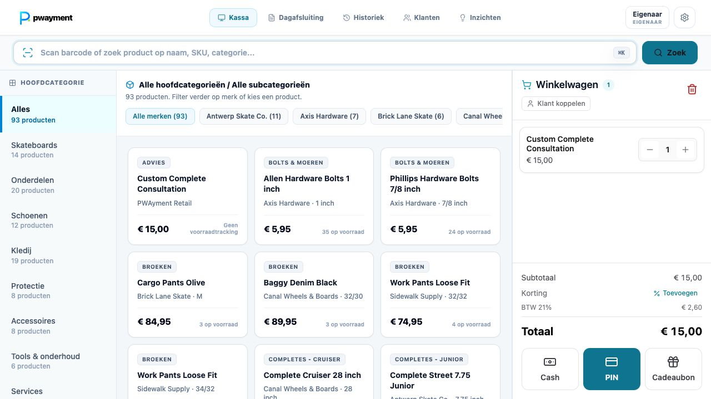
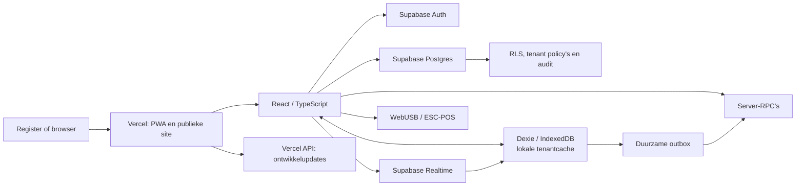

# PWAYMENT Retail Intelligence

<p align="center">
  
</p>

<p align="center">
  Een offline-first retailplatform voor Belgische winkels: POS, voorraad, klanten,
  cadeaubonnen, webshop, herstellingen, personeelsplanning en retail intelligence
  in één operationele omgeving.
</p>

<p align="center">
  <a href="https://github.com/kevinb42O/PWAYMENT_RETAIL/actions/workflows/ci.yml"></a>
</p>



## Inhoud

- [Platform](#platform)
- [Productiearchitectuur](#productiearchitectuur)
- [Modules](#modules)
- [Routes](#routes)
- [Lokale ontwikkeling](#lokale-ontwikkeling)
- [Configuratie](#configuratie)
- [Data, synchronisatie en veiligheid](#data-synchronisatie-en-veiligheid)
- [Kwaliteit en release](#kwaliteit-en-release)
- [Hardware](#hardware)
- [Projectstructuur](#projectstructuur)

## Platform

PWAYMENT is een multi-tenant retailplatform. Elke winkel werkt met een eigen
Supabase-account, tenant, medewerkers, registers, catalogus, transacties en
operationele configuratie. De webapp wordt op Vercel aangeboden; Supabase vormt
de centrale data- en autorisatielaag. Op elk register houdt de PWA een lokale,
offline bruikbare operationele cache bij.

De kernflows zijn niet afhankelijk van demo-data of browser-only gebruikers:

- e-mail/wachtwoord-authenticatie via Supabase Auth, registratie,
  e-mailbevestiging, uitnodiging en wachtwoordherstel;
- winkelprovisioning bij registratie, profielen, winkel-lidmaatschappen en
  owner-, manager- en cashierrollen;
- server-side tenantisolatie met RLS, policy's en gecontroleerde RPC-functies;
- realtime updates tussen registers plus een duurzame synchronisatiewachtrij
  voor lokaal ontstane wijzigingen;
- plan-, trial-, feature- en limietcontrole vanuit de centrale
  entitlementlaag;
- een apart Platform Console-oppervlak voor operationeel beheer, releases,
  tenants, supporttoegang, integratieruns en incidenten.

## Productiearchitectuur



Supabase is de gedeelde, centrale tenantlaag. IndexedDB is geen losstaande
productiedatabase: het is de lokale cache, offline transactiecontext en
herstelwachtrij van een register. Bij een geldige sessie hydrateert de app de
actieve winkel vanuit Supabase, verwerkt zij realtime-wijzigingen en levert zij
wachtende mutaties veilig af zodra een verbinding terug is.

De repository bevat momenteel 72 versiebeheerde Supabase-migraties. De lokale
migratiehistoriek is op **23 augustus 2026** gecontroleerd en komt volledig
overeen met de gekoppelde remote database.

## Modules

### POS, betaling en documenten

- Snelle productzoeker, keyboard-wedge barcodescanning, winkelmand,
  gesuspendeerde mandjes, lijnnotities en modifiers.
- Cash, geregistreerde kaartbetaling, cadeaubon en split tender; cash rounding
  en wisselgeld zijn zichtbaar op de bon en in de historiek.
- Managergoedkeuring voor kortingen en gevoelige kassahandelingen.
- Idempotente verkoop, server- en client-side voorraadcontrole, auditspoor en
  transactie-, tender- en merchant-snapshots.
- Gedeeltelijke retouren met reden, scanbare retourticketcode, gelinkte
  correctietransactie en voorraadherstel.
- Thermische bon, factuurpreview en PDF-documenten; klant- en factuurgegevens
  kunnen tijdens de flow worden vastgelegd.
- Dagafsluiting met kasreconciliatie, betaalmix, omzet, brutomarge,
  kortingen, BTW-uitsplitsing, controleerbare rapportdetails en hashketen.

Mollie In-person Payments is de primaire kaartterminalintegratie. De POS maakt
de betaling server-side aan, volgt de providerstatus en boekt de verkoop pas na
`paid`. Cash, cadeaubonnen en gesplitste betalingen blijven ondersteund.

### Catalogus, voorraad en aankoop

- Producten, categorieën, families, varianten, optiecombinaties, SKU's,
  meerdere identifiers en barcodes.
- Verkoopprijs, kostprijs, prijsniveaus, BTW van 0%, 6%, 12% en 21%, merk,
  leverancier, eigen velden, voorraad en minimumvoorraad.
- Productimport/-export, validatie, barcode-etiketten en labelprint.
- Voorraadbewegingen voor verkoop, retour, telling/correctie,
  webshopreservering, vrijgave en ontvangst.
- Voorraadtempo, days of cover, stockout-signalen, seizoens- en
  vraagprognoses, besteladvies en purchase orders met gedeeltelijke ontvangst.
- Gecontroleerde catalogus- en klantmigratie met activatiebewijs en een
  beperkte undo-periode vóór de eerste echte activiteit.

### Klanten, loyaliteit en cadeaubonnen

- Klantprofielen met contactgegevens, notities, aankoop- en retourhistoriek,
  bezoekfrequentie, omzet en klantwaarde.
- Zoeken, segmenteren en sorteren op gedrag, activiteit en datakwaliteit.
- Loyalty-instellingen, puntenregels, VIP-niveaus en acties.
- Cadeaubonnen uitgeven, opwaarderen, blokkeren, heractiveren en besteden;
  elke mutatie bewaart saldo vóór/na, reden en een controleerbare ledger.

### Webshop en publieke journeys

- Publieke storefront op `/shop`, gevoed door de centrale winkel- en
  catalogusdata.
- Branding, thema, hero, productinhoud, zichtbaarheid, uitgelichte producten,
  coupons, verzending, gratis-verzenddrempel, afhalen, subdomein en domein-
  configuratie.
- Server-side ordercreatie, voorraadreservering, orderregels en een
  verwerkingsflow voor bevestigen, verwerken, verzenden, afhalen en annuleren.
- Publieke product-, prijs-, sector-, resource-, contact- en demojourneys.
  Contact- en demoformulieren en publieke analytics worden centraal opgeslagen.

### Herstellingen en team

- ServiceDesk voor intake, toestel- en serienummergegevens, conditie,
  accessoires, diagnose, kosten, voorschot, status, interne notities en
  leveranciersreferenties.
- Veilige, publieke opvolgpagina per trackingtoken zonder interne gegevens
  bloot te geven.
- Medewerkers, rollen, contracturen, beschikbaarheid, competenties,
  weekroosters en werkpatronen.
- Verlofsoorten, saldi, aanvragen, intrekken, PIN-gecontroleerde goedkeuring,
  roosterpublicatie en bezettingscontrole.

### Inzichten, integraties en platformbeheer

- Verkoop-, marge-, product-, categorie-, voorraad-, klant-, medewerker-,
  kortings-, betaalmix-, uur-, weekdag- en seizoensanalyses.
- Bewaarbare acties en aanbevelingen zonder automatische voorraad- of externe
  wijzigingen.
- Integration Hub met configuratie, status, operationele logs,
  deliverytimeline, test- en synchronisatieruns.
- Platform Console met tenantoverzicht, winkel- en abonnementbeheer,
  incidenten, releases, development updates, audits en tijdelijk,
  gelogd supportaccess.

## Routes

De app gebruikt route dispatch in `src/main.tsx`; Vercel levert voor
client-routes de SPA-fallback.

| Route | Oppervlakte |
| --- | --- |
| `/` | Publieke PWAYMENT-site |
| `/product`, `/pos`, `/inventory`, `/insights`, `/customers` | Product- en oplossingspagina's |
| `/webshop`, `/service-desk`, `/workforce`, `/integrations` | Modulepagina's |
| `/hardware`, `/offline`, `/security` | Technologie- en vertrouwenspagina's |
| `/pricing`, `/demo`, `/contact`, `/resources` | Commerciële en resourcepagina's |
| `/login`, `/register`, `/app` | Account, onboarding en retailomgeving |
| `/shop` en `/shop/*` | Publieke storefront |
| `/service/*` | Publieke serviceopvolging |
| `/customer-display` | Afzonderlijk klantenscherm |
| `/admin` | Platform Console voor bevoegde platformgebruikers |
| `/auth/set-password` | Uitnodigings- en password-recoveryflow |

## Lokale ontwikkeling

### Vereisten

- Node.js `>= 22.12.0`
- npm (de repository gebruikt `package-lock.json`)
- een moderne browser; Chromium is vereist voor WebUSB en de volledige
  Playwright-hardwareflow

```bash
git clone https://github.com/kevinb42O/PWAYMENT_RETAIL.git
cd PWAYMENT_RETAIL
npm ci
npm run dev
```

Open daarna:

- publieke site: [http://localhost:3000](http://localhost:3000)
- account en POS: [http://localhost:3000/app](http://localhost:3000/app)
- storefront: [http://localhost:3000/shop](http://localhost:3000/shop)

### Fixtures

Lokale fixtureaccounts bestaan uitsluitend in development-, presentatie- en
E2E-builds. Productie gebruikt Supabase Auth en echte store memberships.

| Rol | E-mail | PIN |
| --- | --- | --- |
| Eigenaar | `eigenaar@pwayment.be` | `123456` |
| Manager | `manager@pwayment.be` | `234567` |
| Kassamedewerker 1 | `kassa1@pwayment.be` | `111111` |
| Kassamedewerker 2 | `kassa2@pwayment.be` | `222222` |

Het fixturewachtwoord is `password123`. Gebruik deze gegevens nooit buiten de
expliciete fixturemodi.

## Configuratie

Gebruik lokaal `.env.local`. `VITE_*`-waarden worden in de browserbundle
opgenomen; plaats er daarom nooit secrets in.

```dotenv
VITE_SUPABASE_URL="https://your-project-ref.supabase.co"
VITE_SUPABASE_PUBLISHABLE_KEY="sb_publishable_your_key"
VITE_PUBLIC_WEBSHOP_IDENTIFIER="your-shop-subdomain"

# Alleen server-side instellen; nooit met VITE_ prefix.
GEMINI_API_KEY="your-rotated-server-secret"
GEMINI_PACE_MODEL="gemini-3.5-flash-lite"
# Optionele providerfallback wanneer Gemini niet is geconfigureerd.
OPENAI_API_KEY="sk-project-secret"
OPENAI_PACE_MODEL="gpt-5-nano"
SUPABASE_URL="https://your-project-ref.supabase.co"
SUPABASE_PUBLISHABLE_KEY="sb_publishable_your_key"
MOLLIE_API_KEY="test_your_mollie_api_key"
MOLLIE_TERMINAL_ID="term_your_test_terminal_id"

VITE_SEED_DEMO_PRODUCTS=false
VITE_AUTO_RESET_LEGACY_CATALOG=true
VITE_ENABLE_GIFT_CARD_PAYMENT=true
VITE_ENABLE_CSV_IMPORT=false
VITE_ENABLE_PACE_AI=true
```

| Variabele | Standaard | Betekenis |
| --- | --- | --- |
| `VITE_SUPABASE_URL` | — | URL van de Supabase-omgeving |
| `VITE_SUPABASE_PUBLISHABLE_KEY` | — | Publishable browser key; RLS beschermt de data |
| `VITE_PUBLIC_WEBSHOP_IDENTIFIER` | — | Subdomein of store-id voor de publieke webshop |
| `VITE_SEED_DEMO_PRODUCTS` | `false` | Seed uitsluitend een expliciet gemarkeerde demowinkel |
| `VITE_AUTO_RESET_LEGACY_CATALOG` | `true` | Herstel erkende legacycatalogus naar het actuele retailexemplaar |
| `VITE_ENABLE_GIFT_CARD_PAYMENT` | `true` | Kill switch voor cadeaubonbetaling |
| `VITE_ENABLE_CSV_IMPORT` | `false` | Kill switch voor CSV-import; export blijft beschikbaar |
| `VITE_ENABLE_PACE_AI` | `true` | Gebruikt de server-side AI-route voor contextuele antwoorden; zet op `false` voor volledig lokale werking |
| `VITE_PRESENTATION_BUILD` | `false` | Schakelt alleen presentatie-unlock en viewlinks in |
| `VITE_E2E_BUILD` | `false` | Schakelt alleen de geïsoleerde E2E-fixturemodus in |
| `GEMINI_API_KEY` | — | Geheime server-side Gemini-sleutel voor Pace; nooit met `VITE_` prefix of in browsercode zetten |
| `GEMINI_PACE_MODEL` | `gemini-flash-latest` | Standaard Gemini Flash-alias voor volledige Pace-vragen; lokale kennis blijft de fout- en offlinefallback |
| `OPENAI_API_KEY` | — | Optionele server-side fallbackprovider wanneer geen Gemini-sleutel is ingesteld |
| `OPENAI_PACE_MODEL` | `gpt-5-nano` | Optioneel OpenAI-model; alleen gebruikt wanneer Gemini niet geconfigureerd is |
| `SUPABASE_URL` | — | Server-side Supabase-URL voor sessievalidatie van Pace-verzoeken |
| `SUPABASE_PUBLISHABLE_KEY` | — | Publishable key waarmee de Pace-endpoint een gebruikerssessie bij Supabase valideert |
| `MOLLIE_API_KEY` | — | Geheime server-side Mollie test- of livesleutel; nooit met `VITE_` prefix |
| `MOLLIE_TERMINAL_ID` | automatische detectie | Optionele vaste terminal-ID die bij het API-profiel hoort |

## Data, synchronisatie en veiligheid

### Transactie- en synchronisatiegedrag

- Geldbedragen worden als integer eurocenten bewaard; BTW- en
  afrondingsberekeningen blijven uit floating-point paden.
- Checkout, retouren, cadeaubonmutaties, voorraadcorrecties, purchase orders,
  dagafsluitingen en webshoporders worden door server-RPC's en tenantregels
  gevalideerd.
- `clientRequestId`- en eventidentiteiten maken retries idempotent.
- Een lokale actie schrijft atomair naar de relevante Dexie-tabellen en de
  outbox. De worker levert FIFO af, gebruikt browser locks waar beschikbaar,
  retryt tijdelijke fouten en houdt permanente fouten zichtbaar als
  herstelwachtrij.
- Realtime-events actualiseren de lokale cache; een volledige tenant-hydratie
  beschermt tegen verouderde of onvolledige lokale context.
- Dagafsluiting blokkeert wanneer financiële ledger-items niet veilig kunnen
  worden gesynchroniseerd.

### Autorisatie en operationele controle

- Supabase Auth beheert sessies; profielen en winkel-lidmaatschappen bepalen
  de actieve tenant en rol.
- RLS begrenst lees- en schrijfrechten per winkel. Beveiligde RPC's toetsen
  rol, entitlement en payload voor kritieke mutaties.
- Auditregels, voids, kassashifts, cadeaubongebeurtenissen, voorraadbewegingen
  en rapportdetails vormen het operationele spoor.
- Platform-supporttoegang is tijdelijk, redengebonden en auditeerbaar.
- De app registreert privacyveilige synchronisatie- en platformgezondheid voor
  herstel en incidentopvolging.

## Kwaliteit en release

### Scripts

| Commando | Doel |
| --- | --- |
| `npm run dev` | Vite developmentserver op `0.0.0.0:3000` |
| `npm run build` | Productiebundle, PWA en SPA-worker bouwen |
| `npm run preview` | De laatste productiebuild lokaal bekijken |
| `npm run lint` | TypeScript controleren |
| `npm run test` | Vitest-suite uitvoeren |
| `npm run test:coverage` | Tests met V8-coverage uitvoeren |
| `npm run test:e2e` | Desktop- en mobiele Playwright-flows uitvoeren |
| `npm run check:site` | Publieke routes en centrale prijscatalogus valideren |
| `npm run check:bundle` | JavaScript-, CSS- en assetbudgetten bewaken |
| `npm run check:security` | Falen vanaf high-severity dependencyrisico's |
| `npm run check:supabase-release` | Productie-frontend en gekoppelde Supabase-migraties vergelijken |
| `npm run check` | Typecheck, coverage, productiebuild, site- en bundlegates combineren |

De testset dekt onder meer checkout en rollback, retouren, cadeaubonnen,
cash rounding, BTW, voorraad, migraties, synchronisatie, realtime-mapping,
webshoporders, workforce, klantenscherm, toegankelijkheid, mobile UX,
authenticatie en kritieke kassaflows.

### CI en Vercel

GitHub Actions voert op pull requests en pushes naar `main` de quality gates uit
op Node 22.12 en 24, gevolgd door Chromium/Playwright. Een succesvolle
`main`-run triggert de productie-workflow: die haalt de Vercel-
productieconfiguratie op, controleert de Supabase-target en migratiehistoriek,
bouwt het geverifieerde revision en publiceert precies dat prebuilt artifact.

De Vercel-configuratie bewaart de app shell, `index.html` en service worker
zonder cache, en serveert gehashte assets immutable. De PWA-service worker is
alleen actief in een echte productiebuild; development-, presentatie- en
E2E-builds ruimen bestaande workers en caches op om stale bundles te vermijden.

## Hardware

### Mollie betaalterminal

De knop **Kaart** gebruikt Mollie Point of Sale (`method=pointofsale`). Activeer
Point of Sale in het Mollie-profiel en configureer `MOLLIE_API_KEY` server-side.
`MOLLIE_TERMINAL_ID` is alleen nodig om een specifieke terminal vast te zetten;
anders wordt de eerste beschikbare profielterminal automatisch gebruikt. Met een `test_`-sleutel en de virtuele
testterminal toont de betaalmodal een link om `paid`, `canceled` of `failed` te
simuleren. De kassa bewaart de Mollie-betalingsreferentie bij de lokale én
centrale transactie en kan een reeds betaalde maar nog niet geboekte verkoop veilig
opnieuw boeken met dezelfde checkout-idempotentiesleutel.

### Scanner en printer

Keyboard-wedge scanners werken als toetsenbordinvoer. De POS buffert snelle
scanreeksen en zoekt eerst exact op barcode, daarna op SKU. De directe
printerlaag gebruikt WebUSB en raw ESC/POS, gericht op Epson TM-series en
compatibele USB-printers.

WebUSB vereist Chromium, HTTPS of `localhost`, een expliciete gebruikersactie
en een printer die niet door een andere applicatie exclusief is geclaimd.
Zonder WebUSB blijft de rest van de webapp beschikbaar.

### Klantenscherm

Het klantenscherm is een afzonderlijke route en runtime. De kassa kan een
opt-in sessie publiceren; het scherm toont de live mand, bedragen en een
welkomststatus zonder kostprijzen, interne notities of klantdetails te delen.

## Projectstructuur

```text
.
├── .github/workflows/        # quality gates en gecontroleerde productierelease
├── api/                      # Vercel serverless endpoints
├── e2e/                      # Playwright-scenario's
├── public/                   # branding, PWA-manifest en publieke assets
├── scripts/                  # release-, verificatie- en assettools
├── src/
│   ├── admin/                # Platform Console en platform-RPC client
│   ├── auth/                 # Supabase Auth, onboarding en sessieboot
│   ├── billing/              # plan- en entitlementlaag
│   ├── components/           # POS, beheer en operationele modules
│   ├── customer-display/     # losstaand klantenscherm
│   ├── db/                   # lokale tenantcache, migraties en outbox
│   ├── migration/            # gecontroleerde data-overname
│   ├── onboarding/           # winkelconfiguratie
│   ├── public/               # publieke website en storefront journeys
│   ├── services/             # Supabase sync, realtime, checkout en domeinservices
│   ├── store/                # Zustand UI- en domeinstores
│   └── workforce/            # planning- en verlofdomein
├── supabase/migrations/      # versiebeheerde schema-, RLS- en RPC-migraties
├── vercel.json               # headers en SPA-rewrites
├── playwright.config.ts
└── package.json
```

## Aanvullende documentatie

- [`COMPLIANCE-READINESS.md`](COMPLIANCE-READINESS.md) — juridische
  productievelden, retentie/offboarding, subverwerkers en de releasegate.
- [`AUDIT.md`](AUDIT.md) — historische audit van een eerdere POS-fase. De
  actuele implementatie, migraties en tests zijn de bron van waarheid voor de
  huidige productiestatus.
