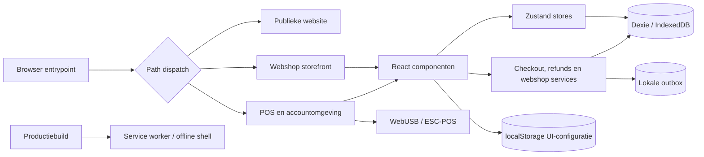

# PWAYMENT Retail Intelligence

<p align="center">
  
</p>

<p align="center">
  Een offline-first retailplatform voor Belgische winkels: publieke website, POS,
  voorraad, klanten, cadeaubonnen, webshop en retail intelligence in één React-app.
</p>

<p align="center">
  <a href="https://github.com/kevinb42O/PWAYMENT_RETAIL/actions/workflows/ci.yml"></a>
</p>

> [!IMPORTANT]
> Dit repository is een actieve ontwikkel- en demonstratiebuild (`0.1.0`), geen
> afgerond SaaS- of fiscaal kassaproduct. De kern van de lokale POS werkt in de
> browser, maar er is nog geen productiebackend, centrale synchronisatie,
> echte payment-provider, e-mailservice of live integratielaag. Lees
> [Productiestatus](#productiestatus) voordat je dit buiten een testomgeving inzet.


## Inhoud

- [Wat zit er in PWAYMENT?](#wat-zit-er-in-pwayment)
- [Wat is echt en wat is demo?](#wat-is-echt-en-wat-is-demo)
- [Snel starten](#snel-starten)
- [Lokale ontwikkelaccounts](#lokale-ontwikkelaccounts)
- [Routes](#routes)
- [Architectuur](#architectuur)
- [Data en financiële waarborgen](#data-en-financiële-waarborgen)
- [Configuratie en feature flags](#configuratie-en-feature-flags)
- [Scripts](#scripts)
- [Tests en CI](#tests-en-ci)
- [Hardware en browserondersteuning](#hardware-en-browserondersteuning)
- [Projectstructuur](#projectstructuur)
- [Build en hosting](#build-en-hosting)
- [Productiestatus](#productiestatus)

## Wat zit er in PWAYMENT?

### POS en checkout

- Productcatalogus met categorie, subcategorie, merk, leverancier, variant,
  SKU, barcode, kostprijs, verkoopprijs, BTW, voorraad en minimumvoorraad.
- Snelle productzoeker en ondersteuning voor keyboard-wedge barcodescanners.
- Winkelmand met aantallen, lijnnotities, modifiers en manager-goedgekeurde
  kortingen.
- Betaling met cash, PIN, cadeaubon of een split van cadeaubon met cash/PIN.
- Cash ontvangen bedrag en wisselgeld op ticket en in transactiehistoriek.
- Idempotente checkout: een dubbelklik of retry met dezelfde request-ID maakt
  geen tweede verkoop.
- Atomaire verwerking van transactie, voorraad, klantbezoek, cadeaubonsaldo,
  auditlog, outbox en voorraadbewegingen.
- Gedeeltelijke retouren met verplichte reden, koppeling naar de oorspronkelijke
  verkoop, negatieve correctietransactie en voorraadherstel.
- Bonweergave, factuurpreview en PDF-download vanuit de historiek.

### Catalogus en voorraad

- Producten en categorieën aanmaken, aanpassen, archiveren en herstellen.
- Prijzen worden als integer eurocenten opgeslagen; geen floating-point geld in
  de transactielaag.
- CSV-export en optionele CSV-import met validatie van kolommen, bedragen,
  BTW-tarieven, dubbele SKU's en dubbele barcodes.
- Barcode-etiketten en productlabels.
- Voorraadbewegingen voor POS-verkoop, retouren, webshopreserveringen,
  vrijgave en ontvangst van bestellingen.
- Verkooptempo, days-of-cover, stockout-prognose, trend en confidence per
  product.
- Besteladvies en leveranciersgebonden purchase-orderconcepten, inclusief
  gedeeltelijke ontvangst.

### Klanten en cadeaubonnen

- Klantendatabase met contactgegevens, notities, bezoeken, omzet en
  aankoopgeschiedenis.
- Uitgebreid zoeken, filteren en sorteren op activiteit, aankoopgedrag,
  contactkwaliteit, omzet en cadeaubonrelatie.
- Klant aan een actieve verkoop koppelen.
- Cadeaubonnen uitgeven, opwaarderen, blokkeren en opnieuw activeren.
- Append-only cadeaubonhistoriek met saldo vóór en na elke gebeurtenis.
- Facturen en transactiedetails vanuit het klantprofiel.
- Loyalty-instellingen en puntenconcept als lokale productflow.

### Historiek, rapportage en retail intelligence

- Verkoop-, retour-, Z-rapport- en auditlogoverzicht.
- CSV- en JSON-export van verkopen, rapporten en auditregels.
- Z-afsluiting met kasreconciliatie, betaalmix, omzet, kostprijs, brutowinst,
  korting en Belgische BTW-uitsplitsing.
- SHA-256 hashketen tussen opeenvolgende Z-rapporten en verificatie van de
  opgeslagen hashpayload.
- Analyses voor omzet, marge, producten, categorieën, betaalmix, medewerkers,
  kortingen, weekdagen en verkoopuren.
- Voorraadprognoses met korte en lange verkoophistoriek, intermitterende vraag,
  trends en seizoenscorrectie.
- Klantretentie, terugkeer, klantwaarde en datakwaliteit.
- Acties bewaren, uitstellen of afronden zonder automatisch voorraad of externe
  systemen te wijzigen.

### Webshop

- Publieke storefront op `/shop`, gevoed door dezelfde lokale productcatalogus.
- Thema, branding, hero, productbeelden, beschrijvingen, varianten en
  zichtbaarheid instellen.
- Uitgelichte producten, coupons, verzendkosten, gratis-verzenddrempel en
  afhalen in de winkel.
- Checkout met idempotente ordercreatie en atomaire voorraadreservering.
- Bestelbeheer voor bevestigen, verwerken, verzenden, afhalen en annuleren.
- Annuleren herstelt gereserveerde voorraad; verzenden of afhalen committeert de
  reservering.

De huidige webshopgateway is bewust een IndexedDB-demo. Betalingen, e-mails en
refunds worden gesimuleerd; zie [Wat is echt en wat is demo?](#wat-is-echt-en-wat-is-demo).

### Publieke website en accountomgeving

- Responsive marketingwebsite met product-, sector-, prijs-, resource-, demo-
  en contactpagina's.
- Login en registratie met e-mail/wachtwoord of lokale medewerkers-PIN.
- Profielomgeving voor winkelgegevens, abonnementsschermen, catalogus,
  webshop, loyalty, integraties en hardware.
- PWA-manifest, offline app-shell en automatisch bijgewerkte service worker in
  productiebuilds.

## Wat is echt en wat is demo?

| Onderdeel | Huidige implementatie | Status |
| --- | --- | --- |
| POS-verkoop, split tender en voorraad | Atomaire Dexie-transactie in de browser | Werkend, lokaal per browserprofiel |
| Retouren | Gelinkte negatieve transactie met voorraad- en klantcorrectie | Werkend, lokaal per browserprofiel |
| Klanten en cadeaubonnen | IndexedDB met audit- en cadeaubonledger | Werkend, lokaal per browserprofiel |
| Z-rapporten | Lokale afsluiting, kasreconciliatie en SHA-256 hashketen | Werkend, nog zonder externe fiscale module |
| Retail intelligence | Berekend uit lokale transacties, producten en klanten | Werkend op aanwezige lokale data |
| Thermische bonprinter | Raw ESC/POS via WebUSB | Werkend in ondersteunde Chromium-browsers en met compatibele hardware |
| Publieke website | Volledige client-side website | Werkend; formulieren verzenden nog niets naar een backend |
| Webshopcatalogus en orderflow | Lokale storefront + IndexedDB-demogateway | Demo; geen echte payment capture, mail of serverorder |
| Integratiebeheer | Persistente configuratie-UI en gesimuleerde tests/sync | Demo; er worden geen leverancier-, boekhouding- of commerce-API's aangeroepen |
| Webhooks en REST API-sleutels | Lokale configuratierecords en gesimuleerde aflevering | Demo; er draait geen REST API of webhook-deliveryservice |
| Login en rollen | Lokale gebruikers in IndexedDB, PBKDF2-SHA-256 credentials | Development scaffold; geen server-side sessies of centraal accountbeheer |
| Billing, abonnementen en licenties | Supabase-planmatrix, trials en feature/limietgates; owner kan tijdelijk alle plannen simuleren | Testfase; entitlement enforcement actief, nog geen facturatieprovider of echte betaling |
| Outbox | Checkout en webshop schrijven events naar IndexedDB | Nog geen worker/backend die de queue aflevert |

## Snel starten

### Vereisten

- Node.js `>= 22.12.0`
- npm (de repository gebruikt `package-lock.json`)
- Een moderne browser; Chromium wordt aanbevolen voor de volledige hardwareflow

### Installeren en starten

```bash
git clone https://github.com/kevinb42O/PWAYMENT_RETAIL.git
cd PWAYMENT_RETAIL
npm ci
npm run dev
```

Open daarna:

- Publieke website: [http://localhost:3000](http://localhost:3000)
- POS/accountomgeving: [http://localhost:3000/app](http://localhost:3000/app)
- Webshop: [http://localhost:3000/shop](http://localhost:3000/shop)

De ontwikkelserver luistert bewust op alle lokale interfaces en gebruikt een
strikte poort `3000`. Als die poort bezet is, stopt Vite met een fout in plaats
van ongemerkt een andere poort te kiezen.

## Lokale ontwikkelaccounts

Tijdens `npm run dev` worden testmedewerkers aangemaakt als de lokale database
ze nog niet bevat.

| Rol | E-mail | PIN |
| --- | --- | --- |
| Eigenaar | `eigenaar@pwayment.be` | `123456` |
| Manager | `manager@pwayment.be` | `234567` |
| Kassamedewerker 1 | `kassa1@pwayment.be` | `111111` |
| Kassamedewerker 2 | `kassa2@pwayment.be` | `222222` |

Het fixturewachtwoord voor deze lokale accounts is `password123`.

> [!WARNING]
> Deze accounts zijn uitsluitend testfixtures voor development, presentatie- en
> E2E-builds. Gebruik ze nooit als productiecredentials. De huidige auth is
> client-side en vervangt geen backend-identiteit, sessiebeheer of centrale
> autorisatie.

## Routes

Er is geen externe routerlibrary. `src/main.tsx` kiest de applicatie-oppervlakte
op basis van `window.location.pathname`; de host moet daarom voor HTML-routes
naar `index.html` terugvallen.

| Route | Oppervlakte |
| --- | --- |
| `/` | Publieke PWAYMENT-website |
| `/product`, `/pos`, `/inventory`, `/insights`, `/customers`, `/webshop`, `/integrations` | Publieke featurepagina's |
| `/pricing`, `/demo`, `/contact`, `/resources` | Publieke commerciële pagina's |
| `/login`, `/register`, `/app` | Account- en POS-omgeving |
| `/shop` en `/shop/*` | Publieke webshop/storefront |

De POS gebruikt interne view-state voor Kassa, Dagafsluiting, Historiek,
Klanten, Inzichten, Beheer en Profiel. In development en speciale
presentatiebuilds kan `?presentation=1&view=<view>` rechtstreeks een POS-view
openen. `?e2e=1` werkt uitsluitend in een build met `VITE_E2E_BUILD=true`.

## Architectuur

PWAYMENT is momenteel één browser-only React SPA. Er is geen applicatieserver of
database buiten de browser.



### Belangrijkste technologieën

| Laag | Technologie |
| --- | --- |
| UI | React 19, TypeScript, Tailwind CSS 4, Motion, Lucide |
| Build | Vite 7, `vite-plugin-pwa` |
| App-state | Zustand 5 |
| Persistente operationele data | Dexie 4 bovenop IndexedDB |
| Runtimevalidatie | Zod |
| Documenten | jsPDF en jsPDF-AutoTable |
| Unit/integratie | Vitest 4, jsdom, fake-indexeddb |
| Browser/E2E | Playwright, Chromium, axe-core |
| Hardware | WebUSB en raw ESC/POS |

### Persistente data

De IndexedDB-database heet `PwaymentRetailPOS` en zit momenteel op schema v14.
Ze bevat onder andere:

- transacties, Z-rapporten, kassashifts, voids en auditregels;
- producten, categorieën, voorraadbewegingen en purchase orders;
- klanten, cadeaubonnen en cadeaubongebeurtenissen;
- gebruikers, business actions en webshoporders;
- een lokale outbox voor toekomstige backend-synchronisatie.

Een eenmalige migratie kan retaildata uit de oude gedeelde database
`POSDatabase` kopiëren. De migratie filtert incompatibele horeca-/BTW-data en
voorkomt dat projecten op dezelfde localhost-origin elkaars data blijven lezen.

Zustand bewaart daarnaast tijdelijke of configuratieve UI-state in
`localStorage`, zoals de open winkelmand, het thema, webshopinstellingen,
merchantprofiel en integratieconfiguratie.

## Data en financiële waarborgen

De code behandelt de browserdatabase als de huidige transactiegrens. Belangrijke
invarianten:

- Geldbedragen worden in integer eurocenten opgeslagen en verdeeld.
- De huidige BTW-engine accepteert uitsluitend `12%` en `21%`; andere tarieven
  blokkeren checkout in plaats van stilzwijgend in een verkeerde bucket te
  vallen.
- Checkout valideert de actuele voorraad en cadeaubonsaldi opnieuw binnen
  dezelfde database-transactie.
- Een `clientRequestId` is uniek voor POS- en webshopcheckout, zodat retries
  idempotent zijn.
- Verkoop, voorraadmutatie, cadeaubondebet, klanttotalen, audit en outbox committen
  samen of helemaal niet.
- Retouren kunnen niet meer stuks terugboeken dan er van de oorspronkelijke
  regels nog retourneerbaar zijn.
- Cadeaubonnen zijn als liability gemodelleerd en hebben een aparte,
  controleerbare eventhistoriek.
- Transacties bewaren product-, tender- en merchant-snapshots voor historische
  documenten.
- Nieuwe Z-rapporten linken naar de vorige hash en kunnen opnieuw worden
  geverifieerd.

Deze waarborgen maken de lokale datalaag robuuster, maar zijn geen vervanging
voor server-side controle, back-ups, payment-providerreconciliatie, boekhouding
of Belgische fiscale certificering.

## Configuratie en feature flags

Maak indien nodig een lokale `.env.local`; `.env*` wordt genegeerd door Git,
behalve `.env.example`.

```dotenv
VITE_SEED_DEMO_PRODUCTS=false
VITE_AUTO_RESET_LEGACY_CATALOG=true
VITE_ENABLE_GIFT_CARD_PAYMENT=true
VITE_ENABLE_CSV_IMPORT=false
```

| Variabele | Standaard | Betekenis |
| --- | --- | --- |
| `VITE_SEED_DEMO_PRODUCTS` | `false` | Seed de catalogus uitsluitend voor een expliciet gemarkeerde demowinkel |
| `VITE_AUTO_RESET_LEGACY_CATALOG` | `true` | Vervang de herkende legacycatalogus door de actuele retaildata |
| `VITE_ENABLE_GIFT_CARD_PAYMENT` | `true` | Toon en activeer cadeaubonbetaling in de POS |
| `VITE_ENABLE_CSV_IMPORT` | `false` | Schakel CSV-import in; export blijft beschikbaar |
| `VITE_PRESENTATION_BUILD` | `false` | Sta presentatie-unlock en directe viewlinks toe in een expliciete build |
| `VITE_E2E_BUILD` | `false` | Sta de geïsoleerde E2E-fixturemodus toe |

Alle `VITE_*`-waarden worden tijdens de build in de client verwerkt. Zet er dus
nooit secrets in.

## Scripts

| Commando | Doel |
| --- | --- |
| `npm run dev` | Vite developmentserver op `0.0.0.0:3000` |
| `npm run build` | Productiebundle maken en de Sites SPA-fallbackworker genereren |
| `npm run preview` | De laatste productiebuild lokaal bekijken |
| `npm run clean` | `dist/` verwijderen |
| `npm run lint` | TypeScript controleren met `tsc --noEmit` |
| `npm test` | Alle Vitest-tests één keer uitvoeren |
| `npm run test:watch` | Vitest in watchmodus starten |
| `npm run test:coverage` | Tests met V8-coveragerapport uitvoeren |
| `npm run test:e2e` | Desktop- en mobiele Playwright-scenario's uitvoeren |
| `npm run test:e2e:headed` | Playwright zichtbaar uitvoeren |
| `npm run test:e2e:debug` | Playwright debugger starten |
| `npm run check:bundle` | JavaScript-, CSS- en totale assetbudgetten bewaken |
| `npm run check:security` | `npm audit` laten falen vanaf high severity |
| `npm run check` | Typecheck, coverage, productiebuild en bundlebudgetten combineren |

## Tests en CI

### Lokaal

De complete codekwaliteitssuite:

```bash
npm run check
```

Voor de browserflows moet Chromium één keer geïnstalleerd zijn:

```bash
npx playwright install chromium
npm run test:e2e
```

De tests dekken onder meer:

- geldafronding, kortingstoewijzing en Belgische BTW;
- atomaire en idempotente checkout, split tenders en rollback bij write failures;
- gedeeltelijke retouren en voorraadherstel;
- cadeaubonuitgifte, saldohistoriek en redemption;
- CSV round-trips, duplicate detection en veilige partial-file-import;
- legacy IndexedDB-migraties;
- voorraadforecasting, purchase orders, seizoenen en retail intelligence;
- webshoporderreservering, annulering, afhalen en idempotentie;
- authenticatie, reload-locking, desktop/mobile flows en accessibility.

### GitHub Actions

`.github/workflows/ci.yml` voert bij pushes naar `main` en pull requests uit:

1. `npm ci` op Node `22.12.0` en Node `24.x`;
2. dependency-audit vanaf high severity;
3. TypeScript-controle;
4. unit-, financiële en migratietests met coverage gates;
5. productiebuild en bundlebudgetten;
6. Playwright-flows in desktop- en mobiele Chromium;
7. upload van coverage en Playwright-diagnostiek als artifacts.

De ingestelde minimale coverage is 75% statements, 65% branches, 70%
functions en 78% lines.

## Hardware en browserondersteuning

### Barcodescanner

Keyboard-wedge scanners werken als toetsenbordinput. De POS buffert snelle
toetsaanslagen, zoekt eerst exact op barcode en daarna op SKU. Handmatig zoeken
kan op naam, SKU, barcode, categorie, merk, leverancier en variant.

Sneltoetsen in de POS:

- `Ctrl/Cmd + K`: focus op scan/zoekveld;
- `Alt + 1`: Kassa;
- `Alt + 2`: Dagafsluiting;
- `Alt + 3`: Historiek;
- `Alt + 4`: Klanten;
- `Alt + 5`: Inzichten;
- `Alt + 6`: Beheer voor owner/manager.

### Thermische printer

De printerlaag stuurt raw ESC/POS-bytes via WebUSB. De implementatie is gericht
op Epson TM-series en compatibele USB-printers, met een generieke USB
printerclass/endpointdetectie.

WebUSB vereist:

- Chrome of een andere compatibele Chromium-browser;
- `https://` of `localhost`;
- een expliciete gebruikersactie om USB-toestemming te geven;
- een printer die niet exclusief door een andere driver of applicatie geclaimd
  is.

De rest van de webapp kan in andere moderne browsers werken, maar de directe
USB-printerflow niet in browsers zonder WebUSB.

## Projectstructuur

```text
.
├── .github/workflows/ci.yml      # quality gates en browserflows
├── .openai/hosting.json          # gekoppeld Sites-project
├── docs/                         # product- en websitedocumentatie
├── e2e/                          # Playwright-scenario's
├── public/                       # branding, PWA-manifest en website-assets
├── scripts/                      # buildworker en bundlebudgetcontrole
├── src/
│   ├── auth/                     # lokale login, rollen en credentials
│   ├── components/               # POS, klanten, inzichten, webshop en beheer
│   ├── config/                   # feature flags
│   ├── data/                     # retailcategorieën en seeddata
│   ├── db/                       # Dexie-schema, migratie en outbox
│   ├── hooks/                    # WebUSB printerhook
│   ├── public/                   # publieke marketingwebsite
│   ├── schemas/                  # Zod-schemas
│   ├── services/                 # checkout, refunds en webshopgateway
│   ├── store/                    # Zustand-stores
│   ├── types/                    # domeintypes
│   └── utils/                    # geld, BTW, rapporten, analytics en printing
├── AUDIT.md                      # historische POS-audit en remediationnotities
├── playwright.config.ts
├── vite.config.ts
└── package.json
```

## Build en hosting

```bash
npm run build
npm run preview
```

De build schrijft de statische assets naar `dist/` en genereert daarnaast
`dist/server/index.js`. Die worker vraagt eerst het statische asset op en valt
voor onbekende HTML-routes terug op `/index.html`, zodat directe bezoeken aan
bijvoorbeeld `/app`, `/shop` of `/pricing` werken.

De repository is gekoppeld aan een OpenAI Sites-project via
`.openai/hosting.json`. Productiepublicatie gebeurt uitsluitend vanuit de
GitHub Actions-workflow **Production deployment**, nadat de volledige
workflow **Quality gates** voor dezelfde `main`-commit geslaagd is. De
rechtstreekse Vercel-deploy bij een push naar `main` staat daarom uit.

Voor de eerste publicatie moeten in GitHub de repositorysecrets
`VERCEL_TOKEN`, `VERCEL_ORG_ID` en `VERCEL_PROJECT_ID` staan. Bescherm ook de
GitHub-environment `production` met de gewenste reviewers; de workflow wacht
dan op die goedkeuring, maar kan nooit vóór de groene quality- en E2E-gates
publiceren.

De PWA-service worker wordt alleen in echte productiebuilds geregistreerd.
Development-, presentatie- en E2E-modi verwijderen bestaande workers en caches
om stale bundles tijdens testen te voorkomen.

## Productiestatus

Wat nog nodig is voor een echte multi-user productieomgeving:

- een backend als centrale bron voor accounts, winkels, registers, catalogus,
  transacties en webshoporders;
- veilige server-side sessies, password reset, uitnodigingen, tenantisolatie en
  autorisatie per API-call;
- synchronisatie, conflictstrategie, monitoring, back-ups en herstelprocedures;
- echte PSP/terminalintegraties, payment lifecycle en providerreconciliatie;
- e-maildelivery, webhookdelivery, REST API en geplande integraties;
- facturatie, subscription lifecycle en server-side entitlement enforcement;
- productiebeheer van secrets; geen externe credentials in browserstorage;
- volledige hardware- en offline-releasegate op de doeltoestellen;
- juridische/fiscale beoordeling voor Belgische inzet, inclusief toepasselijke
  kassawetgeving, facturatie, privacy, bewaartermijnen en certificering;
- operationele verificatie dat rapporten, boekhouding, provider en uitbetalingen
  end-to-end reconciliëren.

`AUDIT.md` bevat een gedetailleerde audit van een eerdere codefase. Een deel van
de bevindingen is intussen opgelost (onder andere refunds, voorraadvalidatie,
registeridentiteit, cashreconciliatie en uitgebreidere Z-verificatie), maar het
document blijft nuttig als historische risicoanalyse en checklist. Beoordeel de
huidige code en tests als bron van waarheid voor de actuele implementatie.

## Aanvullende documentatie

- [`AUDIT.md`](AUDIT.md) — diepgaande financiële en operationele audit van de
  eerdere POS-fase.
- [`docs/PUBLIC-WEBSITE-MASTER-PLAN.md`](docs/PUBLIC-WEBSITE-MASTER-PLAN.md) —
  informatiearchitectuur, content- en implementatieplan voor de publieke site.

---

PWAYMENT is momenteel geoptimaliseerd voor Nederlandse (`nl-BE`) retailflows,
eurobedragen en de tijdzone `Europe/Brussels`.
