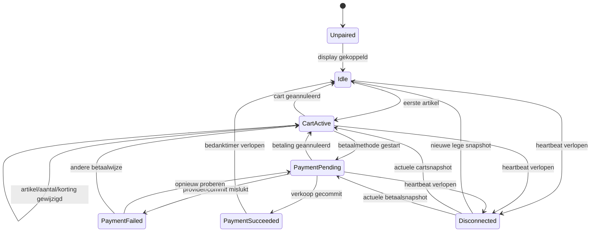
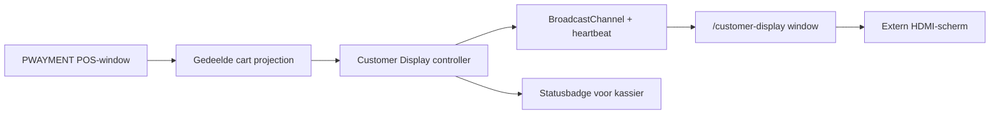
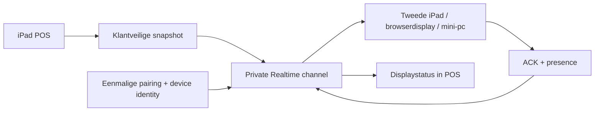

# PWAYMENT Customer Display — masterplan

> **Afbakening:** de lokale MacBook/HDMI-MVP bestaat; veilige pairing met een
> tweede toestel en echte winkel-/hardwareacceptatie blijven een latere fase.
> Zie [`../PROJECT-CONTEXT.md`](../PROJECT-CONTEXT.md) voor de actuele algemene
> status.

Status: architectuur- en uitvoeringsplan
Datum: 13 augustus 2026
Scope: klantgericht transactiescherm, idle content, MacBook + HDMI-proef,
iPad-haalbaarheid en productiepad

Implementatiestatus op 13 augustus 2026: de lokale MacBook/HDMI-MVP uit fase 1
is gebouwd. De module staat standaard uit, is alleen door de owner-rol te
activeren/configureren en is beschikbaar onder **Profiel → Hardware →
Klantenscherm**. De secure second-device/iPad-pairing uit fase 4 blijft een
latere productiefase.

## 1. Besluit in één minuut

PWAYMENT kan dit goed bouwen met de bestaande React-, Zustand-, IndexedDB- en
Supabase-architectuur. Voor de eerste proef is geen extra backend en geen tweede
computer nodig:

1. De MacBook blijft de kassa.
2. macOS gebruikt het HDMI-scherm als **uitgebreid bureaublad**, niet als spiegel.
3. PWAYMENT opent een tweede browservenster op `/customer-display`.
4. De kassa publiceert uitsluitend een klantveilige projectie van de actuele
   winkelwagen via `BroadcastChannel`.
5. Het klantvenster toont die projectie fullscreen op het HDMI-scherm.
6. Alles blijft lokaal werken zonder internet.

Dit is het aanbevolen eerste productpad. Het kan na een korte implementatiefase
veilig in de huidige demo worden getest.

Een iPad kan ook de kassa zijn, maar er zijn twee wezenlijk verschillende
scenario's:

- **iPad + extern HDMI-scherm op hetzelfde toestel:** mogelijk als uitgebreid
  scherm op een beperkte groep compatibele iPad Air/Pro-modellen met iPadOS 26
  en Stage Manager. Niet alle iPads kunnen twee verschillende appvensters over
  twee schermen tonen; veel combinaties spiegelen alleen.
- **iPad-kassa + tweede slim scherm/apparaat:** het robuuste productiepad. De
  klantdisplay draait in een tweede browser of PWA en wordt veilig met de kassa
  gekoppeld. Dit vermijdt de Apple-hardwarematrix, maar vereist voor realtime
  synchronisatie tussen apparaten een netwerktransport.

De productbeslissing moet daarom zijn:

> Bouw één Customer Display-product met meerdere transports. Ondersteun eerst
> hetzelfde toestel via HDMI, voeg daarna een veilig gepaard tweede toestel toe.
> Laat de UI en het datacontract in beide gevallen identiek.

## 2. Waarom dit meer is dan “een tweede winkelmandje”

Het scherm heeft drie banen van waarde, in vaste prioriteitsvolgorde:

1. **Transactietrouw:** de klant ziet onmiddellijk artikel, aantal, eenheidsprijs,
   lijnbedrag, korting, cadeaubon, totaal en betaalstatus.
2. **Betaalduidelijkheid:** alleen werkelijk aanvaarde betaalmethodes worden
   rustig en herkenbaar getoond.
3. **Commerciële waarde:** wanneer er geen verkoop bezig is, toont het scherm
   winkelbranding, eigen campagnes, loyalty, webshop of een digitale-bon-QR.

De derde baan mag de eerste twee nooit vertragen, verbergen of onduidelijk
maken. De kernbelofte is niet “reclame aan de kassa”, maar:

> De klant en kassier kijken naar dezelfde financiële waarheid.

Dat geeft PWAYMENT een sterk productverhaal:

- minder prijsdiscussies en correcties na betaling;
- fouten worden ontdekt vóór de transactie definitief is;
- zichtbare kortingen verhogen vertrouwen;
- betaalmogelijkheden zijn duidelijk vóór de betaalstap;
- idle tijd wordt een eigen, beheersbaar winkelkanaal;
- digitale bon, loyalty en webshop kunnen later zonder extra baliehardware
  worden aangeboden.

## 3. Productprincipes

### 3.1 Financiële waarheid boven decoratie

- De bedragen komen uit dezelfde centrale prijs- en btw-projectie als de kassa.
- Het klantenscherm berekent geen eigen totaal uit losse regels.
- Geld blijft integer eurocenten; formatteer met de bestaande `formatEUR`.
- De getoonde consumentenprijs is de eindprijs inclusief btw.
- Een verouderde of onzekere winkelwagen wordt nooit als actuele waarheid
  getoond.

### 3.2 Privacy by default

- Geen klantnaam, e-mail, telefoon, adres, klantnummer of aankoopgeschiedenis.
- Geen volledige cadeauboncode.
- Geen kaartnummer, laatste vier cijfers, terminalreferentie of technische
  providerfout.
- Geen interne lijnnotities.
- Geen kostprijs, marge, leverancier, voorraad of vrije `customFields`.
- Een optionele begroeting wordt hoogstens “Welkom terug”, nooit de naam.

### 3.3 Read-only en fail-open voor de kassa

- De display kan de cart of betaling nooit wijzigen.
- Displayuitval mag de kassaverkoop niet blokkeren.
- De kassier ziet wel een kleine status: verbonden, vertraagd of offline.
- Bij twijfel faalt het klantenscherm veilig: geen oud totaal, wel een neutrale
  reconnectstatus.

### 3.4 Snel en rustig

- Lokale wijziging zichtbaar in minder dan 250 ms; streefwaarde onder 100 ms.
- De laatste gescande regel krijgt een korte, subtiele highlight.
- Geen springende carrousel tijdens een transactie.
- Geen autoplay-audio.
- In idle maximaal drie campagnes, minimaal 10 seconden per campagne.

### 3.5 Hardware-onafhankelijk

De Customer Display React-UI weet niet of data via lokaal `BroadcastChannel`,
Supabase Realtime of later een native/LAN-relay aankomt. Een transportinterface
maakt deze paden uitwisselbaar.

## 4. Huidige PWAYMENT-code: wat al bruikbaar is

De codebase heeft veel van de noodzakelijke basis al:

- React 19 + TypeScript + Vite voor een aparte display-entry/route;
- Zustand `useStore` voor de actieve cart;
- stabiele `lineId` per winkelwagenregel;
- integer centen in `Product`, `Transaction` en checkout;
- `calculateTotals` als centrale btw- en totaalberekening;
- `withResolvedProductPrice` voor klantgroepsprijzen;
- cartkorting en cadeaubontoewijzingen;
- idempotente checkout met `clientRequestId`;
- offline lokale staat via IndexedDB/Zustand persistence;
- Supabase Realtime en tenantidentiteit voor een later tweede-apparaatpad;
- merchantprofiel voor winkelnaam en basisgegevens;
- een bestaande Hardware-sectie in Profiel;
- Playwright voor testen met twee gelijktijdige browserpagina's.

### 4.1 Code-specifieke valkuilen

#### De volledige cart mag nooit over de displaylijn

`OrderItem.product` bevat onder andere `costPriceCents`, `supplier`, voorraad en
`customFields`. `OrderItem.notes` kan interne tekst bevatten. Daarom is dit fout:

```ts
channel.postMessage(useStore.getState().cart);
```

Er moet een expliciete allowlist-DTO worden opgebouwd. Geen generieke spread,
geen “later filteren” in de ontvanger.

#### Prijsgroepprijzen moeten identiek blijven

`Cart.tsx` past `withResolvedProductPrice` toe op basis van de gekoppelde klant.
Een publisher die alleen `useStore.cart.orders` leest, kan daardoor een andere
prijs tonen dan de kassa. De cartprojectie moet uit `Cart.tsx` worden gehaald en
één gedeelde pure functie worden voor kassascherm, checkoutinput én display.

#### Betalingssucces kan door `clearCart()` worden overschreven

De huidige flow doet na checkout onder meer:

```ts
clearCart();
setReceipt(result.transaction);
```

Een naïeve cartpublisher zou hierdoor onmiddellijk “idle” tonen. Het display-
controller moet eerst een onveranderlijke, klantveilige succesprojectie van de
gecommitte transactie bewaren. Die heeft gedurende bijvoorbeeld acht seconden
voorrang op de nu lege cart.

#### “PIN” bewijst geen aanvaarde kaartmerken

De huidige tender `PIN` zegt niet automatisch dat Bancontact, Visa, Mastercard,
Apple Pay of betaalmethode X werkelijk actief is. De bestaande terminalkeuze in
de profiel-UI bevat nog gesimuleerde statussen. Betaallogo's op het klantenscherm
moeten uit een aparte, geverifieerde capabilityconfiguratie komen.

## 5. De volledige scherm-state-machine



### 5.1 UNPAIRED / SETUP

Alleen relevant voor een tweede apparaat of eerste lokale start.

Toont:

- PWAYMENT-logo;
- “Koppel dit klantenscherm aan een kassa”;
- zescijferige code-invoer of QR-pairing;
- apparaatnaam, bijvoorbeeld “Klantenscherm toonbank links”;
- geen winkel- of transactiedata vóór succesvolle koppeling.

### 5.2 IDLE

Doel: rustig welkom en één duidelijke commerciële boodschap.

Aanbevolen basislayout:

```text
┌──────────────────────────────────────────────────────────────────────┐
│ [Winkel-logo]                                        14:32           │
│                                                                      │
│      Grote eigen campagnefoto / merkkleur                            │
│      “Nieuwe collectie binnen”                                       │
│      Korte ondersteunende zin                       [optionele QR]    │
│                                                                      │
│ Welkom — we helpen je zo verder                                      │
├──────────────────────────────────────────────────────────────────────┤
│ Hier betaal je met:  Bancontact  Visa  Mastercard  Cash  Cadeaubon  │
└──────────────────────────────────────────────────────────────────────┘
```

Inhoudsvolgorde:

1. eigen winkelcampagne;
2. loyalty of cadeaubon;
3. webshop/afhaling;
4. neutrale winkelbranding als er geen actieve campagne is.

Niet in v1:

- advertentienetwerken van derden;
- gepersonaliseerde advertenties op basis van de herkende klant;
- video met geluid;
- nieuws, weer of generieke externe feeds;
- meer dan drie slides.

### 5.3 CART_ACTIVE

```text
┌───────────────────────────────────────┬──────────────────────────────┐
│ UW AANKOOP                            │ OVERZICHT                    │
│                                       │                              │
│ 2 × Product A                         │ Subtotaal          € 59,90  │
│     € 24,95 per stuk        € 49,90   │ Korting           − € 5,00  │
│                                       │ Cadeaubon         − € 10,00 │
│ 1 × Product B                         │                              │
│     Variant / modifier      € 10,00   │ NOG TE BETALEN               │
│                                       │ € 44,90                      │
│                                       │ incl. btw                    │
│                                       │                              │
│                                       │ [rustige winkelboodschap]    │
├───────────────────────────────────────┴──────────────────────────────┤
│ Hier betaal je met: Bancontact · Visa · Mastercard · Cash           │
└──────────────────────────────────────────────────────────────────────┘
```

Regels:

- totaal is visueel het grootste financiële element;
- toon aantal, productnaam, eventuele klantgerichte variant/modifier,
  eenheidsprijs en lijnbedrag;
- toon korting expliciet en positief leesbaar;
- cadeaubon alleen als bedrag, zonder code;
- toon “incl. btw”; btw-buckets kunnen in een secundair detail staan;
- de lijst scrollt automatisch naar de nieuwste regel, maar de gebruiker kan
  het scherm niet bedienen;
- bij veel regels blijft het totaal altijd vast zichtbaar;
- productfoto's zijn geen v1-vereiste en mogen financiële informatie nooit
  verdringen.

### 5.4 PAYMENT_PENDING

Toont:

- te betalen bedrag zeer groot;
- betaalwijze op generiek niveau;
- “Volg de instructies op de betaalterminal” bij kaart;
- “Ontvangen bedrag wordt ingevoerd” bij cash;
- een rustige progressindicatie zonder misleidende tijdsinschatting.

Nooit tonen:

- “Gelukt” vóór de transactie gecommit is;
- kaartdata;
- technische foutcodes;
- een nep-terminalstatus wanneer PWAYMENT de provider niet werkelijk bevraagt.

### 5.5 PAYMENT_FAILED

Toont:

- “Betaling niet gelukt” of “Betaling geannuleerd”;
- “Probeer opnieuw of kies een andere betaalwijze”;
- het nog te betalen bedrag;
- geen rood alarmscherm dat de winkelomgeving domineert;
- geen interne providerresponse.

Na een korte periode blijft de status zichtbaar totdat de kassier een volgende
actie start. Niet automatisch doen alsof er niets gebeurd is.

### 5.6 PAYMENT_SUCCEEDED

Toont gedurende configureerbaar 6–10 seconden:

- duidelijke groene bevestiging;
- definitief betaald totaal;
- bij cash: ontvangen en wisselgeld;
- “Bedankt voor je aankoop”;
- later optioneel een eenmalige QR voor digitale bon;
- geen klantnaam;
- geen volledige tenderdetails.

De bron is de gecommitte `Transaction`, niet de inmiddels lege cart.

### 5.7 DISCONNECTED / STALE

Na twee gemiste heartbeats, bijvoorbeeld 10 seconden:

- wis de financiële snapshot uit beeld;
- toon een ingetogen overlay “Verbinding met de kassa herstellen…”;
- behoud alleen neutrale winkelbranding;
- stuur periodiek `HELLO`/`STATE_REQUEST`;
- herstel onmiddellijk met een volledige actuele snapshot;
- laat de kassa doorwerken.

Nooit een oud bedrag met alleen een klein rood bolletje blijven tonen.

## 6. Idle content als productonderdeel

### 6.1 Campagnetypes

Start met vijf strikt gedefinieerde templates:

1. **Welkom/branding** — logo, merkkleur, korte tekst.
2. **Product of collectie** — beeld, titel, prijs of call-out, voorwaarden.
3. **Loyalty** — voordelen, niet-gepersonaliseerde QR of uitleg.
4. **Cadeaubon** — verkrijgbaarheid en vraag-aan-de-kassa boodschap.
5. **Webshop/digitale catalogus** — QR naar merchantwebsite.

Templates zijn veiliger en consistenter dan een vrije HTML-editor.

### 6.2 Campagnemodel

```ts
interface CustomerDisplayCampaign {
  id: string;
  storeId: string;
  name: string;
  status: "draft" | "scheduled" | "active" | "archived";
  template: "brand" | "product" | "loyalty" | "gift-card" | "webshop";
  headline: string;
  body?: string;
  imageUrl?: string;
  ctaLabel?: string;
  qrUrl?: string;
  legalLine?: string;
  startsAt?: string;
  endsAt?: string;
  daysOfWeek?: number[];
  dailyStart?: string;
  dailyEnd?: string;
  registerIds?: string[];
  priority: number;
  durationSeconds: number;
}
```

### 6.3 Contentregels

- Campaign start/einde wordt in de winkeltimezone geëvalueerd.
- Als media niet laadt, blijft een volledig bruikbare tekstfallback over.
- De display cachet gepubliceerde idle assets vooraf.
- Actieve cart onderbreekt idle media binnen 250 ms.
- Video alleen later, gedempt, lokaal gecachet, met maximale bestandsgrootte.
- QR-bestemmingen moeten HTTPS en merchant-goedgekeurd zijn.
- Prijsclaims en kortingen krijgen een verplicht voorwaardenveld en juridische
  review; prijsverminderingen kunnen regels over referentieprijzen raken.
- Externe scripts, pixels en advertentienetwerken zijn verboden in content.

### 6.4 Betaalmethodestrook

Maak een apart capabilitymodel, bijvoorbeeld:

```ts
interface AcceptedPaymentMethod {
  id: string;
  label: string;
  logoAssetId?: string;
  status: "verified" | "manual" | "unavailable";
  visibleOnCustomerDisplay: boolean;
  sortOrder: number;
}
```

Regels:

- alleen `verified` en bewust bevestigde `manual` methodes zijn zichtbaar;
- providerselectie alleen activeert geen logo;
- kassier kan een methode tijdelijk verbergen;
- tekstlabels blijven beschikbaar als een logo ontbreekt;
- logo-assets worden lokaal meegeleverd of volgens merkvoorwaarden gehost;
- de footer verdwijnt nooit ten gunste van een campagne.

## 7. Klantveilig display-datacontract

De display ontvangt volledige, idempotente snapshots. Geen deltas als primaire
waarheid.

```ts
type CustomerDisplayPhase =
  | "idle"
  | "cart"
  | "payment-pending"
  | "payment-failed"
  | "payment-succeeded";

interface CustomerDisplayLine {
  lineId: string;
  name: string;
  variant?: string;
  modifierLabels: string[];
  quantity: number;
  unitPriceCents: number;
  lineTotalCents: number;
  standardUnitPriceCents?: number;
}

interface CustomerDisplayTotals {
  subtotalCents: number;
  discountCents: number;
  giftCardCents: number;
  totalCents: number;
  remainingCents: number;
  vat12Cents: number;
  vat21Cents: number;
}

interface CustomerDisplayPayment {
  method?: "cash" | "card" | "gift-card" | "split";
  tenderedCents?: number;
  changeCents?: number;
  messageCode?: "follow-terminal" | "cancelled" | "declined" | "commit-error";
}

interface CustomerDisplaySnapshot {
  protocolVersion: 1;
  storeId: string;
  registerId: string;
  displaySessionId: string;
  cartSessionId: string | null;
  epochId: string;
  revision: number;
  emittedAt: number;
  phase: CustomerDisplayPhase;
  merchant: {
    displayName: string;
    logoUrl?: string;
    locale: "nl-BE";
    currency: "EUR";
  };
  lines: CustomerDisplayLine[];
  totals: CustomerDisplayTotals;
  payment?: CustomerDisplayPayment;
  acceptedPaymentMethodIds: string[];
  activeCampaignIds: string[];
}
```

### 7.1 Wat uitdrukkelijk niet in dit contract zit

- volledig `Product`-object;
- `costPriceCents`;
- SKU/barcode tenzij later aantoonbaar nodig;
- voorraad;
- leverancier;
- `customFields`;
- interne notities;
- customer ID of customerprofiel;
- user ID of kassiersnaam;
- cadeauboncode;
- betaalproviderpayload;
- Supabase access token.

### 7.2 Validatie

- Definieer het protocol in Zod en TypeScript vanuit één schema.
- Zowel publisher als receiver valideren protocolversie en payload.
- Verwerp onbekende of te grote payloads.
- `quantity`, centvelden en `revision` moeten veilige integers zijn.
- Een receiver accepteert alleen dezelfde `storeId`, `registerId` en
  `displaySessionId` als tijdens pairing.

## 8. Lokale architectuur: MacBook of compatibele iPad + HDMI



### 8.1 Waarom `BroadcastChannel`

- ontworpen voor communicatie tussen vensters/tabs van dezelfde origin;
- geen backend of internet nodig;
- ondersteunt volledige gestructureerde objecten;
- is breed beschikbaar in moderne browsers;
- een laat geopend display kan `HELLO` sturen en de kassa antwoordt met de
  actuele volledige snapshot.

### 8.2 Transportinterface

```ts
interface CustomerDisplayTransport {
  connect(): Promise<void>;
  publish(snapshot: CustomerDisplaySnapshot): Promise<void>;
  onMessage(handler: (message: CustomerDisplayMessage) => void): () => void;
  getStatus(): "connecting" | "connected" | "stale" | "disconnected";
  close(): Promise<void>;
}
```

Implementaties:

1. `BroadcastChannelDisplayTransport` — v1, zelfde browserprofiel/toestel.
2. `StorageEventDisplayTransport` — beperkte fallback als BroadcastChannel
   werkelijk ontbreekt; geen voorkeursroute.
3. `SupabaseDisplayTransport` — v2, tweede toestel.
4. Later eventueel `NativeLanDisplayTransport` — harde offline-eis tussen
   aparte toestellen.

### 8.3 Kanaal en launch-secret

Gebruik niet één globale naam zoals `pwayment-customer-display`.

Bij “Start klantenscherm”:

1. maak een cryptografisch willekeurige `displaySessionId`;
2. zet de capability in het URL-fragment, niet in queryparameters die in logs
   kunnen belanden;
3. open bijvoorbeeld
   `/customer-display#register=retail-register-1&session=<random>`;
4. kanaalnaam wordt afgeleid als
   `pwayment:customer-display:<registerId>:<session>`;
5. het display stuurt `HELLO`;
6. de kassa stuurt onmiddellijk een volledige snapshot.

De route is read-only. Het capabilitysecret verloopt bij “Stop display”, logout
of het starten van een nieuwe displaysessie.

### 8.4 Berichten

```ts
type CustomerDisplayMessage =
  | { type: "HELLO"; displaySessionId: string }
  | { type: "STATE_REQUEST"; lastRevision?: number }
  | { type: "SNAPSHOT"; snapshot: CustomerDisplaySnapshot }
  | { type: "ACK"; epochId: string; revision: number; renderedAt: number }
  | { type: "HEARTBEAT"; epochId: string; revision: number; sentAt: number }
  | { type: "GOODBYE"; reason: "closed" | "logout" | "replaced" };
```

### 8.5 Revisies en herstel

- `epochId` verandert bij herstart van de POS-controller.
- `revision` stijgt monotoon binnen een epoch.
- De receiver negeert oudere revisies.
- Een nieuw epoch wordt aanvaard na succesvolle sessievalidatie.
- Snapshotpublicatie wordt 16–50 ms gedebounced om scanbursts te groeperen,
  maar betaaltransities worden onmiddellijk verzonden.
- Heartbeat iedere vijf seconden.
- Receiver wordt stale na tien seconden zonder geldig bericht.
- Kassierbadge wordt vertraagd na ontbrekende ACK's, maar checkout blijft actief.

### 8.6 Vensterplaatsing

De eerste versie moet altijd een handmatig pad hebben:

1. browservenster openen na een expliciete klik;
2. venster naar extern scherm slepen;
3. fullscreenknop op het klantenscherm aanklikken.

Chromium kan later met de Window Management API aangesloten schermen detecteren
en na toestemming een venster op het externe scherm plaatsen. Dit is een
progressive enhancement, geen voorwaarde: er is gebruikerspermissie nodig en
niet elke browser implementeert de API.

Een browser kan fullscreen of popups niet onbeperkt zonder user gesture
forceren. Ontwerp de setupflow daarom rond één duidelijke knop en goede
instructies, niet rond stilzwijgende automatisering.

## 9. Tweede apparaat: productiearchitectuur voor iPad-kassa's



### 9.1 Waarom geen publieke of alleen 'geheime' channelnaam

Een onraadbare topicnaam is geen volwaardige autorisatie. Gebruik private
Supabase Realtime-channels met RLS en een eigen device identity. De display
krijgt nooit de kassiersessie en nooit brede leesrechten op storetabellen.

### 9.2 Pairingflow

1. De owner opent **Profiel → Hardware → Klantenscherm**.
2. “Nieuw scherm koppelen” maakt een eenmalige code met vervaltijd van vijf
   minuten.
3. Het display opent `/customer-display/pair` en voert de code in.
4. Backend verifieert store, register, code, vervaltijd en ongebruikt status.
5. Het display krijgt een aparte device identity en refreshmogelijkheid.
6. Backend koppelt alleen dat device aan die store en dat register.
7. Realtime RLS laat ontvangen/ACK alleen toe voor topics die met die koppeling
   overeenkomen.
8. De code wordt atomair als gebruikt gemarkeerd.
9. De owner geeft een herkenbare naam, bijvoorbeeld “Balie rechts”.
10. Owner kan het device onmiddellijk intrekken.

Een uitvoerbare Supabase-optie is een aparte anonieme Auth-identity per display,
gevolgd door een server/RPC-gestuurde pairing naar `customer_display_devices`.
Dit moet eerst in een securityspike worden gevalideerd; zet geen service-role key
of zelfbedachte langdurige JWT in de browser.

### 9.3 Databasemodel op hoofdlijnen

```sql
customer_display_devices (
  id uuid primary key,
  store_id uuid not null,
  register_id uuid not null,
  auth_user_id uuid not null,
  name text not null,
  status text not null, -- active, revoked
  paired_at timestamptz not null,
  last_seen_at timestamptz,
  app_version text,
  unique (store_id, register_id, id)
)

customer_display_pairing_codes (
  id uuid primary key,
  store_id uuid not null,
  register_id uuid not null,
  code_hash text not null,
  expires_at timestamptz not null,
  used_at timestamptz,
  created_by uuid not null
)

customer_display_settings (
  store_id uuid primary key,
  settings jsonb not null,
  updated_at timestamptz not null
)
```

Campaigns horen op termijn in genormaliseerde tabellen met tenant-RLS en object
storage voor media. Ze horen niet als onbeperkt JSON in elke cartsnapshot.

### 9.4 Realtimegedrag

- Topic: `store:<storeId>:register:<registerId>:customer-display`.
- `private: true`.
- Publisher verstuurt alleen de display-DTO.
- Receiver stuurt ACK/presence als device, niet als kassier.
- Bij reconnect stuurt het display `STATE_REQUEST`; POS antwoordt met actuele
  volledige staat.
- Geen cartregels in algemene database-tabellen alleen om het scherm te voeden.
- Ephemeral broadcast is de primaire live weg; campagnes/settings mogen wel
  persistent zijn.

### 9.5 Offlinewaarheid

Er moet commercieel heel precies worden gecommuniceerd:

- Zelfde toestel + HDMI + BroadcastChannel: blijft volledig lokaal werken.
- Tweede toestel + Supabase Realtime: heeft netwerk/internet nodig voor live
  updates.
- Bij netwerkverlies blijft de PWAYMENT-kassa verkopen, maar het tweede scherm
  gaat na timeout naar een veilige reconnectstatus.
- Een werkelijk offline tweede apparaat vereist extra techniek, zoals een
  native lokale relay of zorgvuldig gevalideerde WebRTC/LAN-oplossing. Een
  pure browser-PWA op de iPad kan niet zomaar als betrouwbare LAN-server dienen.

Maak die harde offlinepariteit geen v1-belofte zonder hardwaretests.

## 10. MacBook + HDMI: concreet proefplan

### 10.1 Benodigd

- bestaande MacBook;
- HDMI-scherm of portable monitor;
- passende USB-C/Thunderbolt-naar-HDMI-kabel of adapter;
- stroom voor het scherm;
- recente Chromium-browser als primaire testbrowser;
- resolutie bij voorkeur 1920 × 1080, landscape;
- browserzoom 100%.

### 10.2 macOS-configuratie

1. Sluit het scherm aan.
2. Open **Systeeminstellingen → Beeldschermen**.
3. Kies bij het externe scherm **Gebruik als: uitgebreid beeldscherm**.
4. Rangschik de schermen zoals ze fysiek op de balie staan.
5. Zet mirroring uit.
6. Kies een leesbare native/geschaalde resolutie.
7. Voorkom slaapstand tijdens de pilot en test wat er na kabel reconnect gebeurt.

### 10.3 PWAYMENT-setup na implementatie

1. Start PWAYMENT zoals vandaag.
2. Log in als owner en open **Profiel → Hardware → Klantenscherm**.
3. Activeer de optionele module en bewaar de gewenste configuratie.
4. Klik **Start lokaal klantenscherm**.
5. Sta de popup toe als de browser dit vraagt.
6. Sleep het nieuwe venster naar het HDMI-scherm als automatische plaatsing
   niet beschikbaar is.
7. Klik daar **Volledig scherm**.
8. De hardwarepagina moet “Verbonden” en de resolutie tonen.
9. Scan een product en controleer update, prijs, aantal en totaal.

### 10.4 Pilot-scenario van vijftien minuten

Voer exact deze reeks uit en film beide schermen tegelijk:

1. idle zonder campagne;
2. idle met campagne en betaalmethodestrook;
3. scan één product;
4. scan hetzelfde product opnieuw;
5. wijzig aantal omlaag/omhoog;
6. voeg modifier toe;
7. koppel een klant met prijsgroep en controleer prijsconsistentie;
8. pas een korting toe;
9. pas een cadeaubon toe zonder de code op display te tonen;
10. start PIN;
11. simuleer/finaliseer succes;
12. controleer bedankscherm vóór terugkeer naar idle;
13. test cash en wisselgeld;
14. annuleer een cart;
15. sluit displaywindow tijdens actieve cart en controleer veilige kassierbadge;
16. heropen display en controleer volledige resync;
17. trek HDMI-kabel uit en steek opnieuw in;
18. zet internet uit en herhaal lokaal.

### 10.5 Resultaat dat de proef moet bewijzen

- geen bedragverschil tussen POS en display;
- geen gevoelige of interne data zichtbaar;
- lokale updates zonder internet;
- displayuitval blokkeert checkout niet;
- reconnect herstelt actuele staat zonder oude deltas af te spelen;
- overgang na succes blijft zichtbaar ondanks `clearCart()`;
- leesbaar vanaf normale balieafstand;
- kassier kan de dag starten zonder ontwikkelaar.

## 11. iPad-haalbaarheid en supportbeleid

### 11.1 Eén iPad met extern HDMI-scherm

De geraadpleegde Apple Stage Manager-supportpagina (gepubliceerd 23 september
2025) documenteert voor iPadOS 26 uitgebreide externe displays op deze lijn:

- iPad Air 5e generatie;
- iPad Air 11/13 inch met M2 of M3;
- iPad Pro 11 inch 3e generatie of nieuwer;
- iPad Pro 12,9 inch 5e generatie of nieuwer;
- iPad Pro 11/13 inch M4.

Apple noemt in nieuwere 2026-connectiviteitsdocumentatie inmiddels ook iPad Air
M4 en iPad Pro M5 voor USB-C/Thunderbolt-video. Dat bewijst op zichzelf nog niet
welk multiwindowgedrag PWAYMENT krijgt. De actuele combinatie van model, iPadOS,
Safari/PWA en adapter moet daarom bij elke supportmatrixrelease opnieuw fysiek
worden geverifieerd. Leid “uitgebreid klantenscherm” nooit alleen af uit het feit
dat een toestel HDMI of zelfs 6K-video kan uitsturen.

Op compatibele modellen:

1. verbind USB-C naar HDMI;
2. activeer Stage Manager;
3. open twee PWAYMENT/Safari-vensters binnen dezelfde browsercontext;
4. verplaats de customer-displaywindow naar het externe scherm;
5. houd de POS op het iPad-scherm;
6. test dat beide vensters actief blijven en BroadcastChannel blijft leveren.

Risico's die fysiek getest moeten worden:

- gedrag van twee Safari-vensters versus geïnstalleerde standalone PWA;
- achtergrondthrottling;
- schermslaap en wake;
- Stage Manager na reboot;
- popup/fullscreenregels;
- adaptervoeding tijdens een volledige winkeldag;
- reconnect na loskoppelen;
- Bluetooth-scanner, terminal en display tegelijk;
- thermiek en acculading.

### 11.2 Niet-compatibele iPad

Een HDMI-adapter kan wel video uitsturen, maar dat betekent niet automatisch
een afzonderlijk klantbeeld. Het resultaat kan mirroring zijn. Mirroring is voor
dit product ongeschikt omdat de klant dan het kassierscherm en potentieel interne
informatie ziet.

Productregel:

> Als een iPad geen aantoonbaar uitgebreid extern bureaublad met twee actieve
> PWAYMENT-vensters ondersteunt, markeren we “iPad + dom HDMI-scherm” als niet
> ondersteund, ook als de adapter technisch beeld geeft.

### 11.3 Aanbevolen iPad-productiepad

- iPad 1: kassier, PWAYMENT POS.
- Device 2: klantdisplay-PWA in kiosk/Guided Access of beheerde browser.
- Pairing via code/QR.
- Private realtimechannel.
- Duidelijke netwerkstatus.

Dit maakt elk scherm zelfstandig, vereenvoudigt plaatsing en maakt later één
display per register of vervanging zonder kassastop mogelijk.

## 12. Hardwareprofiel, zonder merkafhankelijkheid

Voor een eerste klantenscherm:

- 13–16 inch voor compacte balie, groter als kijkafstand toeneemt;
- landscape 16:9;
- minimaal 1366 × 768, voorkeur 1920 × 1080;
- matte of antireflecterende afwerking;
- stabiele voet of VESA-montage;
- voldoende helderheid voor winkelverlichting;
- HDMI of USB-C video-in;
- permanente voeding;
- geen touchscreen nodig voor v1;
- fysieke kabeltrekontlasting;
- geen klanttoegang tot systeemknoppen of browsernavigatie.

Voor een slim tweede apparaat:

- ondersteunde moderne browser/PWA;
- Wi-Fi met betrouwbaar bereik aan de balie;
- MDM/kiosk of Guided Access waar passend;
- automatische appstart/recovery is belangrijker dan hoge rekenkracht;
- assetcache groot genoeg voor idle media;
- apparaat-ID zichtbaar in beheer.

Koop voor de proof of concept nog geen dure POS-specifieke display. Bewijs eerst
workflow, leesbaarheid en synchronisatie op een bestaand HDMI-scherm.

## 13. Beheerervaring in PWAYMENT

Voeg onder **Profiel → Hardware** een item **Klantenscherm** toe.

### 13.1 Statuskaart

- displaynaam;
- type: lokaal venster / extern device;
- verbonden sinds;
- laatste ACK en gemeten latentie;
- resolutie/viewport;
- app- en protocolversie;
- groen/oranje/rood status;
- knop “Testbeeld”;
- knop “Herstart sessie”;
- knop “Ontkoppel”.

### 13.2 Instellingen

- klantenscherm aan/uit;
- bedankschermduur;
- klok tonen;
- btw-detail tonen;
- geverifieerde betaalmethodes;
- idle campagneselectie;
- fallbackkleur/logo;
- helderheidsinstructie, niet proberen OS-helderheid vanuit browser te forceren;
- taal per register, later;
- digitale-bon-QR, pas na veilige tokenflow.

### 13.3 Preview en testmodus

Toon in de hardwarepagina een live 16:9-preview met scenarioselectie:

- idle;
- cart met 2/10/50 regels;
- lange productnamen;
- korting;
- split/cadeaubon;
- payment pending/failed/succeeded;
- offline.

“Testbeeld” stuurt een duidelijk gemarkeerde demosnapshot. Het mag nooit een
echte cart overschrijven en stopt automatisch.

## 14. Voorgestelde codewijzigingen

### 14.1 Nieuwe domeinlaag

```text
src/customer-display/
  protocol.ts
  protocol.test.ts
  cartProjection.ts
  cartProjection.test.ts
  displayStateMachine.ts
  displayStateMachine.test.ts
  useCustomerDisplayController.ts
  useCustomerDisplayPublisher.ts
  CustomerDisplayApp.tsx
  customer-display.css
  transports/
    types.ts
    broadcastChannelTransport.ts
    broadcastChannelTransport.test.ts
    supabaseTransport.ts              # fase 2
```

### 14.2 Nieuwe UI

```text
src/components/CustomerDisplaySettings.tsx
src/components/CustomerDisplayStatusBadge.tsx
e2e/customer-display.spec.ts
```

### 14.3 Bestaande bestanden aanpassen

- `src/main.tsx`
  - herken `/customer-display` vóór de normale account/public dispatch;
  - laad een minimale displaybundle zonder POS-auth-UI;
  - behoud production service-workerstrategie, maar cache display-shell/assets.
- `src/components/Profile.tsx`
  - voeg Hardware → Klantenscherm toe.
- `src/components/Cart.tsx`
  - gebruik gedeelde cartprojectie;
  - stuur expliciete payment lifecycle-events;
  - bewaar succesprojectie vóór `clearCart()`.
- `src/App.tsx` of `Layout.tsx`
  - start/stop lokale publisher na unlock;
  - toon compacte verbindingsstatus.
- `src/store/useStore.ts`
  - behoud cart als transactiestaat;
  - stop displayvensterstatus niet in de gepersiste cartstate.
- `src/billing/entitlements.ts`
  - alleen aanpassen na packagingbesluit.
- `src/services/tenantSettingsPersistence.ts`
  - voeg displaysettings pas toe met expliciet tenantmodel; niet willekeurig in
    merchantprofiel mengen.
- `vite.config.ts`
  - controleer PWA precache en routefallback voor display.

### 14.4 Gedeelde cartprojectie

Haal uit `Cart.tsx` een pure functie, conceptueel:

```ts
projectActiveCart({
  orders,
  linkedCustomer,
  discount,
  giftCards,
}): CheckoutProjection
```

Deze functie:

- resolveert klantgroepsprijzen;
- valideert btw;
- berekent subtotalen/totaal via bestaande financiële utilities;
- levert checkoutitems en display-veilige afgeleiden;
- wordt door cart-UI, checkout en displaypublisher gebruikt;
- krijgt uitgebreide unit- en propertytests.

Het display zelf formatteert alleen bedragen; het herberekent ze niet.

## 15. Teststrategie

### 15.1 Unit

- mapping sluit interne productvelden aantoonbaar uit;
- prijsgroep gelijk op POS en display;
- modifierprijzen correct;
- hoeveelheid × eenheidsprijs zonder floating point;
- korting en cadeaubon correct;
- 12%/21% btw correct;
- lange/Unicode-productnamen;
- lege cart;
- snapshot-Zod-validatie;
- protocolversiemismatch;
- oude revision genegeerd;
- nieuw epoch correct hersteld;
- state-machine ongeldige overgang geblokkeerd;
- succesprojectie overleeft cart clear;
- cadeauboncode, customernaam en lijnnotities nooit aanwezig.

### 15.2 Integratie

- twee browservensters in dezelfde context;
- display opent vóór POS;
- display opent na actieve cart en krijgt volledige state;
- snelle scans en debounce;
- display refresh;
- POS refresh;
- display sluiten/heropenen;
- heartbeat timeout en herstel;
- popup geblokkeerd;
- meerdere displaysessies: oude sessie krijgt `GOODBYE`;
- logout wist de display;
- internet uit tijdens lokale HDMI-flow.

### 15.3 Playwright E2E

Gebruik twee `Page`-instanties in één browsercontext:

1. open POS-page;
2. open customer-displaypage met testsessie;
3. voeg product toe;
4. verwacht naam, aantal en cent-exact totaal;
5. verander hoeveelheid;
6. pas korting/cadeaubon toe;
7. checkout;
8. verwacht successcherm;
9. wacht timer;
10. verwacht idle.

Aanvullend:

- snapshots op 1366 × 768, 1920 × 1080 en brede 4K viewport;
- `axe-core` op alle states;
- visuele regressie voor lange namen en 50 cartregels;
- test `prefers-reduced-motion`;
- test 200% tekstzoom waar relevant;
- Safari/iPad-tests blijven fysieke compatibilitytests, niet alleen emulatie.

### 15.4 Hardwareacceptatie

Per ondersteunde combinatie registreert PWAYMENT:

- toestel/model en OS-versie;
- browser/PWA-versie;
- adapter/dock;
- resolutie;
- 8-uurs soak test;
- slaap/wake;
- kabelreconnect;
- netwerkverlies;
- scanner/printer/terminal-interactie;
- status: actief, pilot of niet ondersteund.

## 16. Niet-functionele acceptatiecriteria

### Correctheid

- nul bekende centverschillen tussen POS en display;
- display-sucesscherm alleen na commit;
- stale financiële staat wordt binnen tien seconden verborgen;
- elke wijziging draagt epoch + revision.

### Performance

- lokale p95 scan-to-render onder 250 ms op pilothardware;
- geen merkbare vertraging op het kassascherm;
- idle assets vooraf geladen;
- snapshot blijft compact en bevat geen beelden/binaire data.

### Beschikbaarheid

- kassa blijft werken als display ontbreekt;
- display herstelt zonder POS-reload;
- lokale HDMI-flow werkt zonder internet;
- service-workerupdate breekt protocolcompatibiliteit niet: accepteer minstens
  huidige en één vorige protocolversie tijdens rollout of forceer gecontroleerde
  update vóór pairing.

### Toegankelijkheid en leesbaarheid

- WCAG 2.2 AA-contrast: minstens 4.5:1 voor normale tekst, 3:1 voor grote tekst;
- geen kleur als enige statusdrager;
- producttekst bij voorkeur minimaal circa 20 px op 1080p;
- totaal circa 48–72 px afhankelijk van viewport;
- line-height en tabular numerals;
- reduced-motion respecteren;
- belangrijke content niet in afbeeldingen bakken.

### Security/privacy

- displaypayload op allowlist;
- private channels voor tweede toestel;
- device kan alleen gekoppelde topic ontvangen;
- pairingcode single-use en kortlevend;
- owner kan revoken;
- geen secrets in logs/queryparameters;
- geen klantdata op idle of success;
- CSP en asset allowlist;
- display heeft geen managementroutes of storetable-read access.

## 17. Observability en KPI's

### 17.1 Technische telemetrie

Verzamel zonder cartinhoud:

- `display_session_started`;
- `display_connected`;
- `display_stale`;
- `display_recovered`;
- `display_session_ended`;
- protocolversie;
- transporttype;
- viewport/resolutieklasse;
- p50/p95 publish-to-ACK-latentie;
- reconnectduur;
- displaybeschikbaarheid tijdens transacties;
- payloadvalidatiefouten.

Geen productnamen, customer IDs of aankoopdetails in algemene displaytelemetrie.

### 17.2 Product-KPI's

Eerst meten:

- percentage transacties met verbonden klantenscherm;
- mismatchincidenten: doel exact nul;
- kassiercorrecties vóór betaling;
- display uptime gedurende openingsuren;
- pairing/drop-off;
- digitale-bon-QR gebruik, zodra aanwezig;
- QR/campagneconversie met privacyveilige, first-party campagne-ID;
- medewerker- en klantfeedback.

Campagneomzet of upsell pas claimen na een degelijk experiment met controlegroep.

## 18. Fasering, raming en exitcriteria

Ruwe raming voor één ontwikkelaar die deze codebase kent. Dit zijn
implementatiebanden, geen offerte; de hardware- en securityspikes kunnen ze
bijstellen.

### Fase 0 — protocol- en browser-spike (0,5–1 dag)

- twee lokale vensters via BroadcastChannel;
- test op echte Mac + HDMI;
- test popup/fullscreen/handmatige plaatsing;
- eenvoudige iPad Stage Manager-test als geschikte hardware beschikbaar is.

Exit: artikelnaam en totaal volgen betrouwbaar tussen twee vensters.

### Fase 1 — Mac HDMI MVP (2–4 dagen)

- route en displaybundle;
- gedeelde cartprojectie;
- klantveilige DTO + Zod;
- idle/cart/succes/disconnected;
- lokale transportlaag;
- start/stop/status in Hardware;
- basisunit- en E2E-tests.

Exit: het vijftienminuten-pilotscenario slaagt, inclusief offline.

### Fase 2 — pilot-hardening (3–5 dagen)

- payment pending/failed/cash/split;
- heartbeat/ACK/reconnect;
- browser- en resolutie-QA;
- accessibility/visual regressie;
- service-worker/version handling;
- operationele setupinstructies;
- 8-uurs soak test.

Exit: één echte winkelbalie kan een volledige testdag draaien.

### Fase 3 — iPad externe-displaycompatibiliteit (1–3 dagen + hardware)

- test de beoogde iPadmodellen, adapters en iPadOS-versie;
- documenteer Safari/PWA/Stage Manager-pad;
- publiceer hardwarematrix met actief/pilot/niet ondersteund.

Exit: ondersteuning wordt alleen geclaimd voor fysiek bewezen combinaties.

### Fase 4 — tweede apparaat + secure pairing (7–12 dagen)

- device/pairingdatamodel en migrations;
- auth/RLS-securityspike;
- private Supabase Realtime transport;
- devicebeheer/revocation;
- remote status en reconnect;
- security- en multi-tenanttests.

Exit: een tweede iPad/browser ontvangt uitsluitend zijn gekoppelde register en
kan geen andere tenant/topic lezen.

### Fase 5 — content, digitale bon en fleet (5–10+ dagen)

- campagnetemplates en scheduling;
- mediaopslag/cache;
- veilige QR-links;
- eenmalige digitale-bontokens;
- multi-register/multi-store contentbeheer;
- analytics en campagneexperimenten.

Exit: commerciële content blijft aantoonbaar ondergeschikt aan transactietrouw.

### Verwachting

- overtuigende Mac-demo: binnen ongeveer één ontwikkelweek;
- winkelwaardige lokale HDMI-pilot: circa 1–2 weken;
- veilig tweede-apparaatproduct: circa 3–5 weken totaal, afhankelijk van Auth,
  RLS en beschikbare testhardware;
- fleet/campaignproduct: daarna iteratief.

## 19. Packaging en commercieel model

Maak financiële transparantie geen luxefunctie. Een verstandig model:

- **Basis:** één lokaal customer-displayvenster, transactie + betaalmethodes,
  PWAYMENT/winkel fallbackbranding.
- **Retail Professional:** eigen idle campagnes, meerdere templates, remote
  paired display, digitale bon en displayanalytics.
- **Enterprise:** onbeperkte displays, centrale multi-store scheduling,
  devicefleet, rollen, campagnegoedkeuring en SLA.

De huidige term “kassaschermen” in de prijspagina is ambigu. Maak onderscheid:

- **kassaregister** = bedieningsscherm voor medewerker;
- **klantenscherm** = read-only customer display.

Voorkom dat klanten aannemen dat “3 kassaschermen” automatisch drie
klantdisplays of drie fysieke apparaten betekent.

## 20. Belangrijkste risico's en beheersing

| Risico | Impact | Beheersing |
| --- | --- | --- |
| POS en display tonen ander totaal | Kritiek | Eén gedeelde cartprojectie, cent-exact tests, display rekent niet zelf |
| `clearCart()` wist succes te vroeg | Hoog | Gecommitte succesprojectie heeft tijdelijke voorrang |
| Interne product-/klantdata lekt | Kritiek | Allowlist DTO, Zod, privacytests, geen objectspreads |
| Display toont oud totaal na disconnect | Kritiek | Heartbeat, stale timeout, financiële state wissen |
| Popup/fullscreen wordt geblokkeerd | Middel | User-gesture setup en handmatige fallback |
| iPad spiegelt in plaats van uitbreidt | Hoog | Harde modelmatrix en fysieke test, tweede-devicepad |
| Internet weg bij tweede device | Hoog | POS fail-open, veilige reconnectstate, geen offlineclaim |
| Betaallogo claimt onjuiste acceptatie | Hoog | Verified capabilityconfig, niet afleiden uit `PIN` |
| Campagne verdringt transactie | Hoog | Stateprioriteit in code, onmiddellijke cartinterrupt |
| Oude displayversie begrijpt protocol niet | Middel | Protocolversionering en gecontroleerde updates |
| Multi-tenant channellek | Kritiek | Private Realtime + device identity + RLS + securitytests |
| Te veel beweging/kleine tekst | Middel | WCAG-doelen, vaste templates, fysieke kijkafstandtest |
| Third-party content/privacycomplexiteit | Hoog | Alleen first-party content in eerste releases |

## 21. Definition of Done voor een echte pilot

Een pilot is pas “klaar” als alle onderstaande punten waar zijn:

- [ ] Extern scherm toont nooit het kassierscherm.
- [ ] Alle displaybedragen komen uit dezelfde projectie als checkout.
- [ ] Cartwijzigingen verschijnen lokaal p95 binnen 250 ms.
- [ ] Korting, cadeaubon, klantgroepsprijs en wisselgeld zijn correct.
- [ ] Geen kostprijs, voorraad, leverancier, klantnaam, notitie of code lekt.
- [ ] Betalingssucces verschijnt alleen na commit.
- [ ] Succes blijft staan wanneer cart wordt gewist.
- [ ] Stale state verdwijnt binnen tien seconden.
- [ ] Displayuitval blokkeert geen verkoop.
- [ ] Heropenen geeft zonder handwerk de actuele cart.
- [ ] Mac-flow werkt zonder internet.
- [ ] Lange producten en grote carts blijven leesbaar.
- [ ] Alle schermstaten voldoen aan afgesproken contrast en motionregels.
- [ ] Kassier kan setup, test en herstel zelfstandig uitvoeren.
- [ ] Geclaimde iPadcombinatie is fysiek getest.
- [ ] Remote pairing kan geen andere store/registertopic lezen.
- [ ] Hardwarematrix en supporttekst zijn bijgewerkt.

## 22. Beslissingen die vóór implementatie expliciet moeten worden vastgezet

Aanbevolen defaults staan vet.

1. Primair MVP-transport: **lokaal BroadcastChannel + HDMI**.
2. Primaire MVP-browser: **Chromium**, Safari als extra compatibiliteitstest.
3. Displayformaat: **landscape 16:9, 1080p target**.
4. Bedankschermduur: **8 seconden**.
5. Stale timeout: **10 seconden**.
6. Idle content v1: **winkelbranding + maximaal drie first-party campagnes**.
7. Productfoto's tijdens cart: **niet in v1**.
8. Klantnaam op scherm: **nooit standaard tonen**.
9. Digitale bon: **latere fase met single-use token**.
10. iPadbelofte: **alleen fysiek geverifieerde modellen/configuraties**.
11. Tweede apparaat: **private Realtime + device identity, nooit public topic**.
12. Feature packaging: **transactiedisplay breed beschikbaar; content/fleet als
    premiumwaarde**.

## 23. Aanbevolen eerstvolgende uitvoering

De meest rationele volgorde is:

1. implementeer fase 0 en fase 1 op een aparte featurebranch;
2. sluit het bestaande HDMI-scherm aan en film de eerste end-to-end demo;
3. laat vijf mensen die PWAYMENT niet bouwden prijzen, kortingen en betaalstatus
   hardop verifiëren;
4. corrigeer layout en timing vóór campagnebeheer;
5. draai één volledige testdag;
6. beslis daarna pas of het eerstvolgende commerciële pad iPad Stage Manager of
   secure second-device pairing wordt.

Dat levert het snelst bewijs, zonder de architectuur later vast te zetten op één
type scherm.

## 24. Geraadpleegde actuele bronnen

- Apple: [Mac-desktop uitbreiden of spiegelen](https://support.apple.com/en-ie/guide/mac-help/-mchlb5f905a1/mac)
- Apple: [Apps naar een extern iPad-scherm verplaatsen](https://support.apple.com/en-gb/guide/ipad/ipad8b47dd23/26/ipados/26)
- Apple: [Stage Manager en ondersteunde iPadmodellen](https://support.apple.com/en-gb/105075)
- Apple: [iPad via USB-C/HDMI met een scherm verbinden](https://support.apple.com/en-gb/108894)
- MDN: [Broadcast Channel API](https://developer.mozilla.org/en-US/docs/Web/API/Broadcast_Channel_API)
- Chrome: [Window Management API voor meerdere schermen](https://developer.chrome.com/docs/capabilities/web-apis/window-management)
- Supabase: [Realtime Broadcast](https://supabase.com/docs/guides/realtime/broadcast)
- Supabase: [Realtime Authorization](https://supabase.com/docs/guides/realtime/authorization)
- Supabase: [Private channels en best practices](https://supabase.com/docs/guides/realtime/getting_started)
- EUR-Lex: [Richtlijn 98/6/EG over prijsaanduiding](https://eur-lex.europa.eu/legal-content/NL/TXT/?uri=CELEX%3A01998L0006-20220528)
- EDPB: [Databeschermingsbeginselen en dataminimalisatie](https://www.edpb.europa.eu/sme/learn-the-basics/data-protection-basics_en)
- W3C: [WCAG 2.2](https://www.w3.org/TR/WCAG22/)
