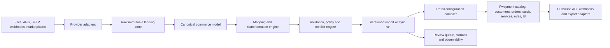
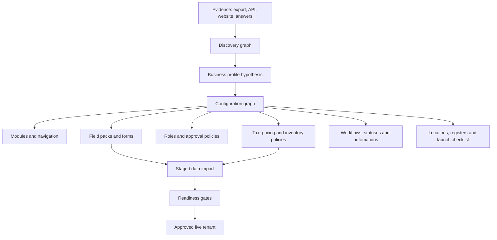
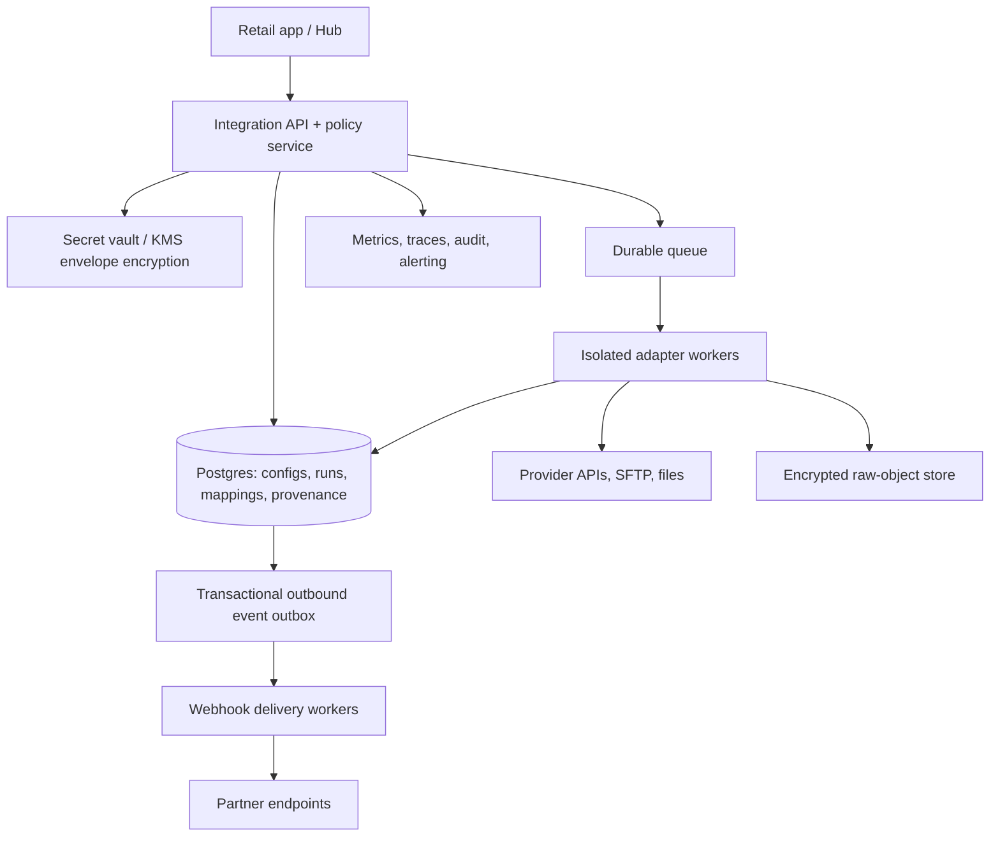

# Pwayment Integration Hub — master plan

> **Actuele afbakening, 31 augustus 2026:** dit is een doelarchitectuur. De
> huidige Hub-UI gebruikt gesimuleerde test- en synchronisatieruns en bewijst
> geen echte providerverbinding, duurzame datarun of webhook/API-product.
> Gebruik [`../PROJECT-CONTEXT.md`](../PROJECT-CONTEXT.md) voor wat vandaag
> operationeel is.

**Status:** proposed implementation plan
**Product promise:** a merchant can bring an export or connection from any reasonable retail system into Pwayment and receive a working, tailored retail operation—not merely a product list—without retyping their business or reshaping a spreadsheet first. A technical partner can connect a system safely, predictably, and observably.

> **Scope correction, 15 August 2026:** This is not an “import hub” project. It is an **Autonomous Retail Migration & Configuration Engine**. The Hub is the user interface for a system that discovers how a retailer operates, compiles a proposed Pwayment operating model, imports the relevant data into staging, proves the outcome, and promotes the entire approved setup to a live tenant.

## 1. Executive decision

The current product importer is a good, safe **v0 catalog migration assistant**. It is not yet an integration hub or an onboarding configurator in the production sense. The next product must be built as a **Universal Commerce Data Plane plus a Retail Configuration Compiler**:

The experience should feel magical, but its internals must be conservative: **preview before write, no silent data loss, provenance on every inferred decision and imported field, idempotency everywhere, and a one-click path back.**

### North-star outcomes

| Outcome | Release target |
| --- | --- |
| First usable catalog from a common source | under 10 minutes without support |
| Files mapped without editing column headings | at least 90% of core fields correctly suggested on supported vertical packs |
| Unsafe writes | zero: every run has validation, explicit approval, provenance, and rollback |
| Duplicate products caused by a run | <0.1% of imported rows, measured and reviewable |
| Successful scheduled runs | 99.5% monthly after connector GA |
| Time to diagnose a failed run | under 5 minutes from Hub to actionable explanation |
| New vertical support | schema/pack configuration first; no product-table migration for ordinary fields |
| Tenant configuration from a typical previous-POS export | at least 80% of applicable setup decisions proposed automatically; every low-confidence decision is an explicit, plain-language question |
| First-day operational readiness | POS, catalog, tax/pricing, workflows and enabled modules pass a preflight checklist before the merchant goes live |

## 2. Candid current-state assessment

### What is genuinely working today

| Capability | Evidence in the codebase | Assessment |
| --- | --- | --- |
| File migration | CSV/TSV, XLSX and JSON parsing; quoted delimiter support; first-sheet XLSX read | Real and useful, though not complete for arbitrary real-world files |
| Assisted mapping | Dutch/English header inference for product, price, stock, supplier and customer-price fields | Good v0 rules engine; transparent because unknown fields default to `ignore` |
| Safe product validation | Required name/price rules, VAT validation, duplicate identifiers within a file, preview counts | Strong instincts; safety is substantially better than a blind spreadsheet import |
| Update matching | Existing product matched by external ID, SKU or barcode | Useful baseline, but collisions/conflicts need explicit policy and review |
| Price books | Dynamic customer price groups stored as integer cents | A meaningful differentiator for retail migration |
| Local auditability | Local import jobs, row issues and mapping profiles; tenant-scoped operational telemetry | Good start, but history is split between browser and server |
| Offline-first catalog path | Product bulk upsert writes the local catalog and queues a server sync | Fits the POS architecture, but the import itself has no server-side transaction boundary |
| First-run configurator | Captures industry, sales model, team size, module selection, source, pricing and VAT choices | Useful basic questionnaire; it does not inspect a previous POS, infer a business model, configure workflows or validate readiness |

### What looks live but is still a prototype

| Surface | Actual behavior | Required correction |
| --- | --- | --- |
| Provider cards (Shopify, Exact, Mollie, Stripe, etc.) | Templates only; no provider API is called | Mark as “planned” until each adapter is certified and shipped |
| Connection test | Waits 550 ms and only checks URL shape/credential presence | Execute a real, least-privileged provider health call from the server |
| “Sync now” and schedules | Waits 700 ms and invents a record count in Zustand/localStorage | Introduce a durable job queue, scheduler and adapter worker |
| OAuth | Configuration flag only; no redirect, PKCE, callback, token exchange or refresh | Implement server-side OAuth connection lifecycle |
| SFTP | URL-format validation only | Implement isolated SFTP fetch, key management and feed discovery |
| Webhooks | Local configuration plus simulated HTTP status | Deliver signed events from a durable outbox and expose delivery attempts/replay |
| REST API keys | Generated in the browser and stored as metadata; no API validates them | Issue hashed server-side credentials and enforce scopes/rate limits at the gateway |
| “Own fields” | `Product.customFields` exists, but the import UI offers no custom-field target and unknown columns are ignored | Add a governed field registry and a mapping option to create/map approved merchant fields |
| Admin integration insights | Per-tenant list of basic integration-run counters | Add a migration dossier, readiness/reconciliation and fleet-level configuration intelligence |

### Scorecard

| Dimension | Today | Why |
| --- | ---: | --- |
| One-time product migration | 7/10 | Clear UI and solid basic parsing/matching |
| Flexible data model | 5/10 | JSON custom fields exist, but have no registry, type system, UI mapping, search or lifecycle |
| Import correctness and recoverability | 5/10 | Row errors are captured, yet no server-owned immutable source, staged write, run rollback or cross-user history |
| Real integrations | 1/10 | The user-facing configurator is simulated/local only |
| Security and tenant isolation | 3/10 | Main app has tenant telemetry, but connector secrets, OAuth, API authentication and inbound-webhook verification do not exist |
| Observability/supportability | 4/10 | Run counters are retained, but no per-record trace, retries, alerts, SLA, correlation or replay |
| Extensibility across verticals | 4/10 | Product fields are flexible, but entities, validation, field semantics and adapter contracts are not yet platformized |
| Automatic business setup | 2/10 | The current setup is a static questionnaire and industry preset; it does not derive a tenant configuration from source data |
| Overall | **4/10 as an integration platform; 7/10 as a first catalog importer** | Do not sell the current connector UI as live integrations. |

## 3. The actual product: Autonomous Retail Migration & Configuration

### 3.1 The promise in one sentence

**“Give Pwayment what you already have. We will understand your shop, set up the right workspace, bring over the data that is safe to bring over, show you what we inferred, and leave you ready to trade.”**

The merchant should not need to know Pwayment’s data model before moving. They should not be asked to make a generic industry choice and then manually rebuild the consequences of that choice. A previous POS export, connected API, screenshots, a supplier file, a website, and a few answers are evidence. Pwayment’s job is to turn that evidence into a safe, editable proposed operating model.

### 3.2 What “set up everything” actually includes

The scope is deliberately broader than the catalog. The engine needs an explicit capability matrix so it can say *imported*, *configured*, *requires confirmation*, *not supported yet*, or *intentionally excluded* for every domain.

| Business domain | What the engine discovers/imports | What Pwayment configures or proposes |
| --- | --- | --- |
| Business identity | merchant identity, locations, legal/tax identifiers, currency, language | store profile, locale, receipt/invoice identity, fiscal defaults, location structure |
| Catalog | products, variants, categories, brands, suppliers, barcodes, media, attributes | catalog taxonomy, searchable fields, variant axes, product editor sections, barcode policy |
| Inventory | on-hand stock, warehouse/shop locations, reorder levels, lots/serials/condition where applicable | stock tracking policy, locations, transfer/adjustment workflow, replenishment fields and alerts |
| Price and tax | standard prices, cost, price groups, contracts, discounts, tax classes, inclusive/exclusive tax conventions | price books, customer groups, VAT policy, margin/reorder settings, permitted discount rules |
| Customers | contacts, segments, preferences, account terms, loyalty points, gift-card balances | CRM fields, customer groups, loyalty and credit/gift-card policy, consent prompts |
| Sales history | orders, sales, line items, payments, returns, invoices, open balances | historic-data access mode, reporting baseline and reconciliation status; never silently re-post historical financial events |
| Service-led retail | repairs, assets, serial/IMEI, warranties, appointments, deposits, repair statuses | service-desk intake form, routes, status model, customer notifications, repair-specific field pack |
| People and access | employee list, job roles, permissions, schedules only when consented and legal | invite plan, least-privilege role proposals, approval flows; credentials/PINs are never imported |
| Channels | webshop, marketplace, supplier and accounting references | module enablement, connection recommendations, source-of-truth policy and staged connector checklist |
| Hardware and operations | receipt/footer conventions, register/location labels, scanners/printers only from explicit questionnaire/evidence | device checklist, receipt template, register defaults, launch-day hardware test—not automatic secret/device takeover |
| Merchant-specific reality | legacy/custom fields, tags, notes, workflow statuses, record types | governed extension fields, views, filters, automations and vertical-pack suggestions |

Some data must deliberately stay outside an automatic migration: passwords, payment-card data, banking secrets, provider refresh tokens, employee credentials/PINs, undocumented fiscal data, and any historical financial action that would alter the new ledger. The engine must make these boundaries obvious, not fail quietly.

### 3.3 The Retail Configuration Graph

The current `StoreConfiguration` is a small flat questionnaire. Replace it with a versioned, explainable **Configuration Graph**. It represents the tenant’s intended operating state, its evidence, and the dependency order in which it becomes safe to activate.

Each configuration node has a stable key, domain, value, status (`proposed`, `approved`, `applied`, `blocked`, `unsupported`, `superseded`), confidence, evidence references, dependencies, source/version and audit events. Example nodes include:

* `catalog.variant_axes = [size, colour]`, inferred from distinct product attributes;
* `service.enabled = true`, inferred from repair-status fields, device identifiers and open-service records;
* `pricing.customer_groups = [retail, business, contract]`, inferred from price columns and customer segments;
* `inventory.locations = [shop-floor, warehouse]`, inferred from stock columns or location records;
* `workflow.repair.statuses = [...]`, proposed from legacy status values but never activated until mapped to safe Pwayment semantics;
* `module.webshop = proposed`, based on storefront/order evidence, not a generic industry preset.

The graph is an **immutable versioned desired state**, not a pile of boolean preferences. Applying a version creates a controlled configuration migration. Each migration has an impact preview and reversible actions where possible.

### 3.4 The discovery engine: how it learns the business

The system should progressively consume evidence, not demand a perfect export. Inputs can be combined and ranked:

1. a known POS/ERP/e-commerce connector with declared schemas;
2. files: catalog, customers, order history, stock, price lists, repair jobs, staff and supplier feeds;
3. a public webshop URL or product feed, only with merchant authorization;
4. screenshots/PDF exports used as low-confidence clues, never as an automatic financial truth;
5. a short adaptive interview asked only where evidence is missing or contradictory;
6. approved reusable configuration profiles from the same merchant group/franchise, never from an unrelated tenant without explicit permission.

Discovery produces a **Business Evidence Report**, not direct writes. For every proposal it records the evidence, alternatives considered, confidence, expected impact and an explanation in merchant language. The question engine is information-gain driven: ask the single question that unlocks the most dependent decisions, instead of presenting a generic multi-page form.

Example: if the source has `IMEI`, `repair_status`, `deposit_paid`, and `warranty_end`, the engine proposes the Telecom & Repair field pack, service workflow, deposit setting and serial-number handling. It asks: “Do you want to continue existing open repairs in Pwayment, or retain them read-only?” It does not ask whether this is a repair business first.

### 3.5 Confidence and approval contract

| Confidence / risk | Engine behaviour | Merchant experience |
| --- | --- | --- |
| High confidence, low risk | Propose and preselect | Included in a concise “we set this up for you” review |
| High confidence, high operational/financial risk | Propose but require explicit confirmation | Shows source evidence, impact and default; one deliberate approval |
| Medium confidence | Offer up to three understandable alternatives | The smallest possible question, with examples from their own data |
| Low confidence or conflicting evidence | Never guess into live configuration | Create an exception/workbench task, optionally allow an expert/support handoff |
| Unsupported source capability | Preserve raw/source context if allowed; do not fabricate functionality | Clearly says what can be retained, exported or needs manual follow-up |

An AI system may help classify labels, infer schemas and draft explanations. It cannot make an irreversible financial, access-control, compliance, deletion or source-of-truth choice without the deterministic policy engine and appropriate human approval.

### 3.6 A migration, from account creation to live trading

1. **Create account:** capture only identity, legal region and permission to inspect chosen sources.
2. **Connect or upload:** “What did you use before?” is an entry point, not a form requirement. Accept multiple source files in a migration workspace.
3. **Discover:** profile datasets, recognise entities/fields/locales, detect relationships and create the evidence report.
4. **Compile:** generate a draft Configuration Graph, data mapping versions, matching policy, field packs, proposed modules, workflows, permissions plan and launch plan.
5. **Review by exception:** accept safe proposals, answer targeted questions, resolve duplicate/conflict candidates and choose treatment for unsupported domains.
6. **Stage and reconcile:** import to isolated staging; calculate source coverage, totals, entity counts, stock/price/customer diffs and sample record traces.
7. **Publish configuration:** apply the approved graph in dependency order, then promote staged entities with server-side idempotency/provenance.
8. **Validate operations:** run simulated sale, barcode lookup, pricing/VAT, stock, customer, service and hardware checks relevant to that retailer.
9. **Launch:** activate only the passing modules; retain a migration receipt, rollback window and “finish setup” queue.
10. **Shadow/reconcile:** for connected sources, compare for a defined period before enabling any bidirectional writes.

The success screen must say more than “1,284 products imported.” It should say: *“Your telecom repair shop is ready: 2 locations, 1,284 catalog items, 3 customer price groups, service intake with IMEI and warranty, warehouse stock tracking and 12 mapped staff roles. Two decisions remain before webshop orders can sync.”*

### 3.7 Vertical packs—not a fixed list of industries

Use current industries only as starter signals. The reusable product unit is a **versioned Retail Capability Pack**:

* semantic fields and entity relationships;
* data-type/parser/validator bundle;
* matching hints and source vocabulary aliases;
* required/optional modules and operational policies;
* workflow/status mappings and safe default transitions;
* forms, views, search facets, reports and readiness tests;
* connector starter mappings and source examples;
* ownership, compatibility and certification tests.

A merchant can have several packs: a bicycle retailer with workshop repairs, rentals and e-commerce; an electronics store with trade-in and B2B contract prices; a food shop with lots/expiry and catering orders. Packs compose through documented compatibility rules; they do not overwrite each other’s fields or workflows.

## 4. Core import and integration product

### 3.1 One guided “bring my business” journey

The primary UX is not “configure API fields.” It starts with: **“Where does your business run today?”**

1. Choose a known platform, an industry pack, or “upload/export from my system.”
2. Connect, upload, or forward a supplier feed.
3. Pwayment discovers data domains, samples safely, proposes a business profile and shows a plain-language migration plan.
4. The merchant confirms key business rules, not raw columns: match policy, price/VAT interpretation, stock locations, categories, customer groups, and what is permitted to change.
5. Show a live impact preview: *1,284 new products, 41 updates, 7 conflicts, 53 possible duplicate pairs, 3 unseen business fields.*
6. Resolve only exceptions. One-click accept all high-confidence proposals; explain every lower-confidence one.
7. Run first import in **staging**, then approve the promotion to live catalog. For small, safe imports a compact “review and publish” is enough; never write during file selection.
8. Hand the merchant a “migration receipt”: counts, data coverage, unresolved work, rollback expiry, owner, and next scheduled run.

This should work for skateshops, telecom resellers, repair shops, apparel, food/non-food retail, wholesale and service-led stores because the experience speaks in **business concepts**, with optional vertical-specific vocabulary.

### 3.2 The three layers of adaptability

1. **Canonical core (strict):** identity, product/variant, category, SKU/barcode, currency/money, tax, price book, inventory, supplier, customer, sale/order, return and location. These have stable semantics and validation.
2. **Vertical packs (configured):** fields, labels, requiredness, validators, mappings, dedupe hints and views for a domain—for example device IMEI/condition, apparel size/colour, bicycle frame size, food allergen/lot/expiry.
3. **Merchant extensions (governed):** named, typed fields owned by a merchant. They are versioned and permissioned, may be indexed/searchable only when explicitly enabled, and retain source provenance. No anonymous JSON blobs hidden from users.

An extension field has: `key`, label, entity, data type, cardinality, validation rule, sensitivity, import/export policy, display group, field owner and lifecycle (`draft`, `active`, `deprecated`). This preserves flexibility without sacrificing discoverability or safe analytics.

### 3.3 Canonical model and provenance

Every imported value must answer five questions: **what is it, where did it come from, when was it last seen, who/what changed it, and can it be reversed?**

Minimum canonical entities:

| Domain | Core entities | Important rules |
| --- | --- | --- |
| Catalog | product, variant, category, brand, supplier, media, attribute | Product vs variant is explicit; SKU/GTIN uniqueness is scoped and policy-driven |
| Commercial | price book, price list entry, customer group, tax class | Integer minor units, ISO currency, tax-inclusive/exclusive declared per source |
| Inventory | location, stock item, stock level, reservation, movement | Quantity changes are movements; feeds declare snapshot vs delta semantics |
| CRM | customer, address, consent, segment | PII classification and legal retention rules |
| Commerce | order, order line, payment, return/refund, fulfillment | Immutable external IDs and idempotency keys |
| Integration | connection, credential reference, adapter version, mapping version, run, record, conflict, delivery | No secrets or raw PII in ordinary logs |

Store `field_provenance` with `entity`, `field`, `value hash`, `source connection`, `external record ID`, `run ID`, `mapping version`, `observed_at`, and `actor`. Keep an append-only `integration_record_state` for idempotency and a replayable raw payload pointer with retention controls.

## 5. Non-negotiable platform architecture

### 4.1 Server-owned integration control plane

The React app becomes a client of the platform; it must never call a third-party connector with a long-lived secret.

Build it as a modular monolith at first—one deployable backend, one worker process type, Postgres, object storage and a queue abstraction—while retaining the boundaries above. Do not begin with a microservice fleet. Scale workers/queues by connector and tenant later.

### 4.2 Required data tables (server side)

| Table/group | Responsibility |
| --- | --- |
| `integration_connections` | Tenant/provider connection status, adapter/version, domain selections, schedule, health—not credentials |
| `integration_credentials` | Encrypted token/key reference, rotation metadata, expiry, KMS key version; restricted service access |
| `integration_mapping_versions` | Immutable mapping/transformation/validation version, schema fingerprint, confidence and approval data |
| `integration_runs` + `integration_run_records` | Durable state machine, counters, per-record outcome, correlation ID, timings and replay pointer |
| `integration_conflicts` | Deterministic conflict, proposed resolution, owner, expiry and audit events |
| `external_identities` | `(tenant, provider, entity type, external ID)` → Pwayment entity and source checksum; unique/idempotent |
| `custom_field_definitions` + values | Governed extensions, their schema, sensitivity and value provenance |
| `integration_outbox` + `webhook_deliveries` | Transactional events, HMAC signing, retry state, response metadata and replay |
| `api_clients` + `api_tokens` | Hashed token material, scopes, tenant/resource boundaries, expiration, use/revocation audit |

Add an audit event for every configuration, mapping approval, connection authorization, run transition, record promotion, conflict resolution, credential rotation, token event and webhook attempt.

### 4.3 Run state machine and transactional semantics

`draft → discovering → mapped → validating → review_required → approved → queued → running → completed | completed_with_exceptions | failed | cancelled | rolled_back`.

* A file/API pull lands records in immutable staging; it does not mutate the live catalog.
* Validation computes a deterministic **change set** from one mapping version and one catalog version.
* Promotion is an idempotent server transaction. Each change records a before-image or logical inverse inside the same transaction.
* A rollback reverts only fields still owned by the selected run; if a later human or run changed a field, create a conflict instead of overwriting it.
* Re-running an unchanged source with the same source checksum is a no-op. Duplicate delivery/retry must not make duplicate entities or movements.
* Inventory snapshots and inventory deltas are different input types. Never treat a snapshot as a delta or vice versa.

### 4.4 Mapping/transformation engine

Start with a versioned declarative mapping DSL, not arbitrary user JavaScript:

* source selectors: columns, JSON paths, XML/XPath later, API resources;
* typed transforms: trim, locale decimal/date parsing, currency conversion policy, unit conversion, split/merge, lookup, enum mapping, conditional/default;
* validators: required, regex, range, uniqueness, GTIN check digit, tax and category policies;
* match rules in priority order: provider external ID → GTIN → SKU + supplier → reviewed fuzzy candidate;
* output: canonical field or approved merchant extension;
* every transform has a preview, test fixtures and a deterministic result.

AI can propose mappings, explain confidence and create a draft vertical pack. It must **not** silently map financial fields, create merchant schema, or auto-publish low-confidence decisions. Treat model output as an untrusted suggestion validated by the same DSL.

## 6. File importer: make the useful v0 exceptional

### Phase 1 improvements

1. Multiple-sheet/workbook chooser with detected header row and preview; preserve original sheet/row number.
2. UTF-8/UTF-16/Windows-1252 detection, locale-aware delimiter/decimal/date detection, comment/preamble skipping and file-size/row caps.
3. XML, XLS and zipped supplier exports only after security review; protect parsers against zip bombs, formula injection and malicious JSON depth.
4. Data profiling: null rate, distinct count, type distribution, min/max, examples and PII warnings. Show “we think this is an EAN”, not only a raw selector.
5. Mapping assistant with confidence, rationale, an “always use this mapping for this provider” option and horizontal sample rows. Offer “create field” only through the governed field registry.
6. Category and supplier resolution wizard: map to existing, create reviewed entities, or define rules. Never force merchants to prepare categories manually before they can evaluate the import.
7. Duplicate studio: exact and fuzzy candidate pairs, chosen matching policy, row-level evidence, bulk decisions and persistence as an identity rule.
8. Change-set review: new/update/archive/no-op/conflict counts, sampled field diffs, per-domain toggle, and a strict “no destructive action” default.
9. Server-side run record and durable report/export. The browser retains convenience cache only.
10. One-click rollback (time-limited by retention policy) and re-run from the original source/mapping version.

### Migration modes

| Mode | Use | Write policy |
| --- | --- | --- |
| Dry run | First contact / uncertain source | No live writes |
| Initial migration | New tenant | Staging then explicit publish |
| Incremental file | Supplier/export refresh | Upsert only approved domains; conflicts queued |
| Reconciliation | Compare source to Pwayment | Generates differences; never deletes by default |
| Controlled replace | Trusted authoritative source | Requires owner approval, backup and explicit scope |

## 7. Connectors: order, standards and certification

### 6.1 Deliver in this order

| Wave | What ships | Why now |
| --- | --- | --- |
| A | Universal file importer + email-to-import inbox + HTTPS pull/CSV feed | Covers the long tail immediately with the safest reusable engine |
| B | Shopify and WooCommerce catalog/orders/inventory adapters | High merchant demand; test bidirectional conflict model on familiar commerce APIs |
| C | Supplier SFTP/API framework and 3–5 prioritized Belgian/Benelux distributors | Turns catalog onboarding into recurring stock/price intelligence |
| D | Exact Online, Moneybird and fiscal export | Valuable, but only after financial event model, reconciliation and accountant controls are mature |
| E | Payments (Mollie/Stripe) and marketplaces | Reconciliation and data ownership are more complex; avoid pretending POS settlement is identical to payment-provider status |
| F | Public developer platform and certified partner marketplace | Enables scale only after the platform contracts are stable |

Choose provider order using actual onboarding data: requested provider count × projected GMV × implementation certainty × support burden. Do not add a card because its logo is familiar.

### 6.2 Adapter contract

Each adapter is versioned and declares:

* authentication mode, token refresh/rotation support, minimum scopes and test endpoint;
* entities/directions it supports, source-of-truth declarations and incremental cursor strategy;
* rate-limit, retry, pagination, webhook verification and backfill behavior;
* source schema fingerprints and tested fixtures;
* mapping starter packs and capabilities (read/create/update/delete per domain);
* certification test suite, sandbox requirements, support owner, deprecation policy and last verification date.

No adapter is generally available until it passes contract tests for auth failure, expiry/refresh, pagination, rate limiting, duplicate webhook, replay, partial record failure, cursor recovery, idempotency, PII redaction and rollback/reconciliation behavior.

### 6.3 External developer experience

Publish a versioned REST API described with OpenAPI, a separate event contract described with AsyncAPI, and standard event envelopes based on CloudEvents. OAuth public clients use authorization code with PKCE; partner machine access uses scoped, rotating credentials. Give developers a sandbox tenant, test data, a webhook-event explorer, a CLI/SDK only after the HTTP contract is stable, and an API changelog with deprecation windows.

## 8. Safety, security, privacy and compliance

### Security requirements before any live connector

* Vault/KMS envelope encryption for secrets; access only from connector workers; redact tokens, headers and PII from logs.
* Server-side OAuth authorization-code flow with PKCE, strict redirect allowlist, encrypted refresh tokens, token-expiry monitoring and disconnect/revocation.
* Per-tenant isolation enforced in database/RPC and worker authorization; workers receive a short-lived scoped work token, never a broad service role in a job payload.
* Inbound webhooks: provider signature verification before parsing, timestamp/replay window, raw-body size caps, idempotency key, dead-letter queue and IP controls only as defense in depth.
* Outbound webhooks: HTTPS only, HMAC signature with timestamp and event ID, per-destination rate/concurrency controls, exponential retry with jitter, delivery log and replay UI.
* API keys: show once, store only a slow hash, least-privilege scopes, tenant/resource boundaries, optional IP allowlist, expiration/rotation/revocation and usage audit.
* SSRF protections for custom endpoints/SFTP: URL validation after DNS resolution, block private/link-local ranges, egress allowlists, DNS rebinding checks, protocol/port allowlists and isolated network execution.
* Malware scan and quarantine uploads; encrypted raw objects; retention/deletion schedule; access logging.
* Threat model, penetration test, dependency/SAST/secret scanning and incident runbook are release gates.

### Privacy and data governance

Classify data at field level (public/business/confidential/PII/special category). Default exports/logs to minimised metadata. Capture data-processing purpose and retention on connections; enable subject access/deletion workflows where legally applicable; prohibit free-form PII in error messages. Put legal/compliance review before accounting, payments or cross-border connector GA.

## 9. Admin and platform intelligence: see the migration estate, not just run counts

The platform admin must become the control room for this capability. Today it shows a tenant’s integration-operation rows (source name, status and counts). That is useful telemetry, but it is not enough to run autonomous onboarding or detect a broken setup before a retailer discovers it at the till.

### 9.1 Three admin surfaces

| Surface | Primary user | Questions it answers | Required capabilities |
| --- | --- | --- | --- |
| Fleet migration dashboard | Pwayment operations/product leadership | Which tenants are onboarding, stalled, at risk or launch-ready? | funnel by phase, source/provider mix, median setup time, exception/SLA backlog, confidence distribution, readiness/reconciliation and rollback trends |
| Tenant migration dossier | Support/onboarding specialist | What was discovered, decided, imported and still blocked for this exact retailer? | evidence report, graph versions/diff, source inventory, run timeline, field coverage, record trace, conflicts, launch checklist, safe actions and complete audit trail |
| Configuration/pack intelligence | Product and connector teams | Which fields, workflows and packs are failing to generalise? | unmapped-field clusters, override rates, question burden, schema drift, capability-pack adoption, connector health, unsupported-feature demand and candidate pack suggestions |

### 9.2 Tenant migration dossier

The dossier needs five tabs, all derived from server-owned data—not browser history:

1. **Readiness:** a live traffic-light checklist by domain (identity, catalog, tax/pricing, inventory, customers, workflows, users, hardware, channels) with blocker owner and next best action.
2. **Business model:** the approved Configuration Graph, evidence/confidence for each decision, graph-version diffs and “why is this enabled?” explanations.
3. **Data quality:** source coverage, mapped/unmapped/invalid counts, duplicate/conflict queue, sample record lineage, reconciliation totals and schema drift.
4. **Runs & connections:** current source freshness, adapter and mapping versions, queue state, retries, error classes, replay/backfill/rollback controls bound to role and policy.
5. **Audit & support:** every approval/override/config change, anonymised support notes, exported migration receipt and escalation handoff.

### 9.3 Fleet-level metrics and alerts

Add server-side aggregates for:

* acquisition-to-live funnel: account created → source connected → discovery complete → staging passed → configuration approved → launch-ready → first successful trade;
* **time-to-operational-readiness**, broken down by source/provider, vertical pack, country, catalog size and human-support involvement;
* configuration automation rate, high/medium/low confidence proportions, question count/abandonment and override rate;
* per-domain data coverage and reconciliation mismatch: catalog, price, stock, customer, orders, service and workforce;
* connector/schema drift, token expiry, stale source, repeated conflict, unusually large planned deletion and rollback events;
* field/pack demand: top unmapped headers, values, legacy statuses and feature requests—aggregated/minimised to avoid exposing merchant data;
* launch quality: day-1 support contacts, post-launch configuration changes, first-sale/preflight failures and 7/30-day active retention.

Alerts should create a human-readable case: “Tenant X is launch-blocked: 96% catalog coverage, but 147 active service jobs have unknown status mapping” is vastly better than “integration failed.”

### 9.4 Admin permissions and safeguards

Separate `integrations.read` from highly sensitive permissions: `migration.support`, `migration.approve_override`, `migration.replay`, `migration.rollback`, `configuration.read`, `configuration.apply`, `credential.metadata.read` and never a broad “read secrets” permission. Admins see redacted values by default. Elevation, support impersonation, raw-file access, deleting a run, applying a graph or overriding reconciliation each require reason, audit and least-privilege policy.

### 9.5 Admin implementation sequence

1. Expand `integration_runs` into durable run/record/configuration graph data; retain the present run table only as a compatibility view.
2. Ship the tenant migration dossier alongside server-side staging—support needs it before the first pilot.
3. Add readiness, coverage and reconciliation calculations; make them launch gates, not vanity charts.
4. Add fleet dashboard and alert rules after pilot telemetry establishes useful thresholds.
5. Add anonymised pack/schema intelligence only after privacy review and explicit data minimisation decisions.

## 10. Operability: merchants, support and engineering see the same truth

The Hub must answer, in one screen: *what ran, what changed, what failed, why, who owns it, and what safely happens next?*

### Merchant-facing command center

* Health: connected/degraded/action needed, last success, next run, freshness per domain and source ownership.
* Run timeline: counts by outcome, affected entities, mapping/adapter version, high-level duration and downloadable migration receipt.
* Exception queue: actionable human language, suggested resolution, bulk actions, assignment/comments, SLA and no raw secrets.
* Diff/reconciliation: source vs Pwayment difference by entity/field, skipped deletes and freshness warnings.
* Controls: pause, resume, test, backfill range, replay failed records, rotate/reconnect, export report, rollback eligible run.

### Engineering/platform observability

Use correlation IDs across UI, API, queue, worker, provider request and webhook. Measure queue age, run duration, success/partial/failure rate, source freshness, record throughput, retries, DLQ count, provider error class, connector version, mapping confidence, conflict rate and rollback rate. Alert on credential expiry, repeated failure, stale source, DLQ, unusual volume/field drift and webhook-delivery failure. Keep structured, redacted logs and traces long enough to investigate support cases.

## 11. Delivery plan and gates

### Phase 0 — truthful product and foundation (2 weeks)

* Rename simulated connector cards to “planned” or remove their test/sync actions.
* Add an explicit capability registry so UI can only claim features backed by a live adapter.
* Reframe the first-run wizard as a **Migration Workspace**: retain the minimum legal/account questions, then offer a source-first route instead of the current static industry/modules questionnaire.
* Define the Configuration Graph, Capability Pack manifest, discovery evidence model, confidence/approval policy and domain-level readiness contract.
* Fix the current custom-fields gap: field registry + mapping choice + governed persistence, or stop advertising preservation of arbitrary fields.
* Move import jobs/mapping profiles to server-owned tables while preserving offline draft convenience.
* Assemble the design-partner source corpus: at least 8 prior POS exports per initial vertical, covering catalog, customers, prices, stock, repairs, orders and legacy custom fields.
* Publish this plan, target architecture decision record, data classification and threat model.

**Exit:** no screen represents a simulated integration as connected or synced; a clickable prototype demonstrates the full source → discovery → configuration proposal → readiness journey with real partner data samples.

### Phase 1 — production-grade universal importer (6–8 weeks)

* Build server integration API, durable run state, raw landing storage, mapping versions, record outcomes, identities, staged change sets and rollback.
* Upgrade parser/profiling, multi-sheet selection, category/supplier resolution, duplicate studio and impact review.
* Build the discovery engine for catalog, price/tax, inventory, customer and service evidence; compile the first Configuration Graph rather than only a field mapping.
* Build vertical/merchant field registry, field provenance, first two Capability Packs, data-quality checks and graph-diff review.
* Add tenant migration dossier, launch readiness checks, audit/redaction/access controls and a comprehensive migration receipt.

**Exit:** a 10k-row initial migration can be dry-run, reviewed, published, audited and safely rolled back by an authorized merchant; the engine configures applicable modules, field packs, tax/price/inventory policies and service workflow from evidence, and every unanswered decision is a visible exception rather than a hidden default.

### Phase 2 — connection and sync engine (6–8 weeks)

* Credentials vault, OAuth PKCE lifecycle, job queue/scheduler, adapter contract and isolated workers.
* HTTPS pull and SFTP adapters; incremental cursor/checksum support; source freshness and reconciliation.
* First one-way supplier connector plus real health check and failure recovery; use its schema to prove repeatable discovery, configuration updates and controlled drift handling.

**Exit:** a real provider sync executes unattended for 30 days at 99.5% successful runs, with test/reconnect/replay and no credentials in browser state/logs.

### Phase 3 — commerce adapters and safe bidirectionality (8–12 weeks)

* Shopify/WooCommerce adapters with catalog, orders and inventory in a deliberately scoped sequence.
* Per-domain source-of-truth, field ownership, conflict engine and consumer-facing diff/review.
* Enable controlled configuration evolution: when a connected source introduces a new field/status/location, propose a graph change and require policy-appropriate approval rather than silently changing the tenant.
* Webhook intake/delivery and event outbox, signed and replayable.

**Exit:** pilot tenants can run catalog/inventory synchronization without duplicate orders, stock drift or unexplained overwrites; reconciliation proves the result.

### Phase 4 — finance and public platform (8–12 weeks)

* Accounting export/adapter after financial ledger reconciliation controls are approved.
* Server-enforced public REST API, scoped keys, developer docs/sandbox and OpenAPI/AsyncAPI contracts.
* Partner certification suite, adapter version/deprecation program and curated marketplace.

**Exit:** external developer can complete a sandbox integration from documentation; certified adapter upgrades are backward compatible or transparently migrated.

### Phase 5 — intelligence and network effects (continuous)

* Consent-based mapping learning: aggregate only non-sensitive header/schema patterns and approved rules, never merchant data values by default.
* AI-assisted import copilot with deterministic validation and approval gates.
* Vertical pack builder, marketplace quality scoring, support tooling and self-serve provider request flow.

### Synthetic Migration Lab — the learning engine behind the product

AI-generated source data can accelerate the system enormously, but only when grounded in real schemas and tested against explicit expected outcomes. The goal is not to teach Pwayment to recognise pretty spreadsheets; it is to teach it to survive the messy, varied exports retailers actually possess.

#### What to collect first

Build a consented, legally reviewed **Source Schema Registry**. Store the schema and behavioural facts, not a merchant’s customer data:

| Registry item | Examples |
| --- | --- |
| Provider/source identity | POS/ERP/webshop name, version, export route, country/locale |
| Structural fingerprint | file names, sheets, headers, JSON paths, nesting/relations, known entity IDs |
| Semantic annotation | `legacy.sku` → canonical product SKU; `repair_state` → service-status candidate |
| Format behaviour | delimiter, encoding, decimal/date format, tax-inclusive pricing, empty/null conventions |
| Relationship rules | product↔variant, customer-price mapping, stock snapshot/delta, sale↔return, repair↔asset |
| Known sharp edges | duplicate headers, truncated exports, formulas, locale changes, deleted records, status aliases |
| Expected migration result | selected capability packs, field mapping, questions, conflict policy and readiness checks |

Never use raw customer names, email addresses, phone numbers, payment references, loyalty balances, employee credentials or sensitive notes as a training corpus by default. If a real export must be inspected for discovery, retain it only under explicit merchant permission, strict access controls and a defined deletion period.

#### How to generate useful examples

For each registered source schema, generate a **scenario family**, not just one file:

1. canonical happy path with representative product/customer/stock/service relationships;
2. field-name and language variants, including Dutch/French/English and supplier-specific jargon;
3. locale variants for delimiters, decimals, dates, currency, VAT and encodings;
4. sparse/dirty-but-realistic values: blanks, typos, inconsistent casing, stale categories, free-text statuses;
5. schema drift: renamed, removed, added, reordered and duplicate columns; changed JSON nesting;
6. identity issues: duplicate SKU/EAN, missing IDs, reused legacy IDs, merge candidates and conflict scenarios;
7. operational ambiguity: price inclusive/exclusive of VAT, stock snapshot vs delta, open vs historic repairs, returns and gift cards;
8. scale and resilience: 1 row, 10k rows, 100k rows, long text, quoted line breaks, malformed rows and interrupted runs;
9. adversarial/security files: CSV formula injection, oversized values, zip bombs/invalid XLSX, malicious URLs and webhook replay fixtures;
10. compositional retailers: multiple sources that disagree—for example POS catalog + Shopify orders + supplier stock feed.

Each generated dataset must include a machine-readable **oracle**: expected canonical entities, configuration graph proposals, confidence band, required questions, expected conflicts/errors, reconciliation totals and whether the run may be auto-published. Without an oracle, generated examples are demos—not tests.

#### Synthetic data quality bar

Use deterministic seeds and a generator version for every fixture. Preserve referential integrity unless that scenario intentionally tests broken references. Encode money in integer cents in the oracle; generate realistic distributions, not random values; label every record as synthetic. A human with experience in that retail domain must review the first scenario family for each provider/vertical.

#### How the corpus is used

| Use | Required measurement |
| --- | --- |
| Mapping/discovery regression suite | field precision/recall, confidence calibration, unmapped critical fields and false financial mappings |
| Configuration compiler suite | graph equality/diff, correct packs/modules/workflows, required-question completeness |
| Parser/resilience suite | parse success, performance, memory limits, safe rejection and no partial writes |
| Adapter certification | pagination, cursor, rate-limit, webhook, retry, idempotency and drift scenarios |
| AI evaluation | suggestion accuracy by risk class; zero unapproved high-risk auto-actions |
| Product research/demo | realistic but clearly synthetic migration journeys; never claimed as customer data |

The promotion rule should be strict: a source/pack may become generally available only after it passes its fixed regression suite, its adversarial suite, and pilot reconciliation against real consented merchants. Synthetic success accelerates coverage; it does not replace production validation.

#### Operating model

* Start with 3 source families × 2 vertical packs × 30–50 scenarios each, not hundreds of loosely specified files.
* Keep generators and expected results in a versioned `migration-fixtures` package. A source schema, generator and test oracle change together in pull requests.
* Add a new fixture whenever a support case, pilot import, schema drift or production incident teaches something. De-identify the pattern; do not copy the customer file.
* Use AI to propose scenario variations and annotations; deterministic code generates the final fixture and validates it.
* Track a coverage matrix: provider/source × entity/domain × locale × risk class × pack × scenario. “100 supported imports” without this matrix does not tell us what we can trust.

This becomes the flywheel: every legitimate edge case makes the next merchant’s migration easier, while the system stays privacy-safe, reproducible and honest about its confidence.

## 12. Workstreams, ownership and sequencing

| Workstream | First deliverable | Depends on |
| --- | --- | --- |
| Product/design | Guided migration prototype with exception/review flows | Current importer research and 8–12 merchant source files |
| Data platform | Canonical schemas, identity/provenance and staged promotion | Architecture decision record |
| Import engine | Parser/profiler/mapping DSL and deterministic test fixtures | Canonical field registry |
| Platform/security | Connection store, vault, OAuth, queue and worker isolation | Threat model and tenant auth |
| Adapter team | HTTPS/SFTP then supplier/commerce adapters | Adapter contract and worker platform |
| Developer platform | API/event spec, gateway, keys, sandbox | Stable canonical contracts |
| Reliability/support | Run center, alerts, DLQ/replay, support playbooks | Durable run/event model |
| Legal/finance | Privacy taxonomy, DPA posture, accounting reconciliation | Field model and target regions |

Run product/design, canonical model, security architecture and importer UX in parallel. Do **not** start branded adapters before the run engine, credentials isolation, provenance and conflict-policy primitives are designed.

## 13. Quality strategy

### Automated tests

* Golden fixtures from each supported source/vertical: valid, malformed, locale variants, large files and schema drift.
* Property/fuzz tests for CSV/JSON parsers and transformation functions.
* Contract tests per adapter against sandbox/mock provider; mutation tests for mapping rules.
* Database tests for tenant isolation, idempotency, concurrent run promotion, rollback-after-later-edit, unique identities and event outbox.
* End-to-end flows: first migration, conflict resolution, rollback, OAuth reconnect, SFTP fetch, webhook replay and expired API key.
* Load/chaos tests: 100k+ rows, provider throttling/timeouts, duplicate events, worker crash mid-run and queue recovery.

### Human validation

Recruit 12–20 pilot merchants across the initial verticals and import real (sanitised/contracted) exports. Record time-to-first-catalog, mapping corrections, conflict confusion, unsupported-field requests, support touches and post-import data discrepancies. A connector is not GA based only on unit tests; it needs a live pilot reconciliation period.

## 14. Product metrics and operating cadence

Review weekly during pilot and monthly after GA:

* onboarding: time to first published catalog, mapping acceptance/correction rate, abandonment stage, support contacts;
* data quality: valid/exception rate, duplicate rate, conflict rate, field coverage and reconciliation drift;
* reliability: run success, freshness SLA, p50/p95 duration, retry/DLQ rate and webhook delivery rate;
* safety: rollback rate, erroneous overwrite incidents, credential/security events and audit completeness;
* business: activation lift, retained connected tenants, adapter adoption, support cost/run and provider demand.

Set explicit kill/rework thresholds: if a connector needs repeated manual mapping per tenant, has <95% successful pilot runs, or causes unexplained stock/financial drift, pause expansion and fix the contract before adding another provider.

## 15. Immediate backlog (ordered)

1. Remove/relabel fake connection, sync, webhook and API-key success states.
2. Add a `capabilities` declaration to provider templates and gate UI controls on actual server support.
3. Replace the static first-run configurator’s architecture with a Migration Workspace and draft Configuration Graph; keep the present questionnaire only as the no-source fallback.
4. Create server migrations for connections, mapping versions, runs/records, identities, configuration graphs, capability packs, custom-field registry, conflicts and delivery outbox.
5. Define canonical JSON Schema/Zod models, discovery evidence model, configuration compiler contracts and mapping DSL; establish test fixtures before adapters.
6. Move product import to server staging/promotion; retain browser offline drafting only.
7. Build custom-field registry and expose “map to business field / create governed field” in the importer.
8. Implement multi-sheet/data profiling/category matching/change-set review, business-model discovery and rollback.
9. Build the tenant migration dossier and readiness/reconciliation gates before the first real pilot.
10. Build vault/OAuth/queue/worker scaffolding with one HTTPS pull adapter.
11. Ship SFTP and an initial priority supplier adapter; pilot with real merchants.
12. Implement signed webhooks/outbound outbox and then Shopify/WooCommerce in limited scopes.
13. Add fleet migration intelligence, alerts and support playbooks before opening bidirectional sync.
14. Publish developer API/event contracts, sandbox and certified-partner program only after contracts are stable.

## 16. Decisions required from leadership before build begins

1. **Initial vertical:** choose the first two vertical packs from customer evidence (recommended: current telecom/repair retail plus independent specialty retail).
2. **Data authority:** define whether Pwayment, supplier, webshop or merchant wins per domain/field. “Bidirectional” without this policy is a data-loss feature.
3. **Hosting/security baseline:** choose production region, secret-management provider, object-storage retention and queue runtime; commission a threat model before OAuth/SFTP work.
4. **Pilot cohort:** secure 8–12 design partners and their anonymised source exports/connector access.
5. **Commercial promise:** do not market branded connectors before their individual capability badges are real and certified.

## 17. Definition of “world-class”

Pwayment will not win by claiming the most logos. It wins when a merchant can bring a messy real-world export, understand exactly what will happen, accept the safe decisions, resolve only meaningful exceptions, and be selling with a trustworthy catalog that same day. Then the same foundation lets a provider, accountant or developer connect through a contract that is secure, observable, replayable and pleasant to maintain.

That is the compounding advantage: **universal ingestion with human-grade clarity and platform-grade correctness.**
