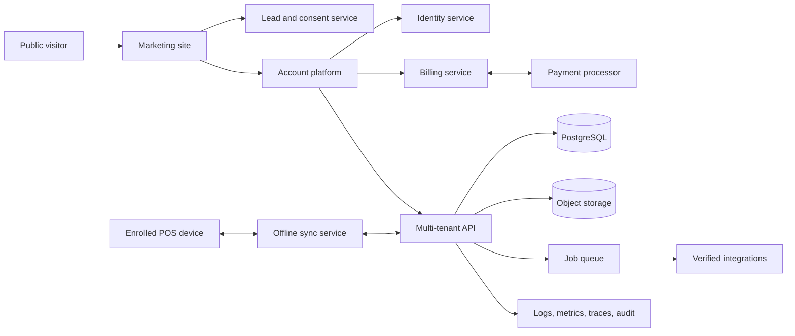

# PWAYMENT public website and customer platform — master plan

**Planning date:** 11 August 2026  
**Scope:** The permanent, production-state public website, pricing and comparison, signup, account entry, acquisition funnels, onboarding, trust, content, documentation, and customer ecosystem.  
**Recommended launch market:** Dutch-speaking Belgian independent retail first; French Belgium next; English after the Belgian proposition converts.

> **Planning assumption:** Treat PWAYMENT as fully production-ready at public launch. Every capability currently promised in the POS, settings, plans, webshop, integrations, hardware, billing, support, and enterprise screens is a committed launch capability. The present local implementation does not constrain the website proposition. The site is designed once for that complete end state and is not published as a reduced or temporary version.

---

## 1. Executive direction

PWAYMENT should not become “a POS homepage with a login button.” It should become a coherent customer platform with three deliberately separate surfaces:

1. **The public website** explains, proves, compares, and converts.
2. **The account platform** owns identity, organizations, subscriptions, onboarding, and support.
3. **The POS application** runs the store, stays fast during a rush, and continues safely during connectivity loss.

The brand promise should be narrower and stronger than “software with many features”:

> **The POS that helps an independent retailer sell, understand, and improve the whole store.**

Recommended homepage message:

> **Your store. One clear system.**  
> Sell faster, keep stock under control, know your customers, and see what deserves attention—without turning your store into an IT project.

Recommended Dutch launch copy:

> **Je winkel. Eén helder systeem.**  
> Verkoop sneller, hou je voorraad onder controle, leer je klanten kennen en zie waar je winkel kan groeien—ook wanneer je internet even wegvalt.

Primary conversion is **“Start gratis.”** Secondary conversion is **“Plan een demo,”** especially for Enterprise & Chains or merchants who want migration and hardware advice. Existing customers always have a persistent **“Log in”** route to the POS.

### What the references contribute

- **Apple:** one idea per section, confident short copy, generous whitespace, large real product visuals, controlled motion, and progressive disclosure.
- **Vercel:** a disciplined product taxonomy, persistent login/signup access, transparent tier summary followed by a searchable comparison, and technical trust without visual noise.
- **Lightspeed:** retail-specific outcomes, feature pages based on merchant jobs, proof and support near conversion, integrations, hardware, and industry relevance.
- **PWAYMENT:** Belgian retail intelligence, offline resilience, direct language, restrained cyan/blue identity, and real product UI rather than generic commerce imagery.

The visual result must be calm, editorial, and product-led. It must not be a collection of colored cards, floating gradients, icon confetti, or invented statistics.

---

## 2. Committed launch product

The website is planned against the complete PWAYMENT product vision. All capabilities below are treated as available, supported, synchronized, and production-ready when the public website launches.

### Launch capability families

- Checkout, cart, discounts, cash/PIN/gift-card flows, refunds, receipts, supported printers, scanners, scales, drawers, and payment terminals.
- Product and category management, variants, SKU/barcode handling, stock, min/max indicators, CSV migration, labels, transfers, forecasting, and purchase orders.
- Customers, gift cards, loyalty/VIP levels, customer profiles, customer analytics, and retention workflows.
- Daily close/Z reporting, audit history, revenue, profit, customer, season, employee, and stock intelligence.
- Store profile, Belgian tax/fiscal rules, team roles, fine-grained permissions, manager PIN controls, themes, and receipt branding.
- Native webshop, online orders, storefront design, assortment, coupons, delivery, payment methods, custom domains, and live synchronization.
- Suppliers, Shopify, WooCommerce, custom commerce, accounting, payment providers, REST API, webhooks, field mappings, and observable sync activity.
- Self-service plans, invoices, payment methods, upgrades/downgrades, add-ons, and plan-based entitlements.

### Permanent capability governance

All promises already present in the product are **Generally available at launch**. A central capability registry still prevents the public site, pricing, billing, and POS from diverging as PWAYMENT grows:

| Status | Public treatment | Meaning |
|---|---|---|
| Generally available | May be presented normally | Production-backed, supported, monitored, documented |
| Beta | Clearly labeled “Beta” | A new post-launch capability with documented limitations |
| Early access | Only on opt-in pages or sales material | A new post-launch capability for selected customers |
| Coming soon | Roadmap mention only | A future addition, never confused with launch inclusions |
| Concept | Never public | An uncommitted future exploration |

Product, sales, pricing, help documentation, checkout, and in-app plan gates read from the same registry. The launch site itself contains no “coming soon” placeholders for the capabilities already promised today.

---

## 3. Audience, positioning, and conversion strategy

### Launch audiences

1. **Independent shop owner, one location**  
   Wants a reliable counter, easy stock, clear daily numbers, and little setup burden.
2. **Growing specialist retailer, one to three registers**  
   Wants variants, barcodes, customer retention, purchasing, integrations, ecommerce, and more control.
3. **Multi-location operator**  
   Wants centralized catalog/pricing, permissions, transfers, consolidated reporting, governance, and an accountable support relationship.
4. **Bookkeeper or implementation partner**  
   Wants clean exports, auditable records, integrations, permissions, and predictable client onboarding.
5. **Cashier or store manager**  
   Is not the buyer, but product ease and reliability influence the buying decision.

### Jobs the website must answer

- What is PWAYMENT, and is it meant for a business like mine?
- Will checkout stay fast and reliable during a rush?
- Can it handle my products, variants, stock, staff, and hardware?
- What insight will I get beyond a cash register?
- Does it work with my webshop, terminal, printer, scanner, and accountant?
- What exactly is included, excluded, limited, or an add-on?
- What will I pay now, after the trial, with extra registers, and when I grow?
- Can I trust it with sales, personal data, and Belgian obligations?
- How hard is migration, installation, and team training?
- Can I see it, try it, speak to someone, and log in?

### Positioning pillars

1. **Fast at the counter** — short flows, keyboard/scanner first, clear exceptions.
2. **Control behind the counter** — products, inventory, purchasing, staff, reports.
3. **Retail intelligence that leads to action** — margin, slow stock, reorder, seasons, and return behavior.
4. **Belgian by design** — Dutch/French readiness, euro and VAT context, Belgian payment and invoice ecosystem, with only verified compliance claims.
5. **Works when the connection does not** — offline-first architecture with an honest explanation of which functions continue offline and how synchronization recovers.

### Voice

- Direct, specific, knowledgeable, and calm.
- Prefer merchant language: “voorraad die cash vasthoudt” over “advanced inventory intelligence.”
- Lead with the outcome; explain the mechanism second.
- Avoid “all-in-one,” “revolutionary,” “seamless,” “effortless,” and “AI-powered” unless a concrete proof immediately follows.
- Never invent logos, customer counts, processed volume, review scores, or performance percentages.

---

## 4. Product ecosystem and domains

Recommended domain model:

| Domain | Purpose |
|---|---|
| `pwayment.be` | Public website, pricing, lead generation, company and legal pages |
| `app.pwayment.be` | Account entry and the authenticated product shell |
| `help.pwayment.be` | Merchant help center, setup guides, troubleshooting |
| `developers.pwayment.be` | Public API/webhook documentation, authentication, examples, and sandbox |
| `status.pwayment.be` | Service health, incidents, maintenance history |
| `trust.pwayment.be` | Security, privacy, subprocessors, availability, compliance evidence |
| `demo.pwayment.be` | Isolated, resettable, synthetic demo—never connected to production merchant data |

The header login link goes to `app.pwayment.be/login?return_to=…`. The marketing site must not render or handle POS credentials. A user with a valid session may see **“Open PWAYMENT”** in place of **“Log in,”** but the session remains owned by the app domain.

### Navigation

**Header**

- Product
  - POS & checkout
  - Products & inventory
  - Insights
  - Customers & loyalty
  - Webshop
  - Integrations
- Solutions
  - Independent retail
  - Specialist retail
  - Multi-location
  - Accountants & partners
- Pricing
- Resources
  - Customer stories
  - Help center
  - Guides
  - Changelog
- Log in
- Primary CTA: Start free
- Secondary sales route: Plan a demo

**Footer**

- Product, solutions, compare, integrations, hardware.
- Help, documentation, system status, contact, migration.
- Company, story, careers, partners, press.
- Security, privacy, cookies, terms, DPA, subprocessors, accessibility.
- Legal company name, registered address, enterprise number, VAT number, email, and telephone where required.
- Language switcher: Nederlands / Français / English when translations are complete.

---

## 5. Page inventory and release layers

### Complete launch website

1. `/` — homepage
2. `/product` — product overview
3. `/pos`
4. `/inventory`
5. `/insights`
6. `/customers`
7. `/webshop`
8. `/integrations`
9. `/hardware`
10. `/pricing`
11. `/compare`
12. `/demo`
13. `/contact`
14. `/login` — a branded handoff/redirect, not a second auth implementation
15. `/start` — signup and plan start
16. `/onboarding` — resumable store setup after authentication
17. `/security`
18. `/offline`
19. `/migrate`
20. `/about`
21. `/solutions/independent-retail`, `/solutions/specialist-retail`, `/solutions/multi-location`, `/solutions/accountants`
22. `/customer-stories` and customer story detail pages
23. `/resources`, guides, help, and changelog entry points
24. `/legal/privacy`, `/legal/cookies`, `/legal/terms`, `/legal/dpa`, `/legal/subprocessors`
25. `/404` and resilient error/maintenance states

### Post-launch growth expansion

- `/compare/lightspeed`, `/compare/shopify-pos`, and similar pages only after legal/content review; use factual comparison dates and sources.
- ROI/pricing calculator.
- Hardware catalog and compatibility finder.
- Partner/accountant program.
- Webinars, migration guides, and downloadable checklists.

### Complete launch ecosystem

- Public changelog and release notes.
- Developer docs, API reference, webhook event catalog, examples, and sandbox keys.
- Integration marketplace with status, requirements, plan, setup instructions, and support ownership.
- Help center covering onboarding, POS workflows, hardware, billing, troubleshooting, and migration.
- Trust center and security evidence request flow.
- Status page with current health, incident history, and maintenance notices.
- Partner/accountant information and lead routing.

Post-launch additions may include a maintained public roadmap, partner portal, implementation certification, and new solution/comparison content. Those use the permanent system and do not require redesigning the website.

---

## 6. Page blueprints

### Homepage

1. **Utility announcement** only for a meaningful event: launch, beta access, or compliance milestone.
2. **Header** with product taxonomy, pricing, login, and one dominant CTA.
3. **Hero**
   - One outcome-led headline.
   - Two-line explanation.
   - Primary CTA: Start free.
   - Secondary CTA: Watch the 90-second tour.
   - Tertiary text route: Plan a demo.
   - A real PWAYMENT screen in a clean device/browser composition.
4. **Credibility strip**
   - Initially use factual product statements, not fake customer logos: “Offline-first,” “Made for Belgian retail,” “Works with barcode workflows.”
   - Replace with customer logos only after written approval.
5. **The retail day narrative**
   - Open: stock and priorities.
   - Sell: scan, pay, receipt.
   - Understand: revenue, margin, stock, customers.
   - Improve: reorder, retain, grow.
6. **POS focus** with short video or interaction and one clear proof.
7. **Inventory focus** using real variants, min stock, purchasing, and dead-stock insight.
8. **Retail intelligence focus** with real charts and a concrete action, not dashboard decoration.
9. **Customers and loyalty** with privacy-aware explanation.
10. **Connected store** for webshop, accounting, terminals, and APIs; only verified integrations shown as active.
11. **Offline/resilience block** explaining what continues, what pauses, and how recovery works.
12. **Plans preview** with three tiers and a link to the full comparison.
13. **Migration and onboarding**: import, configure, train, launch.
14. **Proof**: customer story, quote, or measured result once available.
15. **FAQ** addressing hardware, internet, setup, contracts, support, cancellation, VAT, and data export.
16. **Final CTA:** start free, with a clear demo route for merchants who want advice.

### Pricing

1. Title and plain-language billing explanation.
2. Monthly/yearly switch; the switch must show both effective monthly amount and billed annual total.
3. Three plan summaries with audience, price, included locations/registers/users, support, and the 6–8 decisive differences.
4. Add-ons and usage charges directly below the cards—not hidden in FAQ.
5. Full comparison grouped by merchant jobs:
   - Selling and payments
   - Products and inventory
   - Customers and loyalty
   - Reports and intelligence
   - Webshop and channels
   - Accounting, API, and integrations
   - Locations, team, and permissions
   - Support, onboarding, and SLA
6. Sticky plan names on desktop; stacked plan selector on mobile. Never require horizontal-scroll comparison as the only mobile solution.
7. “What happens when I exceed a limit?” section.
8. Setup, migration, hardware, payment processing, VAT, cancellation, refunds, trial, and contract notes.
9. FAQ and sales-assisted enterprise CTA.

### Product overview

Frame PWAYMENT as one operating loop rather than a feature catalog:

`Sell → Record → Understand → Act → Sell better`

Each capability links to a deep page and has one authentic screenshot, one merchant outcome, and one boundary/requirement where relevant.

### Feature pages

Use a consistent sequence:

1. Merchant problem and promised outcome.
2. Live product proof.
3. Three to five workflows.
4. Who it is for.
5. Hardware/integration/plan requirements.
6. FAQ.
7. Related capabilities.
8. CTA.

### Demo page

- Explain what the 30-minute session covers.
- Form: name, business email, phone optional, company, number of locations/registers, current POS, desired timing, primary challenge, consent.
- Allow a preferred time window; add calendar booking only when staffing is dependable.
- Confirmation page with what happens next, a calendar file, relevant guide, and privacy notice.
- Spam protection and lead deduplication.
- Response-time promise only if it can be met.

### Login handoff

- Keep it minimal: PWAYMENT mark, “Open your store,” secure app entry, password recovery, help link, and status link.
- Never list local staff identities on a public unauthenticated device.
- Staff PIN login is allowed only after the register has been enrolled into an organization by an owner/manager.
- Password reset, email verification, MFA, suspicious-login handling, and device review are complete parts of the account platform at launch.

### Security and offline pages

These are sales pages and operational commitments, not generic legal text. Explain:

- Data location and subprocessors.
- Encryption in transit/at rest.
- Tenant isolation and role model.
- Backups, recovery, incident communication.
- Authentication and MFA.
- Audit history and retention.
- Vulnerability reporting.
- Offline capabilities, local protection, synchronization states, conflict handling, and device loss.
- Certifications only after they are actually achieved.

---

## 7. Pricing system and decisions required

### Current in-product proposal

| Plan | Current monthly | Current yearly display | Current headline scope |
|---|---:|---:|---|
| PWAYMENT Basis | €0 | €0 | One register, 250 products, basic stock, 30-day history |
| Retail Professional | €69/month | €55/month effective | Up to three registers, unlimited products, loyalty, webshop, API/accounting claims |
| Enterprise & Chains | €149/month | €119/month effective | Unlimited locations/registers, multi-store, unlimited API, SLA/support claims |

Current add-ons describe extra terminals at €29/month, webshop sync at €19/month, accounting sync at €15/month, and BI export at €25/month.

### Final public interpretation of the existing plans

This interpretation keeps every current price and promise while making the website unambiguous:

1. **PWAYMENT Basis — €0 forever**  
   One location, one register screen, one POS user, 250 active products, five categories, basic stock, printer/scanner support, Z close, 30-day transaction history, and email support.
2. **Retail Professional — €69 monthly or €660 billed yearly (€55 effective/month)**  
   One retail organization, up to three included register screens, unlimited products/variants, supported integrated payment terminals, advanced printer/scanner/scale workflows, inventory alerts and barcode labels, customers/loyalty/gift cards, PWAYMENT native Webshop and live stock/catalog sync, 5,000 API requests/day, webhooks, Peppol e-invoicing, standard Exact Online connection, priority email/chat, and 99.5% uptime commitment.
3. **Enterprise & Chains — €149 monthly or €1,428 billed yearly (€119 effective/month)**  
   Unlimited locations and register screens, transfers, location price lists/promotions, granular permissions, unlimited audit history, multi-storefront ecommerce, headless connections, unlimited API capacity, enterprise ERP connections, 99.9% SLA, 24/7 emergency support, dedicated account manager, and on-site guidance.

The yearly switch says **“Save €168/year”** for Professional and **“Save €360/year”** for Enterprise. It does not say exactly 20%, because the published rounded effective monthly prices produce slightly larger savings.

### Final add-on definitions

| Add-on | Price | Availability | Exact meaning |
|---|---:|---|---|
| Extra register screen | €29/month each | Professional after the 3 included screens | Additional enrolled POS register; Basis cannot add registers; Enterprise already includes unlimited registers |
| External Webshop Sync | €19/month | Professional | Shopify/WooCommerce two-way catalog, order, customer, and stock connector; the native PWAYMENT Webshop remains included |
| Advanced Accounting Automation | €15/month | Professional | Automatic Z-journal posting and expanded accounting workflows including Octopus; Peppol and the standard Exact connection remain included |
| Advanced BI & Raw Export | €25/month | Professional | Scheduled raw datasets/connectors for Power BI and advanced Excel workflows; normal PWAYMENT Insights remain included |

Hardware purchase/lease and third-party payment processing charges are shown separately from PWAYMENT software. All public software prices carry a clear **“excl. VAT”** note and the yearly view shows the full annual amount charged.

Use a **14-day Retail Professional trial** with no payment card required, followed by an explicit choice: remain on Basis or activate a paid plan. Enterprise remains purchasable at the published price, while the demo/onboarding route helps configure locations, integrations, and rollout.

Plan versions are permanent records. Existing customers retain their agreed `plan_version`; future commercial changes create a new version instead of silently mutating entitlements or old invoices.

### Single source of truth

Create a versioned plan catalog consumed by:

- Public cards and comparison.
- Checkout and invoices.
- In-app billing settings.
- Entitlement checks in the API and POS.
- Sales quotes.
- Help center.
- Analytics and revenue reporting.

Each feature needs: ID, public name, internal entitlement key, plan availability, numeric limit, unit, add-on relationship, status, help link, effective date, and localization.

---

## 8. Key journeys

### Visitor to demo

`Landing page → relevant feature/solution → pricing → demo form → confirmation → CRM owner → discovery call → trial/pilot → conversion`

Record original source, campaign, landing page, compared plan, company size, and consent. Never overwrite original attribution with the most recent visit.

### Visitor to self-service account

`Pricing → choose plan/trial → email verification → create organization → store profile → import/add products → enroll first register → hardware test → first test sale → go-live checklist`

The user may leave and resume at every step. Setup progress belongs to the server, not local browser memory.

### Returning merchant

`pwayment.be → Log in/Open PWAYMENT → app.pwayment.be → organization/location selector → role-appropriate landing page`

Owners/managers may enter management views remotely. A device that will process sales must be enrolled as a register; remote authentication alone must not silently create a new register identity.

### Staff shift entry

`Enrolled register → select staff member or enter employee ID → local quick PIN → open/continue shift → POS`

The PIN is device/organization scoped and rate-limited. It is not a public website password.

### Upgrade

`Blocked/teased capability → explain value and exact plan change → owner authorization → prorated checkout/quote → payment confirmation webhook → entitlement update → audit event → feature available`

Never unlock on optimistic client state alone.

### Cancellation/export

`Billing → cancel → clear effective date and consequences → offer export → confirmation → retention window → deletion workflow`

No dark patterns. Data export and legal retention are explicitly separated from account deletion.

---

## 9. Design system

### Visual principles

- **Neutral foundation:** warm white, near-black, cool grays.
- **One main accent:** PWAYMENT cyan/blue for links, focus, selected state, and primary moments.
- **Lime is semantic and rare:** live/healthy/success, not a second decorative brand field.
- **No rainbow sections:** feature categories are distinguished by typography, layout, and imagery—not unrelated colors.
- **Real product as hero:** use current PWAYMENT screens from the repository/presentation assets after verifying they match the shipped build.
- **Retail humanity:** occasional high-quality real shop photography, with people and context; avoid generic SaaS 3D blobs.

### Suggested tokens

- Content width: 1,200–1,280 px; reading width: 680–760 px.
- 12-column desktop grid, 6 tablet, 4 mobile.
- Spacing scale based on 4/8 px; major sections 96–144 px desktop and 64–88 px mobile.
- Radius: 10–16 px for interface surfaces; avoid making every section a rounded card.
- Borders: low-contrast 1 px; shadows used only to establish real layering.
- Typography: Geist/Inter-class sans for launch; 16–18 px body, 1.5–1.65 line height; fluid display scale.
- Copy hierarchy: short eyebrow, strong headline, one paragraph, one action.

### Motion

- 150–240 ms interface transitions; 300–500 ms editorial reveals.
- Use opacity/transform; honor `prefers-reduced-motion`.
- One purposeful hero/product scroll narrative is enough.
- Video never autoplays with sound; controls, captions, poster, and transcript required.
- No perpetual floating, cursor trails, parallax overload, or motion needed to understand pricing.

### Accessibility

- WCAG 2.2 AA target.
- Full keyboard operation and visible focus.
- Correct landmarks and heading order.
- Contrast measured in every theme/state.
- Form labels, described errors, error summaries, and preserved input.
- Comparison tables have real headers and a non-table mobile representation.
- Product screenshots need meaningful adjacent descriptions; essential information cannot live only in an image.
- Touch targets at least 44×44 px where practical.
- Dutch/French language attributes and correct localized number/date/currency formats.

---

## 10. Technical architecture

### Recommended repository shape

```text
apps/
  marketing/       public website and content rendering
  account/         login, signup, onboarding, billing, organization settings
  pos/             current offline-first application
packages/
  brand/           logos, typography, visual tokens
  ui/              accessible shared primitives, not full page layouts
  plans/           versioned plan catalog and comparison data
  contracts/       API schemas and generated clients
  analytics/       event names and consent-aware adapters
  localization/    NL/FR/EN messages and formatting
services/
  api/             organizations, catalog, sales, reports, entitlements
  sync/            offline outbox ingestion and device synchronization
  workers/         billing webhooks, email, imports, integrations
```

The existing POS should be migrated into this structure carefully, not rewritten merely to match the website stack.

### System boundary



### Core production data model

- `organizations`
- `organization_memberships`
- `users`, `identities`, `sessions`, `mfa_factors`, `recovery_codes`
- `locations`
- `registers`, `register_enrollments`, `devices`, `shifts`
- `plans`, `plan_versions`, `prices`, `subscriptions`, `subscription_items`, `entitlements`
- `products`, `variants`, `barcodes`, `categories`, `price_books`
- `stock_levels`, `stock_movements`, `stock_transfers`, `purchase_orders`
- `sales`, `sale_lines`, `payments`, `refunds`, `gift_card_ledger`
- `customers`, `consents`, `loyalty_ledger`
- `daily_reports`, `fiscal_documents`, `invoices`
- `audit_events`, `idempotency_keys`, `sync_cursors`, `outbox_events`
- `integration_connections`, `webhook_endpoints`, `webhook_deliveries`
- `leads`, `demo_requests`, and marketing consent—preferably isolated from operational POS data access.

Every tenant-owned record carries `organization_id`; location-scoped records also carry `location_id`. Authorization is enforced server-side on every operation. UI hiding is never authorization.

### Authentication

- Managed or independently audited identity layer with email verification.
- Password hashing appropriate for server authentication; optional passkeys; MFA required for high-privilege actions at maturity.
- Secure, HttpOnly, SameSite cookies for browser sessions; rotation and revocation.
- Rate limits, credential-stuffing protection, lockouts/backoff, suspicious-login alerts.
- Password reset invalidates appropriate sessions.
- Owners can inspect and revoke devices/sessions.
- Step-up authentication for billing, exports, role changes, integration credentials, refunds, and destructive operations.
- Staff PINs are separately salted/hashed, organization/device scoped, attempt-limited, and never usable on the public internet.
- Production builds must remove the `?presentation=1` authentication bypass.

### Offline synchronization

Keep IndexedDB as a local operational cache, not the only source of truth.

- Each register has a durable ID and enrolled key.
- Every locally created mutation has organization, location, register, actor, client timestamp, monotonic local sequence, schema version, and idempotency key.
- Financial events are append-only. Corrections create linked void/refund/adjustment records.
- Server assigns canonical sequence/receipt/report references.
- Catalog/settings may use explicit version checks; conflicts are surfaced rather than silently overwritten.
- Stock uses an auditable movement ledger; server recomputes balances.
- Sync UI has states: offline, pending, syncing, synced, attention required.
- Outbox retries use backoff and a dead-letter path; one poison event cannot block later events.
- Device loss, clock drift, long offline periods, duplicate delivery, schema upgrades, and revoked registers have documented behaviors.

### Billing and entitlements

- Payment checkout occurs on the provider; secrets never enter the client.
- Webhooks are signature-verified, idempotent, replay-safe, and stored for audit.
- Subscription state machine covers trialing, active, past due, paused, canceled, and incomplete.
- Dunning emails, grace periods, and read-only/fail-safe POS behavior are explicit. A payment issue must not unexpectedly stop a merchant mid-sale.
- Entitlements are served by the API and cached for offline use with expiry and a safe grace policy.
- Upgrades, downgrades, add-ons, proration, credits, tax, invoicing, refunds, and grandfathered versions are tested.
- Belgian B2B SaaS invoicing/Peppol obligations require a verified provider workflow, not PDF generation alone.

### Content management

Start with typed content in the marketing repository for speed and reviewability. Add a headless CMS only when non-developers genuinely need frequent publishing.

Structured content types:

- Page, feature, solution, plan, comparison row, integration, hardware item.
- Customer story, quote, metric and evidence source.
- Article, guide, FAQ, release note.
- Legal document with version/effective date.
- Claim with owner, proof link, status, locale, last review, expiry.

Preview, approval, scheduled publish, rollback, link checking, and localization status are required before a CMS can publish production content.

---

## 11. Security, privacy, legal, and trust launch gates

This is a product and engineering checklist, not legal advice; Belgian counsel/accounting review is required before launch claims or contracts are finalized.

### Website obligations

- Publish the business name, establishment address, effective contact details including email, enterprise number, and VAT number; additional information can apply depending on activity and online contracting. The Belgian FPS Economy summarizes these required business-site details [here](https://news.economie.fgov.be/203681-informations-obligatoires-sur-le-site-web-de-votre-entreprise/).
- Publish privacy, cookie, terms, DPA, subprocessor, retention, and data-rights information.
- Block non-essential analytics/advertising until valid consent. “Accept” and “Reject non-essential” must be equally accessible; no cookie wall or deceptive color hierarchy. The Belgian Data Protection Authority’s current [cookie checklist](https://www.dataprotectionauthority.be/publications/cookie-checklist.pdf) covers prior, free, specific, informed, active, and withdrawable consent.
- Keep proof of consent configuration and policy versions. Make withdrawal as easy as acceptance.
- Forms disclose purpose, lawful basis/consent where applicable, retention, recipients, and rights.
- Do not load unconsented third-party video, chat, maps, or social pixels by default.

### Product trust

- Data inventory and processing register.
- Data classification, least privilege, production access review, and secrets management.
- Encryption, backups, restore tests, and documented RPO/RTO.
- Dependency and container scanning, security headers, CSP, CSRF/XSS/SQLi defenses, rate limits.
- Independent penetration test before general availability.
- Incident response, severity definitions, notification workflow, and status page.
- Vulnerability disclosure contact/security.txt.
- Tenant isolation tests and audit-log integrity tests.
- Export, correction, retention, legal hold, and deletion workflows.
- Subprocessor due diligence and DPAs.

### Belgian product claims

Belgian structured B2B e-invoicing has applied since 1 January 2026, and official guidance says software must support structured exchange/processing through the relevant network; a PDF alone is not the structured invoice. Any “Peppol included” claim therefore requires a working, supported sending/receiving and retention flow. See the official Belgian [B2B e-invoicing FAQ](https://efactuur.belgium.be/nl/FAQ/algemene-vragen-b2b).

Before claiming “Belgian fiscal compliance,” obtain a written scope opinion covering retailer type, receipts/invoices, registered cash system applicability, VAT rates, cash rounding, Z reports, retention, corrections/refunds, gift cards, and audit evidence. Market the verified scope precisely.

---

## 12. SEO, discoverability, and content engine

### Technical SEO

- Server-render or pre-render all public acquisition pages.
- Unique titles/descriptions, canonicals, Open Graph, social images, and clean URLs.
- XML sitemap index by locale/content type; robots rules; no indexing for app, account, demo data, previews, or duplicate filters.
- `hreflang` for `nl-BE`, `fr-BE`, and later `en` with real translated equivalents.
- Structured data: Organization, SoftwareApplication/Product where accurate, BreadcrumbList, Article, FAQ only when visible and eligible.
- Redirect map and monitored 404s.
- Search Console/Bing setup and release annotations.

### Initial topic clusters

1. POS/kassasysteem for Belgian retail.
2. Stock and barcode management for boutiques/specialty retail.
3. POS with webshop and accounting connection.
4. Retail reports, margin, dead stock, and reordering.
5. Customer loyalty and gift cards.
6. Offline POS and hardware compatibility.
7. Belgian VAT, cash rounding, receipts, e-invoicing, and Peppol—with expert/legal review.
8. Migration from spreadsheets or another POS.

Build one authoritative pillar page plus practical supporting guides per cluster. Do not mass-produce thin city/industry pages.

### Content operating cadence

- Monthly product release note.
- Two high-quality educational resources per month at maturity.
- Quarterly customer story.
- Compliance pages reviewed when law/product changes and at least quarterly.
- Pricing, hardware, integration, and claim registry reviewed before every public release.

---

## 13. Analytics and conversion

### North-star funnel

`Qualified visitors → pricing/product engagement → demo/trial starts → activated organizations → first live sale → retained paid organizations`

### Event taxonomy

| Stage | Events |
|---|---|
| Discover | `page_view`, `solution_viewed`, `feature_viewed`, `video_started/completed` |
| Evaluate | `pricing_viewed`, `billing_cycle_changed`, `plan_compared`, `integration_viewed`, `hardware_checked`, `faq_opened` |
| Convert | `demo_started/submitted`, `signup_started/completed`, `contact_submitted` |
| Activate | `email_verified`, `organization_created`, `store_profile_completed`, `catalog_imported`, `register_enrolled`, `hardware_test_passed`, `test_sale_completed`, `live_sale_completed` |
| Revenue | `trial_started`, `checkout_started/completed`, `subscription_activated`, `upgrade/downgrade`, `payment_failed/recovered`, `cancellation_started/completed` |
| Retain | `weekly_active_org`, `sync_attention`, `support_opened`, `export_completed` |

No product, customer, basket, email, or financial detail belongs in marketing analytics payloads. Define allowed properties per event. Consent state travels with event collection.

### Core reports

- Acquisition by original and last-touch source.
- Landing page → qualified action.
- Pricing plan and comparison engagement.
- Demo form abandonment by field.
- Signup and onboarding step conversion/time.
- Activation cohort: first test sale and first live sale.
- Trial-to-paid and time-to-value.
- Expansion, contraction, churn, cancellation reason.
- Website performance/error correlation with conversion.

Experiment only after baseline traffic is meaningful. Test value propositions and funnel friction, not deceptive urgency or button-color trivia.

---

## 14. Performance and quality budgets

### Public site targets

- Core Web Vitals at the 75th percentile: LCP ≤ 2.5 s, INP ≤ 200 ms, CLS ≤ 0.1.
- Initial JavaScript target under 170 KB compressed for simple marketing pages; heavy demos load on intent.
- Responsive AVIF/WebP images with fixed dimensions.
- Self-host/subset fonts; no more than necessary weights.
- Video poster first, adaptive playback on interaction.
- No third-party script without owner, purpose, consent class, performance cost, and removal path.
- CDN caching and immutable asset fingerprints.

### Test layers

- Unit: plan calculations, localization, forms, validation, entitlement mapping.
- Contract: API schemas, billing webhooks, auth callbacks, integration payloads.
- Component: navigation, pricing, comparison, consent, forms, errors.
- End-to-end: demo, signup, verification, onboarding resume, login/logout, password reset, upgrade, cancellation, export.
- POS/offline: duplicate/reordered sync, outage, clock drift, lost device, conflict, revoked register.
- Security: tenant isolation, authorization matrix, rate limits, session fixation/revocation, webhook replay.
- Accessibility: automated checks plus keyboard/screen-reader/manual zoom review.
- Visual regression at key breakpoints and locales.

Supported browser/device matrices must be separate for the public site, remote management, and hardware-enabled POS. The public site can be broad; hardware POS support must list verified browser/OS/device combinations rather than saying “every device.”

---

## 15. Delivery roadmap to one complete launch

Time ranges assume a focused small team and are effort bands, not promises. These are internal build workstreams, not reduced public releases. The permanent sitemap, design system, URLs, navigation, pricing model, and content structure are established at the beginning; `pwayment.be` launches publicly when the complete experience is ready.

### Phase 0 — Proposition and permanent system design (1–2 weeks)

- Confirm legal company/domain/contact details.
- Name the initial segment and conversion model.
- Resolve the pricing contradictions and publishable plan version.
- Register every currently promised feature as a launch capability and give it a public definition.
- Define support hours and onboarding responsibility.
- Decide the cloud identity, database, billing, email, CRM, and hosting owners.
- Approve brand direction, Dutch voice, and hero message.

**Exit gate:** signed proposition brief, final launch plan catalog, capability registry, permanent sitemap, and system boundary.

### Phase 1 — Public foundation (2–3 weeks)

- Establish marketing app, shared brand tokens, routing, metadata, localization shell.
- Header/footer, consent system, analytics contract, error pages.
- Reusable editorial sections, screenshot/video system, forms, and accessibility foundation.
- Environments, preview/approval workflow, monitoring, backups for form data.

**Exit gate:** audited skeleton with no placeholder claims or tracking before consent.

### Phase 2 — Complete public experience (4–7 weeks)

- Home, product, all feature/solution pages, pricing/compare, customer proof framework, resources, demo/contact, signup/login entry, security/offline, migration, and legal.
- Authentic product media and 90-second product tour.
- Lead routing, confirmation, spam controls, notifications, CRM handoff.
- SEO, performance, accessibility, analytics, content QA.

**Exit gate:** the complete permanent site is content-, accessibility-, performance-, and conversion-ready in a private production-like environment.

### Phase 3 — Account, organization, and synchronized product connection (6–12+ weeks)

- Organization/location/register model and tenant authorization.
- Production identity, verification, recovery, MFA foundation, session/device management.
- Server API, canonical data, offline sync protocol, outbox processing.
- Production transaction/register/refund/shift/report model and resolved audit issues.
- Observability, backups/restores, incident response, security test.

**Exit gate:** full signup/login, organizations, locations, registers, remote management, and realistic outage recovery work with the permanent website journeys.

### Phase 4 — Billing and self-service activation (4–7 weeks)

- Subscription checkout, tax/invoices, webhook state machine, dunning/grace.
- Entitlement service and identical public/in-app plan data.
- Signup, resumable onboarding, catalog import, register enrollment, hardware test, first-sale checklist.
- Cancellation/export/deletion and lifecycle email.

**Exit gate:** a new merchant can start, activate, pay, fail/recover payment, downgrade/cancel, and export without manual database intervention.

### Phase 5 — Launch, proof, and growth (ongoing)

- Customer stories with measured outcomes.
- French launch and translated support readiness.
- Industry/solution pages, migration campaigns, partner program.
- Verified integration marketplace, developer docs, changelog, trust center.
- Content program and evidence-based conversion iteration.

---

## 16. Epic backlog and acceptance criteria

### E1 — Brand and content foundation

- Approved message hierarchy and writing guide.
- Tokens and components cover all planned pages without page-specific color systems.
- Every screenshot is current, permission-safe, and contains synthetic/anonymized data.
- No unsupported claim can publish without a claim-registry status and owner.

### E2 — Public navigation and discovery

- All top tasks are reachable within two navigation decisions.
- Header works with keyboard, touch, zoom, small screens, and no JavaScript fallback where practical.
- Search metadata, canonicals, sitemap, locale alternates, and redirects are verified.

### E3 — Pricing and comparison

- Price totals, discount, VAT notation, included quantities, add-ons, and overage behavior reconcile.
- Public cards, comparison, checkout, invoices, and in-app gates use the same plan version.
- Mobile comparison is usable without precision horizontal scrolling.
- Enterprise never implies instant unlimited provisioning when sales approval is required.

### E4 — Lead generation

- Form survives validation errors and duplicate submission.
- Consent and attribution are stored with policy version.
- Spam is contained without making the form inaccessible.
- Lead reaches an accountable owner; failed delivery alerts operations.

### E5 — Identity and account entry

- No local demo account or presentation bypass is reachable in production.
- Verification, reset, MFA, session revocation, rate limit, and audit paths are tested.
- Staff quick PIN cannot authenticate on an unenrolled device or public page.

### E6 — Organization and onboarding

- Tenant isolation is tested at API and database layers.
- Onboarding resumes across devices.
- Register identity is unique and visible.
- Merchant cannot accidentally convert a management browser into a production register.

### E7 — Sync and offline

- Sales remain idempotent after retry/reconnect.
- Pending/failed sync is visible and actionable.
- Financial conflicts never use silent last-write-wins.
- Restore from long outage and schema upgrade is tested with production-like volumes.

### E8 — Billing and entitlements

- Signed webhooks, replay, proration, trial, dunning, grace, cancel, and refunds are tested.
- A billing outage does not stop an entitled shop from selling during an approved grace period.
- Entitlements cannot be changed by client local state.

### E9 — Trust and operations

- Restore test, incident drill, penetration test, and tenant isolation review pass.
- Status, support, privacy request, vulnerability report, and escalation routes are staffed.
- SLA language matches monitored service and contractual capability.

---

## 17. Risks and controls

| Risk | Consequence | Control |
|---|---|---|
| Public story outruns product reality | Loss of trust, legal/sales exposure | Claim registry, owner, evidence, expiry review |
| Marketing and in-app pricing diverge | Billing disputes | Versioned central plan catalog |
| Public login reuses local auth | Account/data compromise | Separate production identity and app domain |
| Offline multi-device sync is underestimated | Duplicate sales, stock/report corruption | Event/idempotency model and pilot failure testing |
| “Unlimited” creates unbounded cost | Poor unit economics | Sales-assisted Enterprise and fair-use/capacity terms |
| Integrations are presented as toggles but require operations | Support overload | Verified status, owner, certification, observability |
| Belgian compliance is simplified into marketing copy | Regulatory risk | Written scope review and precise claims |
| Free plan attracts non-converting support/storage load | Cost without revenue | Limits, abuse controls, activation and conversion metrics |
| Product screenshots age quickly | Confusing site | Screenshot owner, version tag, quarterly review |
| Too much motion/media hurts usability | Poor conversion/accessibility | Performance budget and reduced-motion path |
| French launch without French support | Broken customer promise | Locale launch gate includes support/legal/product readiness |

---

## 18. Locked product decisions and remaining operational inputs

Locked by this plan:

1. Primary buyer: independent and specialist Belgian retail, with Enterprise & Chains fully represented.
2. Dutch Belgium first, with French and English built into the permanent localization structure.
3. Primary CTA: **Start free**; secondary CTA: **Plan a demo**; persistent **Log in**.
4. Basis remains free; every new organization receives a 14-day Professional trial and can return to Basis.
5. Enterprise retains the published €149 monthly / €119 effective yearly price and the promised unlimited scope.
6. Annual checkout shows €660 Professional and €1,428 Enterprise, with exact euro savings rather than an imprecise percentage.
7. Native PWAYMENT Webshop and standard Exact/Peppol are included in Professional; external commerce sync and advanced accounting automation are the distinct paid add-ons defined above.
8. The final website is built and launched as one end-state product, without a public temporary MVP or “coming soon” placeholders for current promises.

Operational inputs still required for implementation—not proposition changes:

1. Exact definition and enforcement of register, location, user, API request, and order.
2. Final hardware/browser compatibility list and integration setup guides.
3. Support contact details, operating hours, escalation routes, and onboarding booking capacity.
4. Production service-provider choices and credentials.
5. Domain ownership and legal entity information for the footer/contracts.
6. Hardware sales/lease logistics and third-party processing-fee schedules.
7. Written Belgian fiscal/Peppol scope for the final legal wording.

---

## 19. First internal implementation slice

The best first internal slice establishes the permanent foundation. It is not published as a smaller website:

1. Shared brand/design foundation.
2. Homepage.
3. Product overview plus POS, inventory, and insights pages.
4. Final pricing and comparison powered by the versioned plan catalog.
5. Start-free, demo, and contact flows.
6. Final signup/login/account handoff states, connected to production services as those workstreams complete.
7. Security/offline/legal baseline.
8. Analytics, consent, accessibility, performance, and SEO from the first release.

This slice fixes the design language, content system, pricing model, conversion patterns, and account boundary that every remaining page reuses. The complete page inventory is then filled in before public launch.

---

## 20. Definition of public launch

The website is ready for public traffic only when:

- The proposition, segment, CTA, plan catalog, and claim registry are approved.
- Every public feature statement maps to a verified status.
- Prices, discounts, annual totals, VAT note, add-ons, and terms reconcile.
- Demo/contact submissions are consented, protected, delivered, monitored, and owned.
- Login never touches prototype credentials or local demo identities.
- Business identity, privacy, cookies, terms, and required Belgian website details are present.
- Non-essential tracking is absent before consent and consent can be withdrawn.
- Core pages meet accessibility and performance budgets on real devices and slow networks.
- Screenshots contain no merchant/customer personal data.
- Errors, 404, form failure, CRM failure, and maintenance states work.
- Monitoring, uptime checks, backups, on-call ownership, and rollback exist.
- Dutch copy has final editorial review; every active locale is complete.
- Sales and support know exactly what the site promises and what happens after each CTA.

Public launch happens only once the account/POS entry, all promised capabilities, billing, onboarding, support, recovery, and security work as one complete customer experience. There is no later redesign phase required to turn a marketing-only site into the “real” site.

---

## 21. Research references

- [Vercel homepage](https://vercel.com/) — persistent product taxonomy, separate login/signup/demo paths, product-led sections.
- [Vercel pricing](https://vercel.com/pricing) — tier summaries followed by detailed comparison and explicit limits.
- [Apple iPad Pro](https://www.apple.com/ipad-pro/) and [Apple at Work](https://www.apple.com/business/) — progressive product narrative, large evidence-led visuals, focused sectional copy.
- [Lightspeed Retail POS](https://www.lightspeedhq.com/pos/retail/) — retail outcomes, workflows, integrations, proof, support, and product-category depth.
- [Belgian Data Protection Authority cookie checklist](https://www.dataprotectionauthority.be/publications/cookie-checklist.pdf).
- [Belgian FPS Economy: mandatory business website information](https://news.economie.fgov.be/203681-informations-obligatoires-sur-le-site-web-de-votre-entreprise/).
- [Official Belgian B2B e-invoicing FAQ](https://efactuur.belgium.be/nl/FAQ/algemene-vragen-b2b).
