**Onderwerp:** Pwayment Retail — van eerste kennismaking tot dagelijkse winkelwerking

Hoi Fabrice, Edy en Bart,

Ik wil jullie geen los overzicht van functionaliteiten sturen, maar de volledige reis die een winkel doorloopt: van een eerste kennismaking met Pwayment tot de dagelijkse aansturing van de winkel, het team, documenten, voorraad en herstellingen.

Wie eerst zelf wil rondkijken, kan terecht op **[pwayment.vercel.app](https://pwayment.vercel.app)**. Daar vinden jullie de website, de prijzen en het gratis starttraject.

### 1. Kennismaken, kiezen en meegroeien

Pwayment vertrekt vanuit één heldere gedachte: kassa, voorraad, klanten, webshop en rapportage horen samen te werken, niet naast elkaar te bestaan.

Daarvoor is er een duidelijk groeipad. **Basis** is gratis voor een kleine of startende winkel. **Retail Professional** is er voor de zelfstandige winkel die professioneel wil werken. **Enterprise & Ketens** voegt onder meer het beheer van meerdere vestigingen, uitgebreidere rechten, personeelsplanning en geavanceerdere voorraadsturing toe.

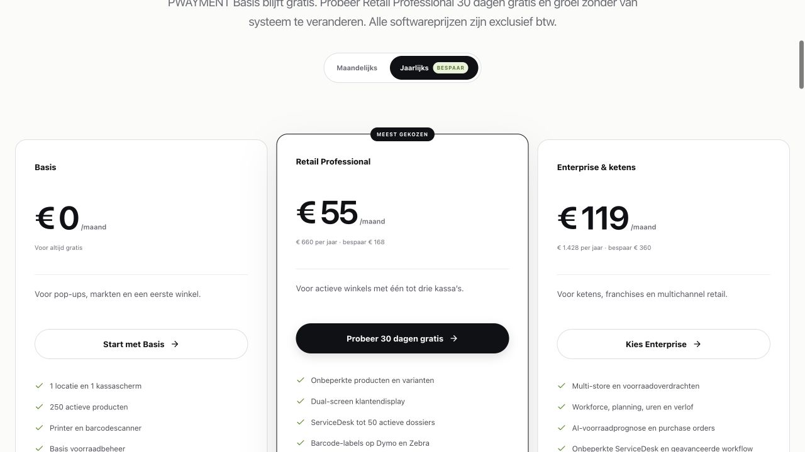

Ook in de winkelomgeving ziet de eigenaar dezelfde pakketten, met duidelijk wat elk plan bevat. Een upgrade is dus geen belofte op een verkoopspagina, maar een concrete keuze die de eigenaar zelf kan maken wanneer de winkel daar klaar voor is.

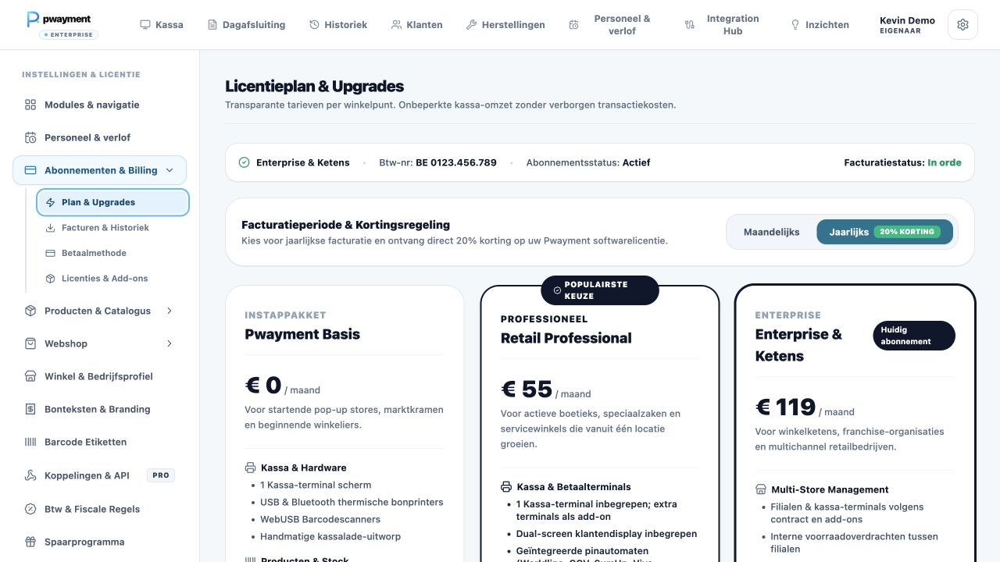

### 2. Een werkplek op maat van de winkel

Zodra een plan actief is, kan de eigenaar zelf bepalen welke beschikbare onderdelen zijn team in de navigatie ziet. Dat gebeurt via **Profiel → Instellingen → Modules & navigatie**. Klantenbeheer, Integration Hub, hersteldienst, personeel en verlof, en inzichten kunnen daar in- of uitgeschakeld worden. De navigatie past zich meteen aan.

Het onderscheid is eenvoudig: het plan bepaalt waar de winkel toegang toe heeft; de eigenaar bepaalt welke onderdelen het team elke dag gebruikt. Kassa, dagafsluiting en historiek blijven altijd beschikbaar.

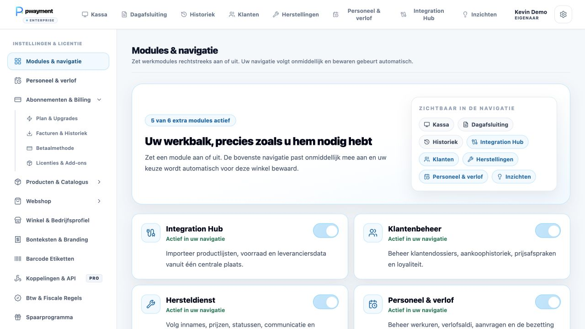

De instellingen vormen ook één logisch geheel: bedrijfsgegevens, factuuridentiteit, bonteksten, hardware, beveiliging, teamrechten, koppelingen en abonnement horen samen.

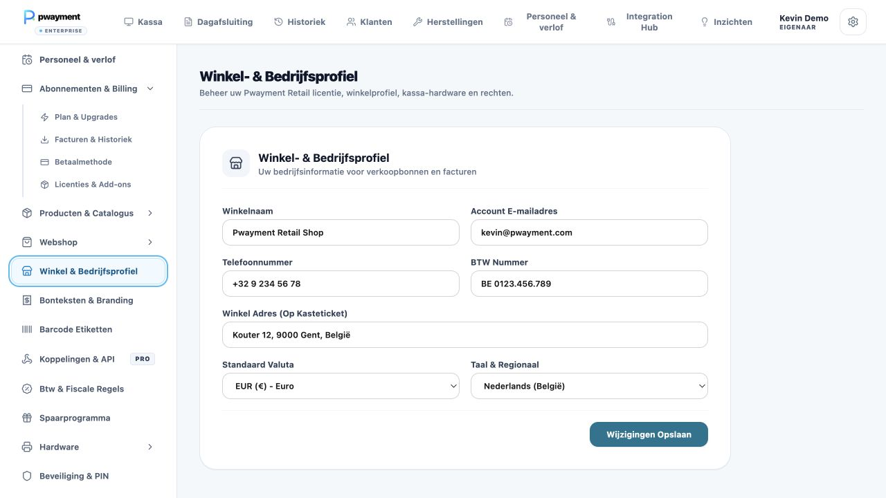

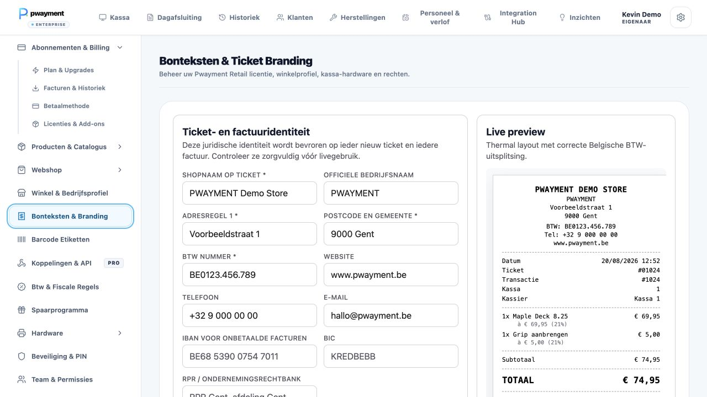

### 3. Een winkel opstarten — of overstappen

Via **Start gratis** doorloopt een nieuwe winkel een begeleid starttraject in vijf stappen: account, winkel, werkwijze, data en prijzen, en klaarzetten. De eigenaar kan die keuzes later altijd aanpassen.

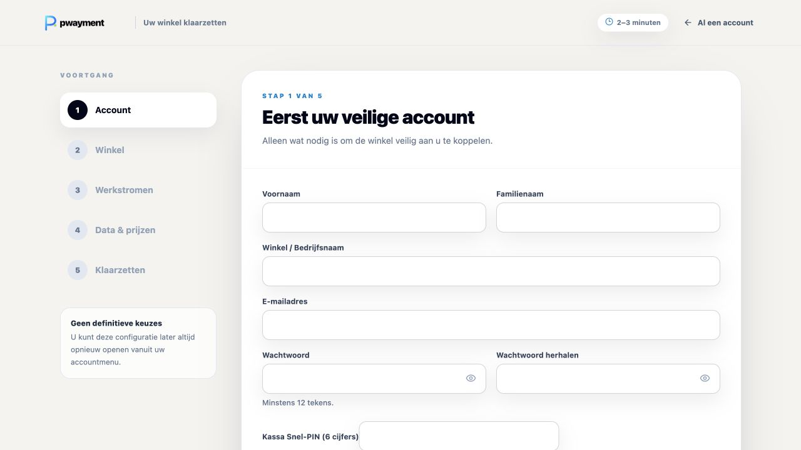

Voor een bestaande winkel is een zorgvuldige migratie minstens even belangrijk. In de Integration Hub vertrekt de winkelier van de bestanden die al bestaan: catalogus, voorraad en klanten. Een vast sjabloon is niet vereist.

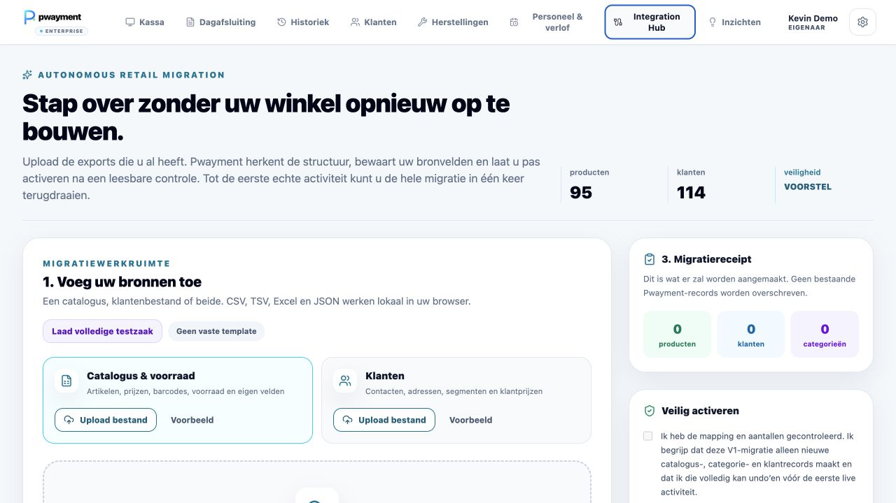

Vervolgens controleert de winkelier kolom per kolom waar de gegevens terechtkomen: productnaam, SKU, barcode, categorie, leverancier, aankoopprijs, verkoopprijs, btw, voorraad en eventuele eigen velden.

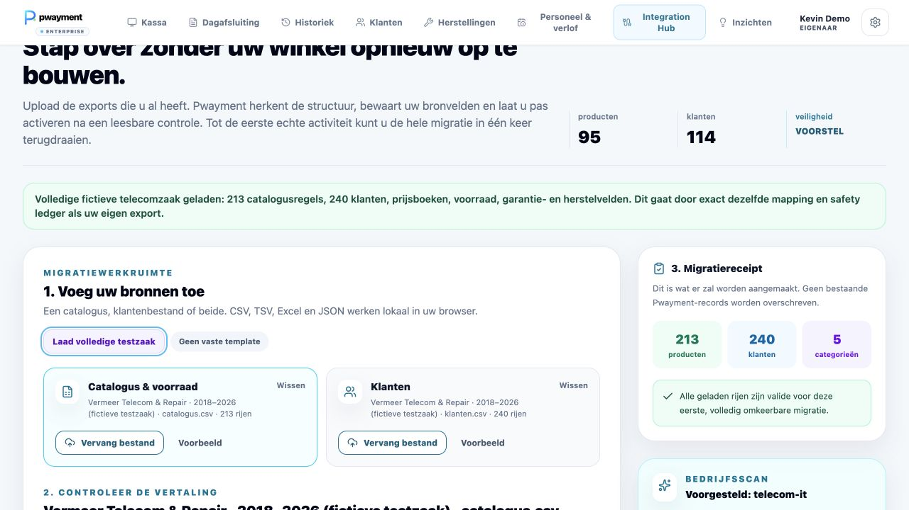

Pas na die controle verschijnt een duidelijk migratieoverzicht met aantallen en een expliciete bevestiging. Bestaande gegevens in Pwayment worden niet overschreven. Vóór de eerste echte verkoop kan de volledige eerste migratie bovendien weer ongedaan gemaakt worden.

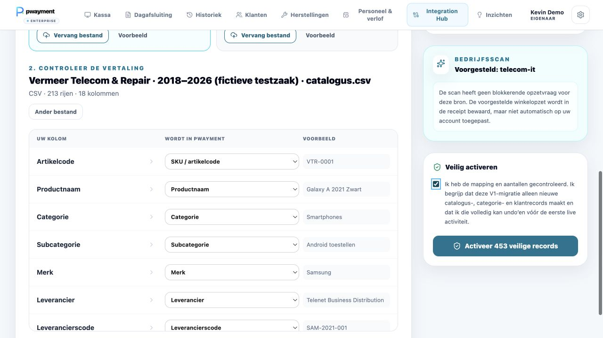

### 4. Aan de balie: twee schermen, elk met de juiste informatie

De eigenaar kan hardware en het klantenscherm per winkel instellen. Het tweede scherm is optioneel, draait lokaal in de winkel en kan volledig worden afgestemd op de uitstraling van de zaak.

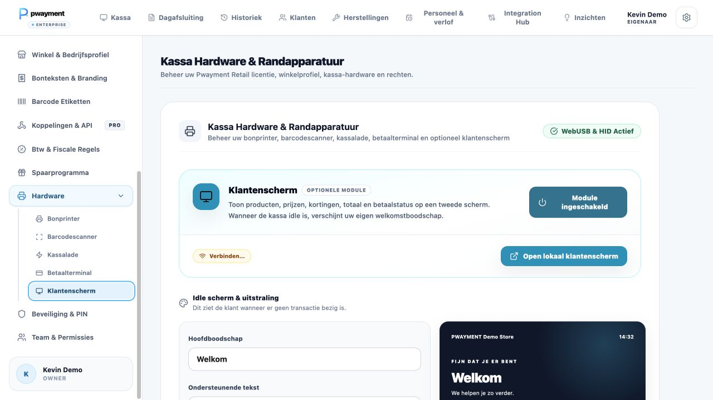

In ruststand ziet de klant een rustig welkomstscherm. Tijdens een verkoop ziet hij de artikelen, btw, het totaalbedrag en de betaalmogelijkheden. Kostprijzen, voorraad, interne notities en klantgegevens blijven bewust buiten beeld.

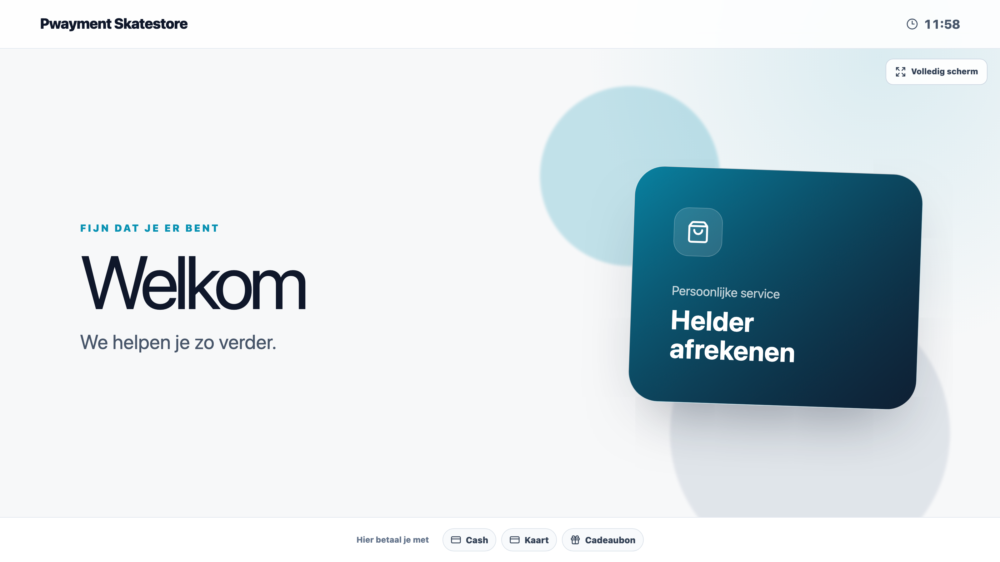

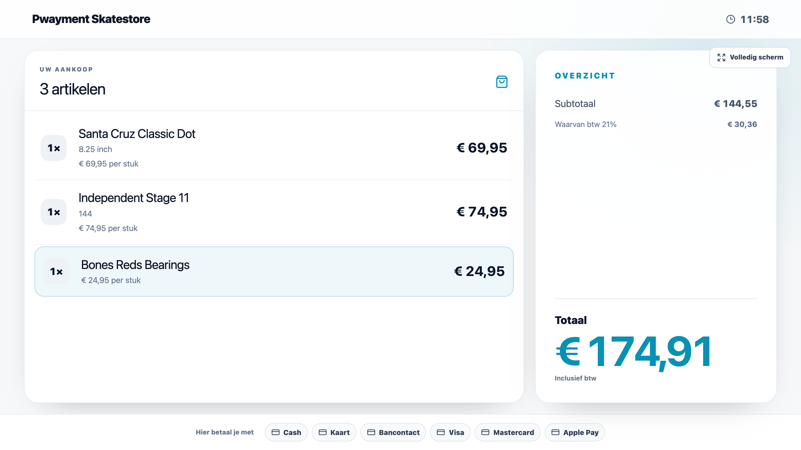

### 5. Van verkoop naar factuur

Een factuur wordt gemaakt vanuit een verkoop en bewaart de bedrijfs- en klantgegevens als een definitieve momentopname. Vanuit de historiek kan de winkelier het document openen, afdrukken of als PDF downloaden — met factuurnummer, btw-uitsplitsing, betaalwijze en documentreferentie.

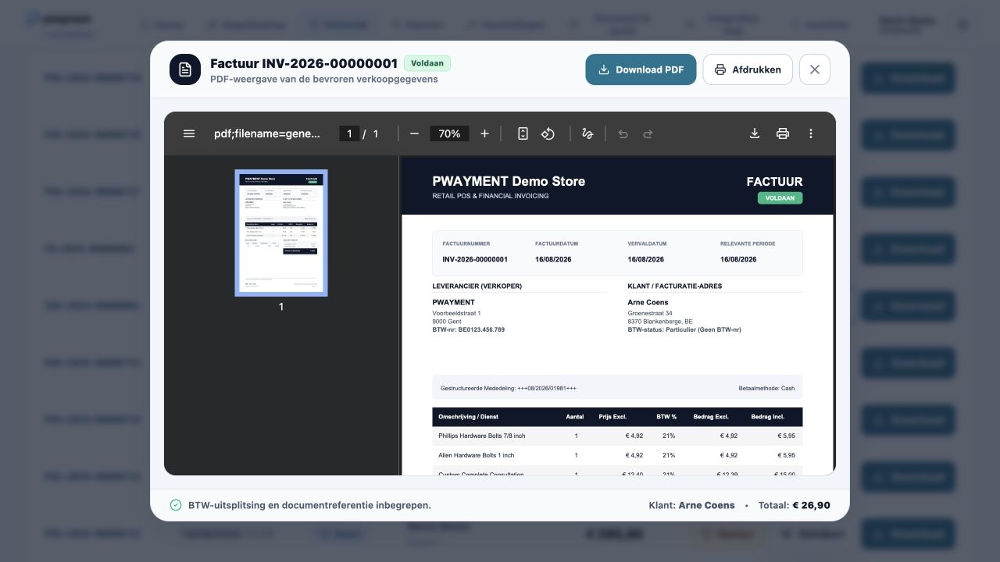

### 6. Voorraad is dagelijkse sturing, geen telling achteraf

Voorraad loopt mee met elke verkoop. De eigenaar ziet de voorraadwaarde, producten die te lang blijven liggen, minimumvoorraad en artikelen die binnenkort aandacht nodig hebben.

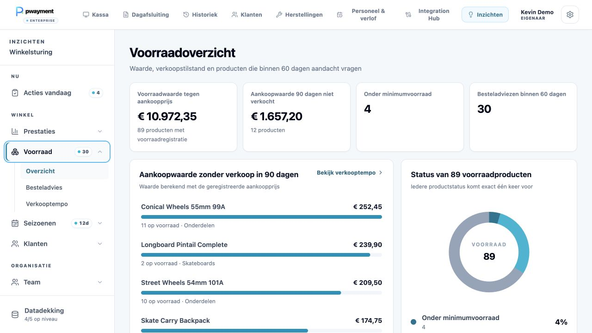

Daaruit volgen besteladviezen op basis van verkooptempo en minimumvoorraad. Cruciaal: **Pwayment bestelt nooit automatisch.** De eigenaar selecteert zelf producten; de bestelvoorstellen worden daarna per leverancier gegroepeerd.

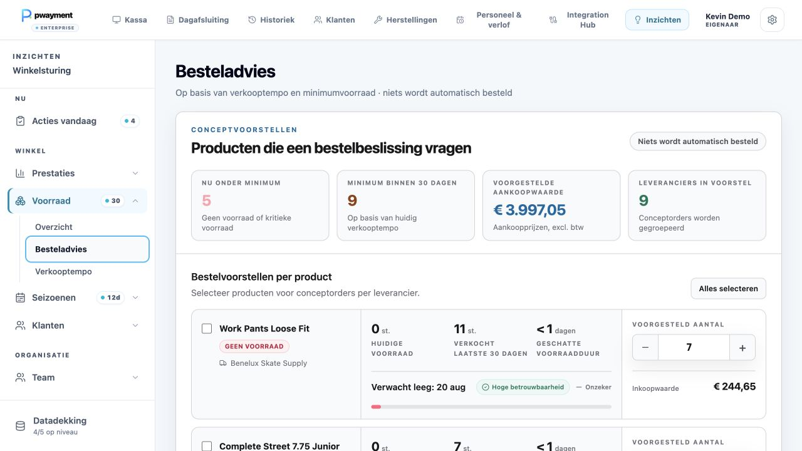

### 7. Herstellingen: van intake tot afhaling

Een hersteldossier begint niet met een losse notitie. De medewerker koppelt een klant, registreert het toestel en de identificatie, noteert de klacht en de staat bij binnenkomst, voegt indien nodig foto’s toe en kiest de juiste route: herstelling in de winkel, externe hersteller, omruiling of garantie.

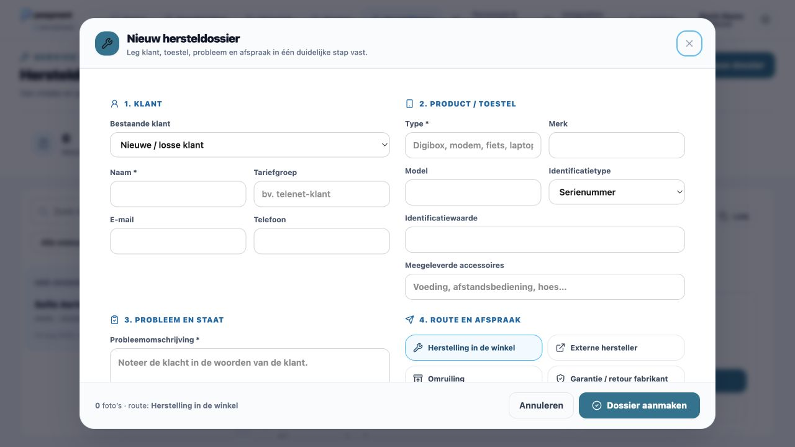

Daarna blijft alles in één dossier: status, diagnose, uitgevoerde oplossing, prijsopbouw, klantcontact, een beveiligde statuspagina voor de klant en de volledige historiek. Wanneer het toestel klaar is, kan de afrekening rechtstreeks naar de kassa.

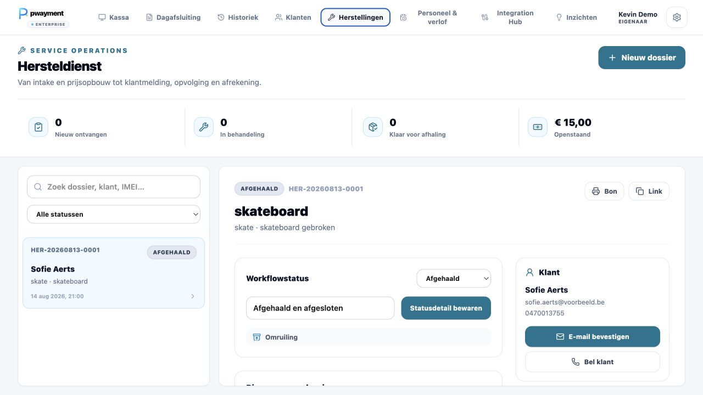

### 8. Verlof: aanvraag, effect op de planning en een veilige beslissing

Ook personeel en verlof vormen een volledig proces. Een medewerker kiest het verloftype en de periode; Pwayment berekent de duur volgens het werkpatroon en toont de aanvraag in de planning.

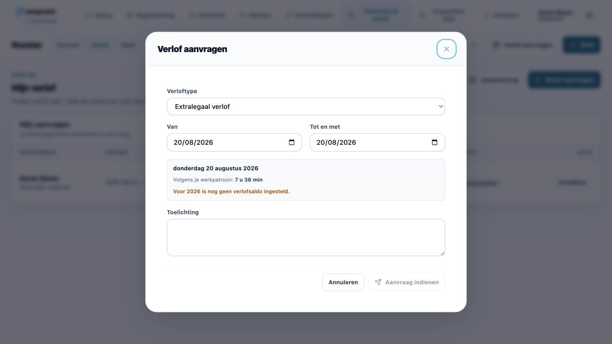

De eigenaar ziet niet alleen een aanvraag, maar ook het effect op de minimumbezetting. De aparte inbox voor verlofbeslissingen is bewust afgeschermd met een persoonlijke pincode.

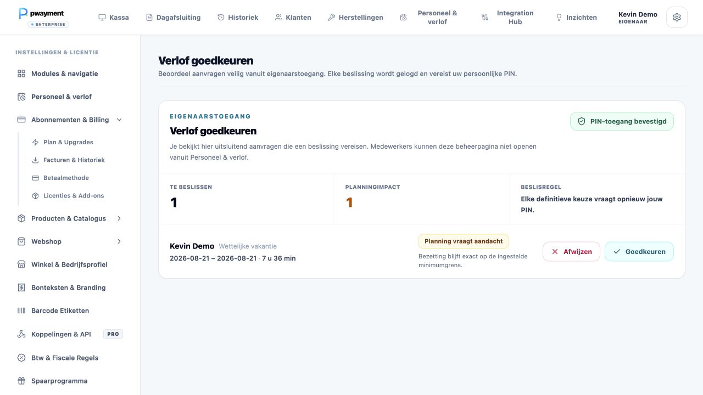

Bij de definitieve beslissing verschijnt dat effect opnieuw. Een goedkeuring of afwijzing wordt pas vastgelegd na een motivatie waar nodig én een bevestiging met de persoonlijke pincode. Zo blijft elke gevoelige beslissing controleerbaar.

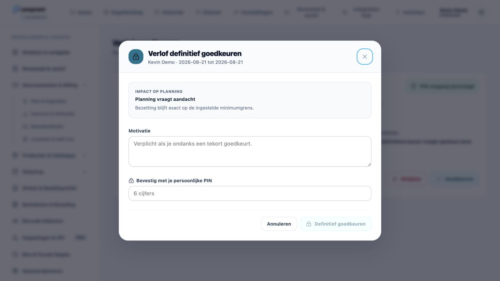

### 9. Wanneer we meerdere winkels ondersteunen

De **Platform Console** is geen extra scherm voor de winkelier. Het is onze centrale beheeromgeving voor ondersteuning, synchronisaties, nieuwe versies en zaken die in de dagelijkse werking aandacht vragen. Zo kunnen we winkeliers gericht helpen zonder per situatie eerst in verschillende systemen te moeten zoeken.

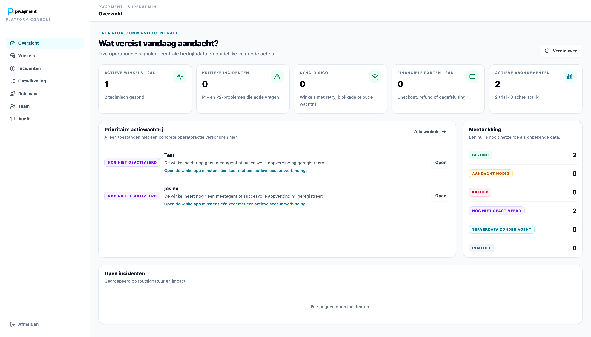

Dat is de productreis die ik wilde tonen: eenvoudig starten, de winkel op de eigen werking afstemmen en daarna zonder systeemwissel groeien in voorraad, service, team en meerdere vestigingen.

Als jullie even tijd hebben, kijk dan gerust eerst op **[pwayment.vercel.app](https://pwayment.vercel.app)**. De website, de prijzen en het starttraject zijn daar meteen beschikbaar.

Groeten,

Kevin
